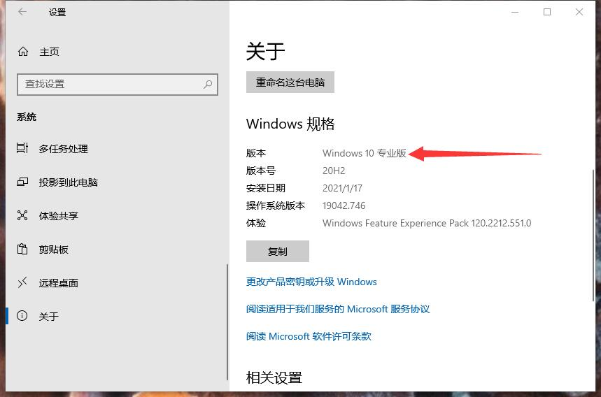
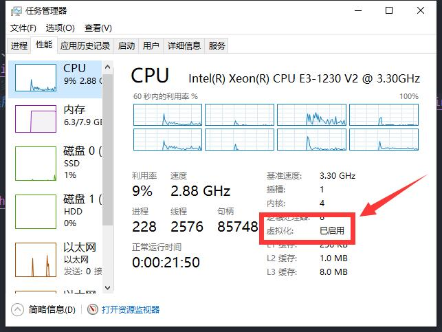

# Docker

::: tip
Docker 可以让开发者打包他们的应用以及依赖包到一个轻量级、可移植的容器中，然后发布到任何流行的 Linux 机器上，也可以实现虚拟化。
容器是完全使用沙箱机制，相互之间不会有任何接口（类似 iPhone 的 app）,更重要的是容器性能开销极低。

[Docker 官网](https://www.docker.com/)
[Docker 官方文档](https://docs.docker.com/)
[Docker Hub](https://hub.docker.com/)
:::

<iframe src="//player.bilibili.com/player.html?aid=838132893&bvid=BV1og4y1q7M4&cid=191591478&page=2" scrolling="no" border="0" frameborder="no" framespacing="0" allowfullscreen="true" style="width: 100%; height: 380px;"> </iframe>

## 安装

推荐参考官方文档：[安装 Docker 引擎（英文）](https://docs.docker.com/engine/install/)

### Windows

推荐参考官方文档 [在 Windows 上安装 Docker Desktop（英文）](https://docs.docker.com/docker-for-windows/install/)

首先，确保满足先决条件：

- **- Windows 10 64 位 专业版、企业版、教育版**
  
  > + ~~Yue_plus：“如果是家庭版建议重装系统”~~ `→_→`
  > + [在 Windows 10 家庭版上安装 Docker Hub（英文）](https://docs.docker.com/docker-for-windows/install-windows-home/)
- **已开启 Windows 虚拟化**
  

然后，[从官网下载 Docker Desktop 安装包](https://www.docker.com/products/docker-desktop)

安装时会自动打开 Windows 功能——虚拟机平台，如果勾选了
<abbr title="适用于 Linux 的 Windows 子系统">WSL</abbr>
可能会要求安装 [适用于 x64 计算机的 WSL2 Linux 内核更新包](https://docs.microsoft.com/zh-cn/windows/wsl/install-win10#step-4---download-the-linux-kernel-update-package)
下载安装后重启即可。

**安装完成：**


## `Dockerfile`

官方文档：
[`Dockerfile` 文档（英文）](https://docs.docker.com/engine/reference/builder/)
[`Dockerfile` 最佳实践（英文）](https://docs.docker.com/engine/userguide/eng-image/dockerfile_best-practices/)

## 常用命令

可以在官网找到 [所有命令](https://docs.docker.com/reference/)

### `docker version`

查看 Docker 版本

::: details 示例
```sh
Client: Docker Engine - Community
 Cloud integration: 1.0.7
 Version:           20.10.2
 API version:       1.41
 Go version:        go1.13.15
 Git commit:        2291f61
 Built:             Mon Dec 28 16:14:16 2020
 OS/Arch:           windows/amd64
 Context:           default
 Experimental:      true

Server: Docker Engine - Community
 Engine:
  Version:          20.10.2
  API version:      1.41 (minimum version 1.12)
  Go version:       go1.13.15
  Git commit:       8891c58
  Built:            Mon Dec 28 16:15:28 2020
  OS/Arch:          linux/amd64
  Experimental:     false
 containerd:
  Version:          1.4.3
  GitCommit:        269548fa27e0089a8b8278fc4fc781d7f65a939b
 runc:
  Version:          1.0.0-rc92
  GitCommit:        ff819c7e9184c13b7c2607fe6c30ae19403a7aff
 docker-init:
  Version:          0.19.0
  GitCommit:        de40ad0
```
:::

### `docker info`

查看 Docker 的系统信息

::: details 示例
```sh
Client:
 Context:    default
 Debug Mode: false
 Plugins:
  app: Docker App (Docker Inc., v0.9.1-beta3)
  buildx: Build with BuildKit (Docker Inc., v0.5.1-docker)
  scan: Docker Scan (Docker Inc., v0.5.0)

Server:
 Containers: 1
  Running: 1
  Paused: 0
  Stopped: 0
 Images: 1
 Server Version: 20.10.2
 Storage Driver: overlay2
  Backing Filesystem: extfs
  Supports d_type: true
  Native Overlay Diff: true
 Logging Driver: json-file
 Cgroup Driver: cgroupfs
 Cgroup Version: 1
 Plugins:
  Volume: local
  Network: bridge host ipvlan macvlan null overlay
  Log: awslogs fluentd gcplogs gelf journald json-file local logentries splunk syslog
 Swarm: inactive
 Runtimes: runc io.containerd.runc.v2 io.containerd.runtime.v1.linux
 Default Runtime: runc
 Init Binary: docker-init
 containerd version: 269548fa27e0089a8b8278fc4fc781d7f65a939b
 runc version: ff819c7e9184c13b7c2607fe6c30ae19403a7aff
 init version: de40ad0
 Security Options:
  seccomp
   Profile: default
 Kernel Version: 5.4.72-microsoft-standard-WSL2
 Operating System: Docker Desktop
 OSType: linux
 Architecture: x86_64
 CPUs: 8
 Total Memory: 6.126GiB
 Name: docker-desktop
 ID: GEVB:2QBS:GAWG:ZFNQ:7ITG:VHFB:MP2G:CKI4:7RTO:2E2M:H6SH:KQKO
 Docker Root Dir: /var/lib/docker
 Debug Mode: false
 Registry: https://index.docker.io/v1/
 Labels:
 Experimental: false
 Insecure Registries:
  127.0.0.0/8
 Live Restore Enabled: false

WARNING: No blkio weight support
WARNING: No blkio weight_device support
WARNING: No blkio throttle.read_bps_device support
WARNING: No blkio throttle.write_bps_device support
WARNING: No blkio throttle.read_iops_device support
WARNING: No blkio throttle.write_iops_device support
```
:::

### `docker <命令> --help`

查看 Docker 命令帮助

::: details 示例
```sh
docker --help
```
```text
Usage:  docker [OPTIONS] COMMAND

A self-sufficient runtime for containers

Options:
      --config string      Location of client config files (default
                           "C:\\Users\\Yue_plus\\.docker")
  -c, --context string     Name of the context to use to connect to the
                           daemon (overrides DOCKER_HOST env var and
                           default context set with "docker context use")
  -D, --debug              Enable debug mode
  -H, --host list          Daemon socket(s) to connect to
  -l, --log-level string   Set the logging level
                           ("debug"|"info"|"warn"|"error"|"fatal")
                           (default "info")
      --tls                Use TLS; implied by --tlsverify
      --tlscacert string   Trust certs signed only by this CA (default
                           "C:\\Users\\Yue_plus\\.docker\\ca.pem")
      --tlscert string     Path to TLS certificate file (default
                           "C:\\Users\\Yue_plus\\.docker\\cert.pem")
      --tlskey string      Path to TLS key file (default
                           "C:\\Users\\Yue_plus\\.docker\\key.pem")
      --tlsverify          Use TLS and verify the remote
  -v, --version            Print version information and quit

Management Commands:
  app*        Docker App (Docker Inc., v0.9.1-beta3)
  builder     Manage builds
  buildx*     Build with BuildKit (Docker Inc., v0.5.1-docker)
  config      Manage Docker configs
  container   Manage containers
  context     Manage contexts
  image       Manage images
  manifest    Manage Docker image manifests and manifest lists
  network     Manage networks
  node        Manage Swarm nodes
  plugin      Manage plugins
  scan*       Docker Scan (Docker Inc., v0.5.0)
  secret      Manage Docker secrets
  service     Manage services
  stack       Manage Docker stacks
  swarm       Manage Swarm
  system      Manage Docker
  trust       Manage trust on Docker images
  volume      Manage volumes

Commands:
  attach      Attach local standard input, output, and error streams to a running container
  build       Build an image from a Dockerfile
  commit      Create a new image from a container's changes
  cp          Copy files/folders between a container and the local filesystem
  create      Create a new container
  diff        Inspect changes to files or directories on a container's filesystem
  events      Get real time events from the server
  exec        Run a command in a running container
  export      Export a container's filesystem as a tar archive
  history     Show the history of an image
  images      List images
  import      Import the contents from a tarball to create a filesystem image
  info        Display system-wide information
  inspect     Return low-level information on Docker objects
  kill        Kill one or more running containers
  load        Load an image from a tar archive or STDIN
  login       Log in to a Docker registry
  logout      Log out from a Docker registry
  logs        Fetch the logs of a container
  pause       Pause all processes within one or more containers
  port        List port mappings or a specific mapping for the container
  ps          List containers
  pull        Pull an image or a repository from a registry
  push        Push an image or a repository to a registry
  rename      Rename a container
  restart     Restart one or more containers
  rm          Remove one or more containers
  rmi         Remove one or more images
  run         Run a command in a new container
  save        Save one or more images to a tar archive (streamed to STDOUT by default)
  search      Search the Docker Hub for images
  start       Start one or more stopped containers
  stats       Display a live stream of container(s) resource usage statistics
  stop        Stop one or more running containers
  tag         Create a tag TARGET_IMAGE that refers to SOURCE_IMAGE
  top         Display the running processes of a container
  unpause     Unpause all processes within one or more containers
  update      Update configuration of one or more containers
  version     Show the Docker version information
  wait        Block until one or more containers stop, then print their exit codes

Run 'docker COMMAND --help' for more information on a command.

To get more help with docker, check out our guides at https://docs.docker.com/go/guides/
```
:::

### `docker search`

在 [Docker Hub](https://hub.docker.com/) 上搜索镜像。

语法：`docker search [OPTIONS] TERM`

选项：
- `--filter , -f`
  + 根据提供的条件过滤输出
- `--format`
  + 使用Go模板进行漂亮的打印搜索
- `--limit`
  + 默认为 `25`
  + 最多搜索结果数
- `--no-trunc`
  + 不截断输出

### `docker pull`

从仓库拉取镜像。

语法：`docker pull [OPTIONS] NAME[:TAG|@DIGEST]`

> [参考官网手册](https://docs.docker.com/engine/reference/commandline/pull/)

选项：
- `--all-tags , -a`
  + 下载仓库中所有标记的镜像
- `--disable-content-trust`
  + 默认为：`true`
  + 跳过镜像验证
- `--platform`
  + `1.32+` 可用
  + 如果服务器支持多平台，则设置平台
- `--quiet , -q`
  + 禁止详细输出

### `docker run`

在新容器中运行命令。

语法：`docker run [OPTIONS] IMAGE [COMMAND] [ARG...]`

> [参考官方手册](https://docs.docker.com/engine/reference/commandline/run/)

选项：
- `--add-host`
	+	添加自定义主机到 IP 映射（主机：ip）
- `--attach , -a`
	+	连接到 STDIN、STDOUT 或 STDERR
- `--blkio-weight`
	+	块 IO（相对权重），介于 10 和 1000 之间，或 0 禁用（默认 0）
- `--blkio-weight-device`
	+	块 IO 权重（相对设备重量）
- `--cap-add`
	+	添加 Linux 功能
- `--cap-drop`
  +	放弃 Linux 功能
- `--cgroup-parent`
	+	容器的可选父 cgroup
- `--cgroupns
	+	`1.41+` 可用
  + 要使用的 C组命名空间（主机|私有）"主机"：
    在 Docker 主机的 cgroup 命名空间"私有"中运行容器：
    在其自己的专用 cgroup 命名空间中运行容器'：
    使用由守护程序上的默认 cgroupns 模式选项配置的 cgroup 命名空间（默认）
- `--cidfile`
	+	将容器 ID 写入文件
- `--cpu-count`
	+	CPU 计数（仅窗口）
- `--cpu-percent`
	+	CPU 百分比（仅窗口）
- `--cpu-period`
	+	限制 CPU CFS（完全公平的调度程序）周期
- `--cpu-quota`
	+	限制 CPU CFS（完全公平的调度程序）配额
- `--cpu-rt-period`
	+	`1.25+` 可用
  + 以微秒为单位限制 CPU 实时周期
- `--cpu-rt-runtime`
	+	`1.25+` 可用
  + 以微秒为单位限制 CPU 实时运行时间
- `--cpu-shares , -c`
	+	CPU 共享（相对权重）
- `--cpus`
	+	`1.25+` 可用
  + CPU 数量
- `--cpuset-cpus`
  + 允许执行的 CPU （0-3， 0，1）
- `--cpuset-mems`
	+	允许执行的 MEM （0-3， 0，1）
- `--detach , -d`
	+	在后台运行容器并打印容器 ID
- `--detach-keys`
	+	覆盖分离容器的键序列
- `--device`
	+	将主机设备添加到容器
- `--device-cgroup-rule`
	+	将规则添加到 cGroup 允许的设备列表
- `--device-read-bps`
	+	限制设备读取速率（字节/秒）
- `--device-read-iops`
	+	限制设备读取速率（IO/秒）
- `--device-write-bps`
	+	将写入速率（字节/秒）限制为设备
- `--device-write-iops`
	+	将写入速率（IO/秒）限制为设备
- `--disable-content-trust`
	+ 默认为：`true`
  +	跳过镜像验证
- `--dns`
	+	设置自定义 DNS 服务器
- `--dns-opt`
	+	设置 DNS 选项
- `--dns-option`
	+	设置 DNS 选项
- `--dns-search`
	+	设置自定义 DNS 搜索域
- `--domainname`
	+	容器 NIS 域名
- `--entrypoint`
	+	覆盖图像的默认入口点
- `--env , -e`
	+	设置环境变量
- `--env-file`
	+	在环境变量文件中读取
- `--expose`
	+	暴露端口或一系列端口
- `--gpus`
	+	`1.40+` 可用
  + 要添加到容器的 GPU 设备（"全部"通过所有 GPU）
- `--group-add`
	+	添加要加入的其他组
- `--health-cmd`
	+	命令运行以检查运行状况
- `--health-interval`
	+	运行检查之间的时间（ms | s | h）（默认 0s）
- `--health-retries`
	+	报告不正常行为所需的连续故障
- `--health-start-period`
	+	`1.29+` 可用
  + 容器的开始周期在开始运行状况重倒数之前初始化（ms | s | h）（默认 0s）
- `--health-timeout`
	+	允许运行一次检查的最大时间（ms | s | h）（默认 0s）
- `--help`
	+ 输出帮助
- `--hostname , -h`
	+	容器主机名
- `--init`
	+	`1.25+` 可用
  + 在容器内运行一个 init，该容器转发信号并收获进程
- `--interactive , -i`
	+	即使未连接，也保持 STDIN 打开
- `--io-maxbandwidth`
	+	系统驱动器的最大 IO 带宽限制（仅窗口）
- `--io-maxiops`
	+	系统驱动器的最大 IOps 限制（仅 Windows）
- `--ip`
	+	IPv4 地址（例如：`172.30.100.104`）
- `--ip6`
	+	IPv6 地址（例如：`2001:db8::33`）
- `--ipc`
	+	要使用的 IPC 模式
- `--isolation`
	+	容器隔离技术
- `--kernel-memory`
	+	内核内存限制
- `--label , -l`
	+	在容器上设置元数据
- `--label-file`
	+	在标签的行分隔文件中读取
- `--link`
	+	将链接添加到另一个容器
- `--link-local-ip`
	+	容器 IPv4/IPv6 链路本地地址
- `--log-driver`
	+	容器的日志记录驱动程序
- `--log-opt`
	+	日志驱动程序选项
- `--mac-address`
	+	容器 MAC 地址（例如：`92:d0:c6:0a:29:33`）
- `--memory , -m`
	+	内存限制
- `--memory-reservation`
	+	内存软限制
- `--memory-swap`
	+	交换限制等于内存加交换：'-1'，支持无限制交换
- `--memory-swappiness`
	+ 默认为：`-1`
  +	调整容器内存交换（0 到 100）
- `--mount`
	+	将文件系统装载附加到容器
- `--name`
	+	为容器分配名称
- `--net`
	+	将容器连接到网络
- `--net-alias`
	+	为容器添加网络范围别名
- `--network`
	+	将容器连接到网络
- `--network-alias`
	+	为容器添加网络范围别名
- `--no-healthcheck`
	+	禁用任何容器指定的运行状况检查
- `--oom-kill-disable`
	+	禁用 OOM 杀手
- `--oom-score-adj`
	+	调整主机的 OOM 首选项 （-1000 到 1000）
- `--pid`
	+	要使用的 PID 命名空间
- `--pids-limit`
	+	调整容器皮斯限制（设置为 -1 无限制）
- `--platform`
	+	`1.32+` 可用
  + 设置平台，如果服务器是多平台功能
- `--privileged`
	+	向此容器授予扩展权限
- `--publish , -p`
	+	将容器的端口发布到主机
- `--publish-all , -P`
	+	将所有公开端口发布到随机端口
- `--pull	missing`
	+ 运行前拉图像（"始终"|"缺少"|"从不"）
- `--read-only`
	+	将容器的根文件系统装载为只读
- `--restart	no`
	+ 重新启动策略，在容器退出时应用
- `--rm`
	+	容器退出时自动移除容器
- `--runtime`
	+	用于此容器的运行时
- `--security-opt`
	+	安全选项
- `--shm-size`
	+	大小 /开发/shm
- `--sig-proxy`
	+ 默认为 `true`
  +	代理接收到进程的信号
- `--stop-signal`
	+ SIGTERM	停止容器的信号
- `--stop-timeout`
	+	`1.25+` 可用
  + 停止容器的超时（以秒为单位）
- `--storage-opt`
	+	容器的存储驱动程序选项
- `--sysctl`
	+	Sysctl 选项
- `--tmpfs`
	+	装载 tmpfs 目录
- `--tty , -t`
	+	分配伪 TTY
- `--ulimit`
	+	极限选项
- `--user , -u`
	+	用户名或 UID（格式：`<name|uid>[:<group|gid>]`）
- `--userns`
	+	要使用的用户名空间
- `--uts`
	+	要使用的 UTS 命名空间
- `--volume , -v`
	+	绑定装载卷
- `--volume-driver`
	+	容器的可选卷驱动程序
- `--volumes-from`
	+	从指定的容器中装载卷
- `--workdir , -w`
	+	容器内的工作目录

## `docker exec`

在正在运行的容器中执行命令。

语法：`docker exec [OPTIONS] CONTAINER COMMAND [ARG...]`

> [参考官网手册](https://docs.docker.com/engine/reference/commandline/exec/)

选项：
- `--detach , -d`
	+	分离模式：在后台运行命令
- `--detach-keys`
	+	覆盖分离容器的键序列
- `--env , -e`
	+	`1.25+` 以上可用
  + 设置环境变量
- `--env-file`
	+	`1.25+` 以上可用
  + 在环境变量文件中读取
- `--interactive , -i`
	+	即使未连接，也保持 STDIN 打开
- `--privileged`
	+	向命令授予扩展权限
- `--tty , -t`
	+	分配伪 TTY
- `--user , -u`
	+	用户名或 UID（格式：`<name|uid>[:<group|gid>]`）
- `--workdir , -w`
	+	`1.35+` 以上可用
  + 容器内的工作目录