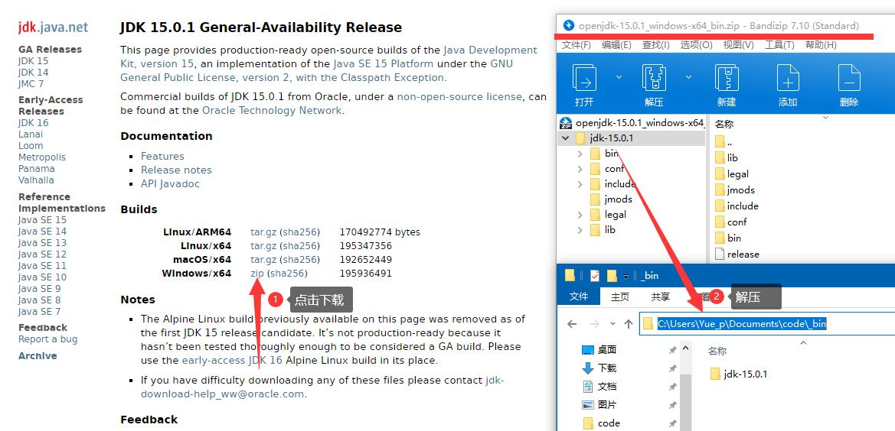
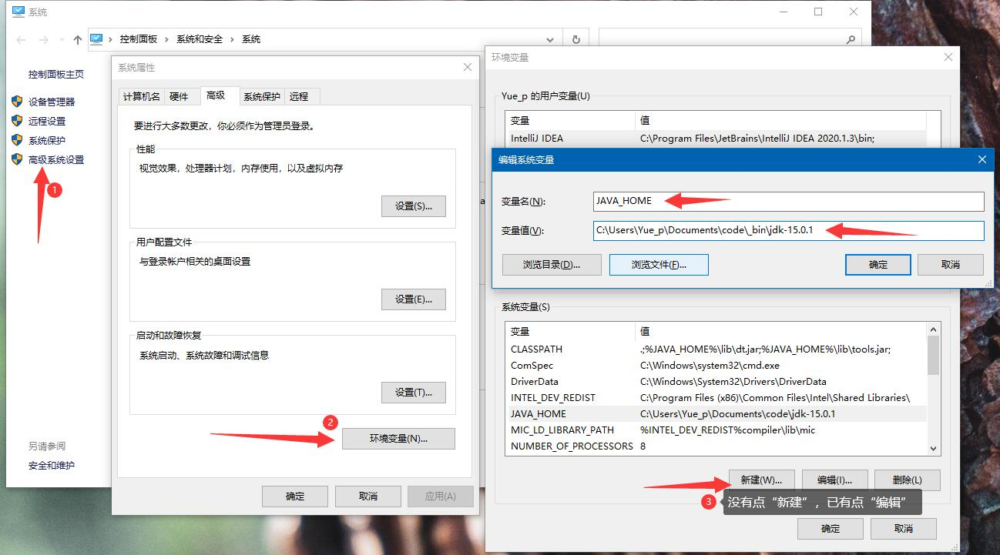
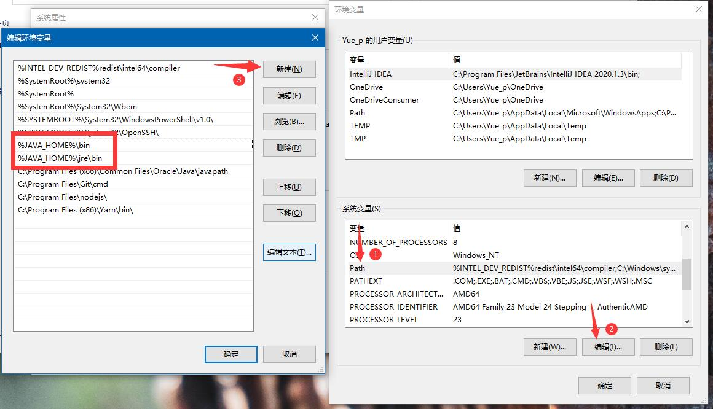

# Java

:::tip
- Java 是由 Sun Microsystems 公司于 1995 年 5 月推出的高级程序设计语言。
- Java 可运行于多个平台，如 Windows, Mac OS 及其他多种 UNIX 版本的系统。
- 本教程通过简单的实例将让大家更好的了解 Java 编程语言。
- 移动操作系统 Android 大部分的代码采用 Java 编程语言编程。
:::

## 链接

### 教程

- [Java 教程 - 菜鸟教程](https://www.runoob.com/java/java-tutorial.html)
- [Java 教程 - 廖雪峰的官方网站](https://www.liaoxuefeng.com/wiki/1252599548343744)

### 下载

- [OpenJDK](http://openjdk.java.net/)
- [OpenJFX (JavaFX) 中文网](https://openjfx.cn/)

## 推荐阅读

- [《Java核心技术·卷 I 》（原书第11版）](https://book.douban.com/subject/34898994/)
  + 
- [《Java核心技术·卷 II》（原书第11版）](https://book.douban.com/subject/34935138/)
  + 

## 配置环境变量

### Windows 10

01. 前往 [OpenJDK 官网](http://openjdk.java.net/) 下载 JDK。

    

02. 配置 **环境变量**：

    

    添加以下环境变量：

    - `JAVA_HOME` : `<JDK 解压路径>`
    - `CLASSPATH` : `.;%JAVA_HOME%\lib\dt.jar;%JAVA_HOME%\lib\tools.jar;`

    编辑 `Path` 变量：

    

    点击 `新建`，添加：

    - `%JAVA_HOME%\bin`
    - `%JAVA_HOME%\jre\bin`

03. 输入 `java -version` 验证配置。

    ```bash {1}
    $ java -version
    openjdk version "15.0.1" 2020-10-20
    OpenJDK Runtime Environment (build 15.0.1+9-18)
    OpenJDK 64-Bit Server VM (build 15.0.1+9-18, mixed mode, sharing)
    ```

## 构建工具
### Apache Maven

::: tip
Maven 是流行的 Java 项目构建系统，Maven 项目对象模型(POM)，可以通过一小段描述信息来管理项目的构建，报告和文档的软件项目管理工具。

[Apache Maven 官网](https://maven.apache.org/)
:::

- [Maven 教程_w3cschool](https://www.w3cschool.cn/maven/)

#### 将 Maven 项目转换为 Gradle 项目

参考 [执行自动转换](https://docs.gradle.org/current/userguide/migrating_from_maven.html#migmvn:automatic_conversion)

```sh
gradle init --type pom
```

### Apache Ant

::: tip
Apache Ant，是一个将软件编译、测试、部署等步骤联系在一起加以自动化的一个工具，大多用于 Java 环境中的软件开发。

[Apache Ant 官网](https://ant.apache.org/)
:::

- [Apache Ant 教程_w3cschool](https://www.w3cschool.cn/ant/)

### [Gradle](./gradle/)

::: tip
Gradle 是一个基于 Apache Ant 与 Apache Maven 概念的项目自动化构建开源工具。

[Gradle 官网](https://gradle.org/)
:::

## 安卓（Android）开发

> 在培训室内外环境下访问：`\\WS19\Yue_plus 的共享\Android`

- [安卓开发者文档](https://developer.android.com/docs)
    + [Android Studio](https://developer.android.com/studio)
    + [命令行工具](https://developer.android.com/studio/command-line)

## AsciiDoc

::: tip
AsciiDoc 是一种轻量级标记语言，它可以让我们以纯文本的形式来书写笔记、文章、文档、书籍、网页、幻灯片和 man 帮助。
:::

### 链接

- [Asciidoctor（官网）](https://asciidoctor.org/)
- [Asciidoctot（中文网）](https://asciidoctor.cn/)
- 

