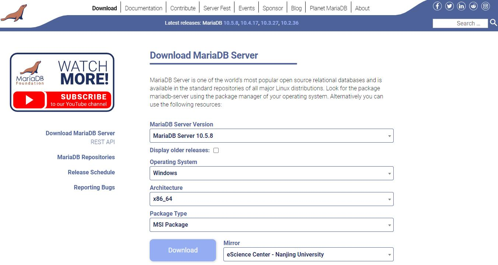
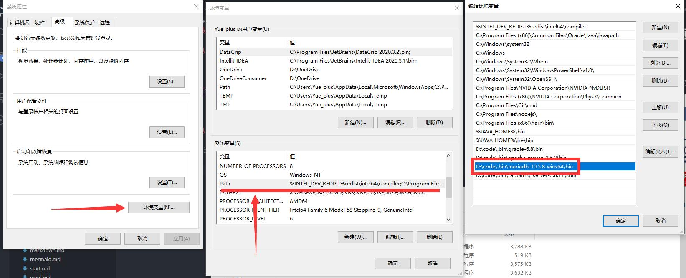

# MariaDB

::: tip
MariaDB 数据库管理系统是 MySQL 的一个分支，主要由开源社区在维护，采用 GPL 授权许可。
MariaDB 的目的是全兼容 MySQL，包括 API 与命令行，使之能轻松成为 MySQL 的代替品。

[MariaDB 官网](https://mariadb.org/)
:::

<iframe src="//player.bilibili.com/player.html?aid=83395424&bvid=BV1NJ411J79W&cid=142661514&page=3" scrolling="no" border="0" frameborder="no" framespacing="0" allowfullscreen="true" style="width: 100%; height: 380px;"> </iframe>

## 安装

### Windows

#### 使用 MSI 包安装

前往 [MariaDB 官网下载](https://mariadb.org/download/) 安装包。



点击 Download 安装下载安装。

#### 使用 ZIP 包安装

Package Type 选择 ZIP file，点击 Download 按钮下载，并解压到任意目录。

将 `\bin` 目录添加到环境变量：



配置完成后就可以使用 `mysql` 命令了。

### Debian

#### 使用 apt 包管理器安装

```sh
apt update
apt install mariadb-server
```

## 配置

### Debian - 允许外部通过 3306 端口链接

修改 `/etc/mysql/mariadb.conf.d/50-server.cnf` 文件，将第 29 行注释掉：

```diff
 # Instead of skip-networking the default is now to listen only on
 # localhost which is more compatible and is not less secure.
-bind-address          = 127.0.0.1
+# bind-address          = 127.0.0.1
```

## MariaDB创建数据库

### 我们可以在登陆MySQL服务后，使用 " create " 命令创建数据库

```diff
 #在mysql模式下使用该命令
 #mysql > CREATE DATABASE <数据库名称>;
 -注意大小写区分  " DATABASE" "database"
``` 

## MySQL删除数据库

### 使用 " drop " 命令删除数据库 和使用 " mysqladmin "删除数据库

```
#1. DROP database <数据库名称>；<-----使用" drop "命令删除数据库
#2. 使用" mysqladmin " 就是在[ root ]中使用
#3. 如：mysqladmin -u root -p drop <数据库名称>;
```

## MySQL选择数据库

#### 在 mysql> 提示中可以很简单的选择特定的数据库. 你可以使用下面命令来指定数据库
```
 #MySQL> USE <数据库名称>;
 #执行以上命令后，你就已经成功选择了<   >数据库，在后续的操作中都会在所选的数据库中执行
```

##关于MySQL的数据类型

###数据类型分为 “ 五大类 ”

####详细：[https://www.cnblogs.com/-xlp/p/8617760.html]
```
整数类型：BIT、BOOL、TINY INT、SMALL INT、MEDIUM INT、 INT、 BIG INT

浮点数类型：FLOAT、DOUBLE、DECIMAL

字符串类型：CHAR、VARCHAR、TINY TEXT、TEXT、MEDIUM TEXT、LONGTEXT、TINY BLOB、BLOB、MEDIUM BLOB、LONG BLOB

日期类型：Date、DateTime、TimeStamp、Time、Year

其他数据类型：BINARY、VARBINARY、ENUM、SET、Geometry、Point、MultiPoint、LineString、MultiLineString、Polygon、GeometryCollection等
```

##MySQL创建数据表

###创建数据表须知：创建MySQL数据表需要 "表名" "表明字段" "定义每个表字段"

```puml
#语法：MySQL> CREATE TABLE table_name (column_name column_type);
#注释：MySQL> CREATE（创建） TABLE(表) table_name(表名) (column_name column_type)：列名和类型；
``` 

##MySQL删除数据表

###在mysql>命令提示窗口中删除数据表SQL语句为  "DROP TABLE"
```puml
#MySQL> DROP TABLE table_name ;
```

##MySQL插入数据

###MySQL 表中使用 INSERT INTO SQL语句来插入数据
```puml
#MySQL> INSERT INTO table_name ( field1, field2,...fieldN )
                       VALUES
                       ( value1, value2,...valueN );
```

##MySQL 查询数据（重要）

###以下为在MySQL数据库中查询数据通用的 SELECT 语法
```puml
#查找单列：SELECT [列名] FROM [表名]
#查找多列：SELECT [列名]，[列名]，[列名] FROM [表名]
#查找所有：SELECT * FROM [列名]
```

##SELECT语法说明（重要）

### SELECT 【 列，行，】FROM [表名] 基本语法

### 限制5行显示：要使用 LIMIT 如：SELECT [列名] FROM [表名] LIMIT 5 ;

###排序用法ORDER BY：SELECT [列名] FROM [表名] ORDER BY

##搜索条件(过滤) WHERE （重要）

###在 SELECT 语法基础下使用 WHERE 创造搜索条件(具体看" WHERE 操作符说明")
```puml
 #SELECT [列名] FROM [表名] WHERE [列名] = [赋值];
 #上面的语法表示一个简单的过滤，拥有 [赋值]数的才会显示
 -[赋值]可以是"数""，也可以是 "行"
```

##