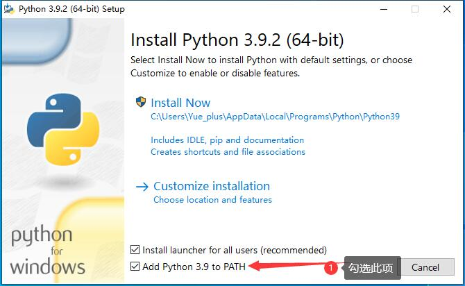

# Python

::: tip
Python 是一个高层次的结合了解释性、编译性、互动性和面向对象的脚本语言。

Python 的设计具有很强的可读性，相比其他语言经常使用英文关键字，其他语言的一些标点符号，它具有比其他语言更有特色语法结构。

[Python 官网](https://www.python.org/)
[PyPI——Python 包管理器](https://pypi.org/)
:::

## 环境配置

[前往官网](https://www.python.org/downloads/) 下载最新的 Python 安装包，安装。

安装完成后，可使用 `python --version` 指令，成功输出版本号即为安装成功。

## 教程

- [Python 基础教程 - 菜鸟教程](https://www.runoob.com/python/python-tutorial.html)
- [Python3 教程 - 菜鸟教程](https://www.runoob.com/python3/python3-tutorial.html)

## pip 包管理器

- [Python pip 安装与使用](https://www.runoob.com/w3cnote/python-pip-install-usage.html)
- [ pypi | 清华大学开源软件镜像站](https://mirrors.tuna.tsinghua.edu.cn/help/pypi/)