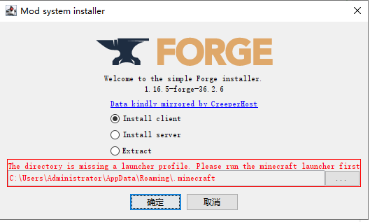
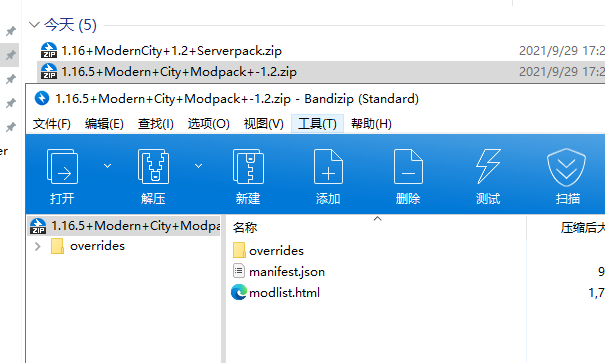

# Minecraft

::: tip
Minecraft 是一款沙盒式建造游戏，缔造者为 Mojang Studios 创始人马库斯·佩尔松，其灵感源于《无尽矿工》､《矮人要塞》和《地下城守护者》。
现首席创意官为延斯·伯根斯坦，首席开发者为昂内丝·拉尔森。
玩家可以在游戏中的三维空间里创造和破坏林林总总的方块，甚至在多人服务器与单人世界中体验不同的游戏模式，打造精妙绝伦的建筑物，创造物和艺术品。
时至今日，Minecraft 的游戏平台已囊括了移动设备和游戏主机。
:::

## 链接

- [MCBBS - Minecraft 中文论坛](https://www.mcbbs.net/)
- [HMCL 启动器](https://ci.huangyuhui.net/job/HMCL/)
- [OpenJDK](https://jdk.java.net/)
- [JavaSE](https://www.java.com/zh-CN/download/manual.jsp)
- [Minecraft Wiki](https://minecraft.fandom.com/zh/wiki/Minecraft_Wiki)
- [Minecraft Forge](https://files.minecraftforge.net/net/minecraftforge/forge/)
- [CurseForge](https://www.curseforge.com/)

## 获取游戏

前往 [Minecraft.net](https://www.minecraft.net/zh-hans) 购买 Java 版。

::: details 其他版本
- 前往 [Microsoft Store](https://www.microsoft.com/store/productId/9NBLGGH2JHXJ) 购买 Win10 版（基岩版）。
- 前往 [Google Play](https://play.google.com/store/apps/details?id=com.mojang.minecraftpe) 购买 PE 版（基岩版）。
:::

推荐使用最新的 [OpenJDK](https://jdk.java.net/) 并设置 [配置好环境变量](/coding/Java/#配置环境变量)。

由于 Java 版官方启动器速度感人，推荐使用 [HMCL](https://ci.huangyuhui.net/job/HMCL/) 启动器。

## 安装 Forge

前往 [Minecraft Forge](https://files.minecraftforge.net/net/minecraftforge/forge/)
获得 **对应版本** 的 Mod 安装器（installer）

使用命令打开安装器：`java -jar forge-1.16.5-36.2.6-installer.jar`



> - client 为客户端
> - server 为服务端

## 安装 Mod

Mod（模组）一般为 `.jar` 文件。
在安装好 Forge 后直接把 `.jar` 文件丢到 `.minecraft/mods/` 文件夹里就好了。

### CurseForge Modpack

可能会遇到一些 `.zip` 格式的“模组包（Modpack）”：



这是 [CurseForge](https://www.curseforge.com/)
的格式，需要使用他们的 [CurseForge 联机平台](https://download.curseforge.com/) 。

或者可以使用 [curseDownloader](https://github.com/portablejim/curseDownloader/releases)
工具，解析 Modpack 内的 `manifest.json` 文件来下载 `.jar` 文件。

或者也可以参照 Modpack 内的 `modlist.html` 一个个手动下载。Orz

## 服务器

### 创建服务器

1. 先获取服务器核心：

   - [Minecraft.net（官方）](https://www.minecraft.net/zh-hans/download/server)
   - [softonic（第三方）](https://minecraft-server.en.softonic.com/)

    然后复制到一个单独的文件夹。

2. 参考 [配置 Java 环境变量](/coding/Java/#配置环境变量)

3. 试着运行一次服务器：

   ```shell
   java -jar minecraft_server.1.16.5.jar -nogui
   ```

   现在文件夹内应该有以下文件：

   ```dir
   eula.txt
   logs/
   minecraft_server.1.16.5.jar
   server.properties
   ```

   需要同意 [MINECRAFT 最终用户许可协议](https://account.mojang.com/documents/minecraft_eula)，
   如果同意协议需要修改目录下的 `eula.txt` 文件：

   ```diff
    #By changing the setting below to TRUE you are indicating your agreement to our EULA (https://account.mojang.com/documents/minecraft_eula).
    #Wed Sep 29 15:13:24 CST 2021
   -eula=false
   +eula=true
   ```

4. 添加启动脚本

参考 [教程/服务器启动脚本 - Minecraft Wiki，最详细的官方我的世界百科](https://minecraft.fandom.com/zh/wiki/教程/服务器启动脚本)

### 配置服务器

参考 [Minecraft Wiki](https://minecraft.fandom.com/zh/wiki/Server.properties?variant=zh-cn)
修改服务器配置文件 `server.properties`

#### 常用配置：

##### 设置游戏难度：

`server.properties` 第 15 行：`difficulty=`

- `peaceful (0)` - 和平
- `easy (1)` - 简单
- `normal (2)` - 普通
- `hard (3)` - 困难

##### 限制服务器人数

`server.properties` 第 18 行：`max-players=20`

##### 关闭正版验证：

`server.properties` 第 22 行：`online-mode=false` 设为 `true`


