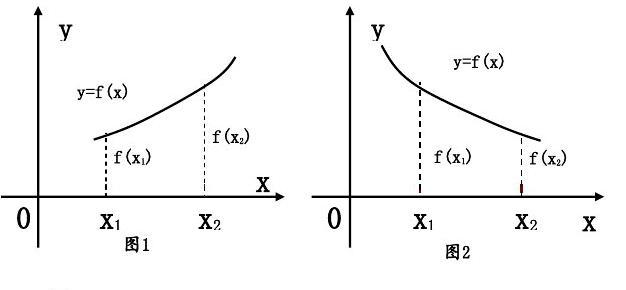

# 3.1 函数

## 3.1.1 函数的概念

### 变量与常量

[**变量（variable）**](https://baike.baidu.com/item/%E5%8F%98%E9%87%8F/5271)：没有固定的值，可以改变的量；

**常量（constant）**：保持不变的量；

### 自变量与因变量

[**自变量（Independent variable）**](https://baike.baidu.com/item/%E8%87%AA%E5%8F%98%E9%87%8F)：
能够影响其他变量的变量叫做 **自变量**。

[**因变量（dependent variable）**](https://baike.baidu.com/item/%E5%9B%A0%E5%8F%98%E9%87%8F/5872908)：
随着 **自变量** 的变化而变化，且 **自变量** 取唯一值时，**因变量**（函数）有且只有唯一值与其相对应。

### 函数三要素

[**函数**](https://baike.baidu.com/item/%E5%87%BD%E6%95%B0/301912) 的三要素是：

1. [**定义域（domain of definition）**](https://baike.baidu.com/item/%E5%AE%9A%E4%B9%89%E5%9F%9F/7879679)、
2. [**值域（range）**](https://baike.baidu.com/item/%E5%80%BC%E5%9F%9F/9707225)、
3. [**对应法则（corresponding rule）**](https://baike.baidu.com/item/%E5%AF%B9%E5%BA%94%E6%B3%95%E5%88%99/6450621)。

***`y=f(x)`***

在上式中 `x` 为 **自变量**，`y` 为 **因变量**。
自变量 `x` 的取值集合叫做函数的 **定义域**， 对应的 **因变量** 值 `y` 的集合叫做函数的 **值域**。

在上式中对 `x` 取值为 `a`，`y` 的值也随之被确定为 `b`，`b` 就叫做 `a` 的 **函数值**。

在上式中表示 *变量 `y`* 是 *变量 `x`* 的 **函数**，
其中字母 `f` 就抽象地表示 *变量 `y`* 与 *变量 `x`* 的 **对应法则**。

## 3.1.2 函数的表示方法

**函数** 概念的核心是 *变量 `y`* 与 *变量 `x`* 之间的 **对应法则**。
表示 **对应法则** 的方法是多种多样的，通常有：

### 解析法（分析法、公式法）

***`s=100t (0≤t≤2)`***

在上式中给出了 *自变量 `t`* 与 *应变量 `s`* 的关系，这种表示函数的方法叫做 [**解析法（analytic method）**](https://baike.baidu.com/item/%E8%A7%A3%E6%9E%90%E6%B3%95/650935) ，
并且这个等式叫做 *函数* 的 **解析式**。

> 也叫：**分析法** 或 **公式法**。

### 列表法

把 *函数* 的 *自变量* 与 *因变量* 的值列成表格来表示函数，这种方法叫
[**列表法**](https://baike.baidu.com/item/%E5%88%97%E8%A1%A8%E6%B3%95/12666394)。

### 图像法

用“图形”来表示 [函数的图像](https://baike.baidu.com/item/%E5%87%BD%E6%95%B0%E5%9B%BE%E5%83%8F/514135) ，
这种方法叫做 [**图像法**](https://baike.baidu.com/item/%E5%9B%BE%E8%B1%A1%E6%B3%95/3911543)。

## 3.1.3 函数的单调性

函数的 [**单调性（monotonicity）**](https://baike.baidu.com/item/%E5%8D%95%E8%B0%83%E6%80%A7/6194133)
也叫函数的增减性，可以定性描述在一个指定区间内，*函数值* 变化与 *自变量* 变化的关系。

如上图 1，函数 `f(x)` 的 *自变量* 在其定义区间内增大（或减小）时，函数值 ***也随着增大（或减小）***，这时称函数在这个区间上是 **增函数**。

如上图 2，函数 `f(x)` 的 *自变量* 在其定义区间内增大（或减小）时，函数值 ***反而随着减小（或增大）*** ，这时称函数在这个区间上是 **减函数**。

## 3.1.4 函数的奇偶性

### 奇函数

若对函数 `f(x)` 定义域内的任意一个 `x` 值，都有 ***`f(-x)=-f(x)`***，则称之为 **奇函数**。

***一个函数是奇函数的充要条件是，它的图象是以坐标原点为对称中心的中心对称图形。***

### 偶函数

若对函数 `f(x)` 定义域内的任意一个 `x` 值，都有 ***`f(-x)=f(x)`***，则称之为 **偶函数**。

***一个函数是偶函数的充要条件是，它的图象是以 `y` 轴为对称轴的轴对称图形。***
