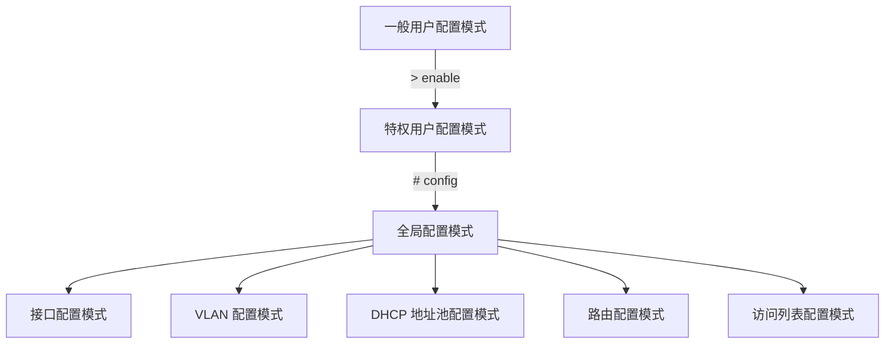

# 网络基础

## 常用软件下载

- [SecureCRT（配置终端软件）](https://www.vandyke.com/cgi-bin/releases.php?product=securecrt)
- [Z-TEK 官网（串口转 USB 口线驱动）](http://www.z-tek.com.cn/index.php?catid=13)

## 网线接法


## 使用设备列表

- [DCN S4600 系列全千兆绿色智能安全接入交换机](http://www.dcnetworks.com.cn/goods/43.html)
- [DCN S5750E 系列绿色智能万兆安全汇聚接入交换机](http://www.dcnetworks.com.cn/goods/24.html)
  + 开机时间：约 4m35s  
- [DCN DCFW-1800E-N3002-Pro下一代防火墙](http://www.dcnetworks.com.cn/goods/148.html)
- [DCN DCR-2655 模块化路由器](http://www.dcnetworks.com.cn/goods/131.html)
- [DCN DCWS-6028 有线无线智能一体化控制器](http://www.dcnetworks.com.cn/goods/146.html)
- [DCN WL8200-I2 室内放装型无线AP](http://www.dcnetworks.com.cn/goods/26.html)

> [DCC-CRL 1000 云服务实训平台](/serve/VM/Cloud/)

## 使用 SecureCRT

从[常用软件下载](#常用软件下载)，前往官网下载并安装 SecureCRT 软件（可免费试用 30 天）与串口转 USB 口线驱动。

### 连接网络设备

协议（Protocol）一般为 `Serial`。
波特率（Baud rate）一般为 `9600` 或 `115200`


### 设置中文

在网络设备上输入以下指令切换到中文帮助：

```sh
language chinese
```

设置 SecureCRT 软件的文本编码为 `简体中文 GB2312`，**防止乱码**：


## 使用 CLI 进行配置管理

### 配置模式介绍



#### 一般用户模式

进入 CLI 界面，首先进入的就是 **一般用户模式**，提示符为 `Switch>`，符号 `>` 为 **一般用户模式** 的提示符。
当从 **特权用户模式** 使用命令 `exit` 退出时，可以回到一般用户模式。

#### 特权用户模式
在 **一般用户模式** 使用 `enable` 命令，如果已经配置了进入特权用户的口令，则输入相应的特权用户口令，即可进入 **特权用户模式** “Switch#”。
当从 **全局配置模式** 使用 `exit` 退出时，也可以回到 **特权用户模式**。
另外交换机提供 <kbd>Ctrl</kbd> + <kbd>z</kbd> 的快捷键，使得交换机在任何配置模式（一般用户模式除外），都可以退回到 **特权用户模式**。

在 **特权用户模式** 下，可以查询交换机配置信息、各个端口的连接情况、收发数据统计等。
而且进入 **特权用户模式** 后，可以进入到全局模式对交换机的各项配置进行修改，因此进入 **特权用户模式** 后必须要设置特权用户口令，防止非特权用户的非法使用，对交换机配置进行恶意修改，造成不必要的损失。

#### 全局配置模式

进入 **特权用户模式** 后，只需使用命令 `config`，即可进入 **全局配置模式** `Switch(config)#`。
当在其他配置模式，如接口配置模式、VLAN 配置模式时，可以使用命令 `exit` 退回到全局配置模式。

在 **全局配置模式** 可以对交换机进行全局性的配置，如对 MAC 地址表、端口镜像、创建 VLAN、启动 IGMP Snooping、STP 等。
在 **全局配置模式** 还可通过命令进入到接口配置模式对各个接口进行配置。

##### 接口配置模式

在全局配置模式，使用命令 `interface` 就可以进入到相应的接口配置模式。
交换机操作系统提供了三种端口类型，因此有三种接口的配置模式：

1. **VLAN 接口**
   - 在 **全局配置模式** 下，输入命令：`interface vlan <Vlan-id>`
   - 可配置交换机的 IP 等
  
2. **以太网端口**
   - 在 **全局配置模式** 下，输入命令：`interface ethernet <interface-list>`
   - 可配置交换机提供的以太网接口的双工模式、速率等

3. **port-channel**
   - 在 **全局配置模式** 下，输入命令：`interface port-channel <port-channel-number>`
   - 可配置 port-channel 有关的双工模式、速率等。

***使用 `exit` 命令退回全局配置模式***

##### VLAN 配置模式

在 **全局配置模式**，使用命令 `vlan <vlan-id>` 就可以进入到相应的 VLAN 配置模式。
在 **VLAN 配置模式**，可以配置属于本 VLAN 的成员端口。
执行 `exit` 命令即可从 VLAN 配置模式退回到全局配置模式。

##### DHCP 地址池配置模式

在 **全局配置模式** 下用 `ip dhcp pool <name>` 命令进入到 **DHCP 地址池配置模式** `Switch(Config-<name>-dhcp)#`。
在 **DHCP 地址池配置模式** 下可以配置 DHCP 地址池的属性。
执行 `exit` 命令即可从 DHCP 地址池配置模式退回到全局配置模式。

##### 路由配置模式

- **RIP 路由协议**
  + 在全局配置模式下输入 `router rip` 命令，可配置 RIP 协议参数

- **OSPF 路由协议**
  + 在全局配置模式下输入 `router ospf` 命令，可配置 OSPF 协议参数

- **BGP 路由协议**
  + 在全局配置模式下输入 `router bgp <AS number>` 命令，可配置 BGP 协议参数

***使用 `exit` 命令退回全局配置模式***

##### 访问列表配置模式

- **命名标准 IP 访问列表配置模式**
  + 在全局配置模式下输入 `ipaccess-list standard` 命令，可配置扩展访问列表配置模式。

- **命名扩展 IP 访问列表配置模式**
  + 在全局配置模式下输入 `ipaccess-list extanded` 命令，可配置扩展访问列表配置模式。

***使用 `exit` 命令退回全局配置模式***

### CLI 配置语法

交换机提供的配置命令形式不完全一样，但都遵循交换机配置命令的语法。
以下是交换机提供的通用命令格式：

```text
cmdtxt <variable> {enum1 | … | enumN} [option1 | … | optionN]
```

语法说明：
- `cmdtxt` 表示命令关键字
- `<variable>` 表示参数为变量
- `{enum1 | … |enumN }` 表示在参数集 enum1 ~ enumN 中必须选一个参数
- `[option1 | … | optionN]` 表示该参数可选择一个或者不选

在各种命令中还会出现 `< >`、`{ }`、`[ ]` 符号的组合使用，如：

`[<variable>]`、`{enum1 <variable> | enum2}`、`[option1 [option2]]` 等等。

下面是几种配置命令语法的具体分析：
- `show version`，没有任何参数，属于只有关键字没有参数的命令，直接输入命令即可；
- `vlan <vlan-id>`，输入关键字后，还需要输入相应的参数值；
- `firewall {enable | disable}`，此类命令用户可以输入 `firewall enable` 或者 `firewall disable`；
- `snmp-server community {ro | rw} <string>`，出现以下几种输入情况：
  + `snmp-server community ro <string>`
  + `snmp-server community rw <string>`

### 键盘快捷键

交换机为方便用户的配置，特别提供了多个快捷键，如上、下、左、右键（方向键）及删除键 <kbd>BackSpace</kbd> 等。
如果超级终端不支持上下光标键的识别，可以使用 <kbd>Ctrl</kbd> + <kbd>P</kbd> 与 <kbd>Ctrl</kbd> + <kbd>N</kbd> 来替代。

- <kbd>BackSpace</kbd>（删除键）
  + 删除光标所在位置的前一个字符，光标前移

- <kbd>↑</kbd> | <kbd>↓</kbd>（上下方向键）或 <kbd>Ctrl</kbd> + <kbd>P</kbd> | <kbd>N</kbd>
  + 翻找曾经使用过的命令（最多记录 20 条）

- <kbd>←</kbd> | <kbd>→</kbd>（左右方向键）或 <kbd>Ctrl</kbd> + <kbd>B</kbd> | <kbd>F</kbd>
  + 左右移动光标，可用于修改当前输入的命令

- <kbd>Ctrl</kbd> + <kbd>Z</kbd>
  + 从其他配置模式（一般用户配置模式除外）直接退回到特权用户模式

- <kbd>Ctrl</kbd> + <kbd>C</kbd>
  + 打断交换机 ping 或其它正在执行的命令进程

- <kbd>Tab</kbd>
  + 自动补全命令

### 查看帮助

- `help`
  + 在任一命令模式下，输入 `help` 命令均可获取有关帮助系统的简单描述。
- `?`
  + 在任一命令模式下，输入 `?` 获取该命令模式下的所有命令及其简单描述
  + 在命令的关键字后，输入以空格分隔的 `?`，若该位置是参数，会输出该参数类型、范围等描述；
    若该位置是关键字，则列出关键字的集合及其简单描述；
    若输出 `<cr>` ，则此命令已输入完整，在该处键入回车即可执行命令；
  + 在字符串后紧接着输入 `?`，会列出以该字符串开头的所有命令

### 不完全匹配指令（缺省指令）

交换机的 Shell 支持不完全匹配的搜索命令与关键字，当输入无冲突的命令或关键字时，Shell 就会正确解析。

例如：
- 对特权用户配置命令 `show interface ethernet 1/0/1`，只要输入 `sh in e 1/0/1` 即可。
- 对特权用户配置命令 `show running-config`，如果仅输入 `sh r`，系统会报 `>Ambiguous command!`，因为 Shell 无法区分 `show r` 是 `show radius` 命令还是 `show running-config` 命令，因此必须输入 `sh ru`，Shell 才能正确的解析。

## 使用网页管理

通过网页管理交换机的 **必要条件**：

1. 交换机配置IPv4/IPv6 地址；
2. 作为客户端的主机 IPv4/IPv6 地址与其所属交换机的 VLAN 接口的 IPv4/IPv6 地址在相同网段；
3. 若不满足第 2 条，那么客户端可以通过路由器等设备到达交换机某个IPv4/IPv6 地址。
   与 Telnet 用户登录交换机类似，只要主机能够 ping/ping6 通交换机的 IPv4/IPv6 地址，并且输入正确的登录口令，该主机就可通过 HTTP 访问交换机。

### 启动交换机的 HTTP Server 功能

参考 [使用 CLI 进行配置管理](#使用-cli-进行配置管理)，使用 `ip http server` 指令开启 Web Server 功能。

```text {4}
S5750E-28C-SI>enable 
S5750E-28C-SI#config terminal 
S5750E-28C-SI(config)#ip http server 
web server has worked
```

### 设置管理员用户

登录到 Web 的配置界面，需要输入正确的用户名和口令，否则交换机将拒绝该 HTTP 访问。
该项措施是为了保护交换机免受非授权用户的非法操作。
若交换机没有设置授权 Web 用户，则任何用户都无法进入交换机的 Web 配置界面。

因此在允许 Web 方式管理交换机时，必须在 Console 方式下的全局配置模式下使用命令
`username <username> privilege <privilege> [password (0 | 7)<password>]`
为交换机设置 Web 授权用户和口令并使用命令
`authentication line web login local`
打开本地验证方式，其中 `privilege` 选项必须存在且为15。

如交换机的授权用户名为 admin，口令为明文的 admin，设置方式如下：

```text
Switch>enable
Switch#config
Switch(config)#username admin privilege 15 password 0 admin
Switch(config)#authentication line web login local
```

### 浏览器访问配置页面

::: tip
当前配置页面 <http://192.168.100.1/>
:::

在使用 IPv6 地址访问交换机时，推荐使用 Firefox 浏览器，版本在 1.5 以上，比如交换机的 IPv6 地址为 `3ffe:506:1:2::3`，在地址处输入交换机的 IPv6 地址 `http://[3ffe:506:1:2::3]`，地址需要用方括号括起来。


## 设备恢复出厂设置

<!--
### [DCN S4600 系列全千兆绿色智能安全接入交换机](http://www.dcnetworks.com.cn/goods/43.html)
-->

### [DCN S5750E 系列绿色智能万兆安全汇聚接入交换机](http://www.dcnetworks.com.cn/goods/24.html)

```text
S5750E-28C-SI>enable
S5750E-28C-SI#set default 
Are you sure? [Y/N] = y
S5750E-28C-SI#write
Nov 03 14:56:20:000 2020 S5750E-28C-SI MODULE_CONFIG_SHELL/3/:Switch configuration has been set default!
NULL(factory config) will be used as the startup-config file on member 1, slot 1 at the next time!
S5750E-28C-SI#reload
Process with reboot? [Y/N] y
```

<!-- ### [DCN DCFW-1800E-N3002-Pro下一代防火墙](http://www.dcnetworks.com.cn/goods/148.html) -->

### [DCN DCR-2655 模块化路由器](http://www.dcnetworks.com.cn/goods/131.html)

进入 CLI 界面，输入：

```text {1,3,5}
Router>enable
Router#Jan  1 00:36:39 Unknown user enter privilege mode from console 0, level = 15
Router#reset
Incomplete command
Router#write   
Saving current configuration...
OK!
```

### [DCN DCWS-6028 无线控制器](http://www.dcnetworks.com.cn/goods/120.html)

在开机（能进入配置 CLI）后，用回形针戳下一 **RST** 孔。

<!-- ### [DCN WL8200-I2 室内放装型无线AP](http://www.dcnetworks.com.cn/goods/26.html) -->

## 推荐阅读

- [《计算机网络 - 自顶向下方法》](https://book.douban.com/subject/30280001/)
  + 
