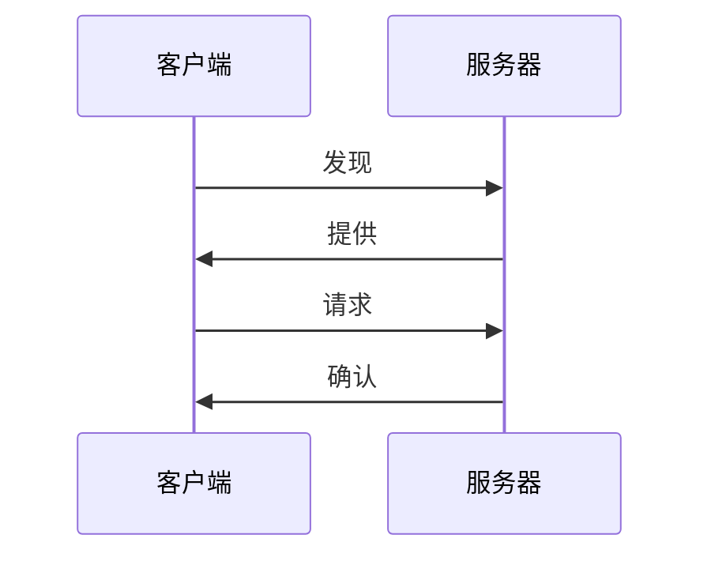

# DHCP（动态主机配置协议）

::: tip
DHCP（Dynamic Host Configuration Protocol）<sup>[RFC2131](https://datatracker.ietf.org/doc/rfc2131/?include_text=1)</sup> 是动态主机配置协议的简写，它能从地址池中把 IP 地址动态分配给请求的主机，同时也能够提供其它网络配置参数，如：缺省网关、DNS服务器、域名与网络范围内主机映像文件的位置等。
:::

DHCP 是 BOOTP 协议功能的增强，与 BOOTP 相比，DHCP 是主流技术，它不仅能为无盘工作站提供引导信息，而且在大型的网络中可以大大减轻网络管理员跟踪记录手工分配 IP 地址的负担，同时也能减轻用户的配置任务与花费。

DHCP 的另外一个优点是可以部分缓解 IP 地址紧张的状况，当某一 IP 地址的用户离开使用环境时，该 IP 地址还能再次分配给其他用户使用。

DHCP 是基于 Client－Server 模式的协议，DHCP 客户端向 DHCP 服务器索取网络地址及配置参数；
服务器为客户端提供网络地址及配置参数；
当客户端与服务器不在同一子网时，需要由 DHCP 中继为客户端与服务器传递 DHCP 报文。

DHCP 实现的过程如下：



图解：

1. 首先客户端在本子网内广播 DHCPDISCOVER 包；
2. 服务器收到 DHCPDISCOVER 包后，给该客户端发送带有 IP 地址与其他网络参数的 DHCPOFFER 包；
3. 客户端对收到的 DHCPOFFER 包进行选择后，广播带有它要选择的服务器的信息的 DHCPREQUEST 包；
4. 被客户端选中的服务器向客户端发送 DHCPACK 包，客户端得到 IP 地址与其他网络配置参数。

通过上面四个步骤，完成动态分配主机配置的协议过程。
但如果服务器与客户端不在同一网络时，服务器是无法收到客户端发出的 DHCP 广播报文，因此服务器也不会给客户端发送任何 DHCP 报文，这时需要 DHCP 中继来转发报文，完成客户端与服务器之间的 DHCP 报文交互过程。
交换机实现了服务器和 DHCP 中继的功能。
服务器不但支持动态分配 IP 地址，还支持手动绑定 IP 地址（即为指定的硬件地址或者指定设备标识的网络设备分配一个固定的长期的 IP 地址）。

动态分配 IP 地址与手动绑定 IP 地址的区别与联系是：

1. 采用动态方式获得的 IP 地址可以是不固定的；而采用手动绑定方式获得的 IP 地址是固定的；
2. 采用动态方式获得的 IP 地址租期与其地址池的租期一致，是有时间限制的；而采用手动绑定方式获得的 IP 地址的租期理论上是无限长时间，即没有时间限制；
3. 已经动态分配出去的地址，不允许再手动绑定；
4. 手动 DHCP 地址池可以继承相关网段的动态 DHCP 地址池的网络配置参数。

## DHCP 服务器配置

::: tip
使用设备：
   [DCN S5750E 系列绿色智能万兆安全汇聚接入交换机](http://www.dcnetworks.com.cn/goods/24.html)
:::

### 启动/关闭 DHCP 服务功能

**全局配置模式** 下：

- **启用**：
  ```text
  S5750E-28C-SI(config)#service dhcp
  ```
- **禁用**：
  ```text
  S5750E-28C-SI(config)#no service dhcp
  ```

### 配置 DHCP 地址池

**全局配置模式** 下：

- 创建 DHCP 地址池
  ```text
  S5750E-28C-SI(config)#ip dhcp pool <name>
  ```
- 创建 DHCP 地址池
  ```text
  S5750E-28C-SI(config)#no ip dhcp pool <name>
  ```

### 配置动态 DHCP 地址池的参数

**DHCP 地址池配置模式** 下：

```text

```

## 相关命令

### [DHCP 配置命令](./command/DHCP.md)

<!--
#### DHCP服务器配置命令

- [bootfile](./command/DHCP.html#bootfile)
- [clear ip dhcp binding](./command/DHCP.html#clear-ip-dhcp-binding)
- [clear ip dhcp conflict](./command/DHCP.html#clear-ip-dhcp-conflict)
- [clear ip dhcp server statistics](./command/DHCP.html#clear-ip-dhcp-server-statistics)
- [client-identifier](./command/DHCP.html#)
- [debug ip dhcp client](./command/DHCP.html#)
- [debug ip dhcp relay](./command/DHCP.html#)
- [debug ip dhcp server](./command/DHCP.html#)
- [default-router](./command/DHCP.html#)
- [dns-server](./command/DHCP.html#)
- [domain-name](./command/DHCP.html#)
- [hardware-address](./command/DHCP.html#)
- [host]()
-->

## 相关链接

- [DHCP - 百度百科](https://baike.baidu.com/item/DHCP/218195?fr=aladdin)
