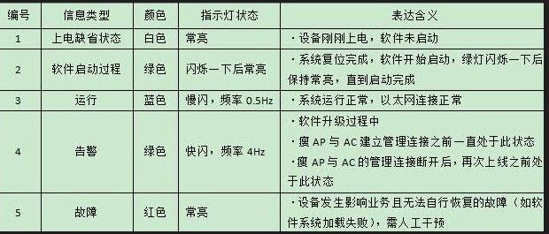

# AC/AP 配置

## AP 指示灯状态



## ap上线:
```shell script
config)#vlan 10
config)#int vlan 10
config)#ip add 192.168.10.254 255.255.255.0
config)#int e1/0/1
config)#swi mode trunk 
config)#swi trunk native vlan 10      /*指定VLAN10通过*/
config)#exit
config)#wireless                      /*进入无线设置*/
config)#enable                        /*开启无线功能*/
config)#discovery vlan-list 10        /*设置ACvlan10二层发现*/
config)#ap database 00-03-0f-78-d8-00 /*绑定AP的mac地址*/
```
## ①AP管理:
```shell script
AC发现AP
二层发现
DCWS-6028(P)(config-wireless)#discovery vlan-list 1 //指定VLAN发现列表
DCWS-6028(P)(config-wireless)# ap database xx-xx-xx-xx-xx-xx  //添加AP MAC地址

AP发现AC

AP配置
DCN-WLAN-AP# set management static-ip 192.168.2.1  //配置静态IP
DCN-WLAN-AP# set management static-mask 255.255.255.0  //配置掩码
DCN-WLAN-AP# set static-ip-route gateway 192.168.2.2   //配置默认网关
AC配置
DCWS-6028(P)(config-wireless)# discovery ip-list 192.168.2.1  //指定AP IP
DCWS-6028(P)(config-wireless)# ap database xx-xx-xx-xx-xx-xx  //添加AP MAC地址

AP静态发现
DCN-WLAN-AP# set managed-ap switch-address-1 192.168.1.1	//设置第一个AC地址
DCN-WLAN-AP# set managed-ap switch-address-2 192.168.2.2	//设置第二个AC地址
Option下发AC地址
DCWS(config)#ip dhcp pool ap
DCWS(dhcp-ap-config)#option 43 hex 01040A090005	//0104为固定值，后接IP地址16进制
```
## ②AP认证:
```shell script
无验证
DCWS(config-wireless)#ap authentication none

MAC地址验证
DCWS(config-wireless)#ap authe mac //设置AP验证方式为mac地址验证
DCWS(config-wireless)#ap database xx-xx-xx-xx-xx-xx //手动添加AP database 条目

密码验证
AP配置
AP# set managed-ap pass-phrase 12345678	//设置认证密码
AC配置
DCWS(config-wireless)#ap authentication pass-phrase 
DCWS(config-wireless)#ap database xx-xx-xx-xx-xx-xx            
DCWS(config-ap)#password plain 12345678	//设置AP认证密码

序列号认证

AP操作
AP# get system 
Property          Value
---------------------------------------------------------------
model             Wireless Infrastructure Platform Reference AP
version           2.0.20.15
altversion        2.0.20.15
protocol-version  2
base-mac          xx:xx:xx:xx:xx:xx
serial-number     WL013210FA24000118	//序列号
system-name       
system-contact    
system-location   
apmode            fit
AC操作
AC(config)#wireless 
AC(config-wireless)# ap authentication serial-num
AC(config-wireless)# ap database xx-xx-xx-xx-xx-xx 
AC(config-ap)#serial-num WL013210FA24000118

AP逃生
DCWS(config-wireless)#ap prof 1
DCWS(config-ap-profile)#ap escape //开启AP逃生模式
修改AP配置文件
AC(config-ap)#profile 3 //在AP配置模式下()
修改AP管理VLAN
AC(config-ap-profile)#management vlan 4094 
AC(config-ap-profile)#wireless ap profile apply 1
```
## 本地Portal认证:
```sh
 AC(config)#captive-portal    //进入captive-portal模式
  AC(config-cp)#enable    //开启Protal功能
  AC(config-cp)#authentication-type internal    //认证类型为内置Protal
  AC(config-cp)#user user1    //创建并设置用户 user1
  AC(config-cp-local-user)#password 123456    //设置账户的密码为 123456
  AC(config-cp-local-user)#group 0    //用户加入组 group 0
  AC(config-cp-local-user)#!
  AC(config-cp)#configuration 1    //进入captive-portal 配置1
  AC(config-cp-instance)#enable    //开启此配置
  AC(config-cp-instance)#verification local    //设置验证模式为本地
  AC(config-cp-instance)#group 0    //绑定Group 0 组
  AC(config-cp-instance)#auth-method mac-ip-based    //设置认证方式为基于MAC-IP
  AC(config-cp-instance)#interface ws-network 1    //绑定无线网络 (对应配置下发时的 Network 对应一个VAP)
```
## ARP抑制:
```sh
AC(config)# wireless 
AC(config-wireless)#network 1 
AC(config-network)# arp-suppression
```   
## 设置IP地址信息:
```shell script
AP# set management static-ip 192.168.2.1 //设置IP
AP# set static-ip-route management gateway 192.168.2.254    //配置网关
AP# set management static-mask 255.255.255.0  //设置掩码
AP# set management dhcp-status down //关闭DHCP
AP# set management dhcp-status up   //开启DHCP
AP# set managed-ap switch-address-1 1.1.1.1 //设置主AC地址
AP# set managed-ap switch-address-2 2.2.2.2 //设置备用AC地址
AP# set managed-ap switch-address-2 3.3.3.3 //设置备用AC地址
AP# set management vlan-id 1  //设置管理VLAN

DCN-WLAN-AP# factory-reset   //重置AP

AP#switch-apmode fat   //瘦AP转胖AP

AP#switch-apmode fit    //胖AP转瘦AP
```
## WEP认证:
```shell script
DCWS(config-network)#Sec mode static-wep 	//设置认证方式为WEP
DCWS(config-network)#wep key length 64		//设置key长度，64为5位，128为13位
DCWS(config-network)#wep key type ascii		//设置WEP密钥类型
DCWS(config-network)#wep key  1 12345		//设置WEP密钥
```
## WPA个人版:
```shell script
DCWS(config-wireless)#network 1
DCWS(config-network)#Sec mode wpa-per 	//设置认证方式为WPA个人版
DCWS(config-network)#wpa ciphers tkip 	//设置WPA加密方式为Tkip
DCWS(config-network)#wpa key tikp123456789	//设置WPA密钥
```
## AC配置:
```shell script
DCWS(config)#dot1x enable      //开启dot1x认证
DCWS(config)#radius-server authentication host 172.16.5.164 key 0 123 //设置服务器地址和key
DCWS(config)#radius source-ipv4 172.16.5.233  //设置源地址
DCWS(config)#radius nas-ipv4 172.16.5.233     //设置NAS地址
DCWS(config)#aaa enable
DCWS(config)#!
DCWS(config)#aaa group server radius 2012    //设置AAA组
DCWS(config-sg-radius)# server 172.16.5.164    //添加服务器
DCWS(config-sg-radius)#!
DCWS(config)#wireless
DCWS(config-wireless)# radius server-name auth 2012 //调用AAA服务器组
DCWS(config-wireless)# network 1
DCWS(config-network)#  radius server-name auth 2012    //调用AAA服务器组
DCWS(config-network)#  security mode wpa-enterprise    //设置无线企业认证
DCWS(config-network)#  ssid radius
DCWS(config-network)#  vlan 20
```
## 本地Portal认证:
```shell script
AC(config)#captive-portal    //进入captive-portal模式
AC(config-cp)#enable    //开启Protal功能
AC(config-cp)#authentication-type internal    //认证类型为内置Protal
AC(config-cp)#user user1    //创建并设置用户 user1
AC(config-cp-local-user)#password 123456    //设置账户的密码为 123456
AC(config-cp-local-user)#group 0    //用户加入组 group 0
AC(config-cp-local-user)#!
AC(config-cp)#configuration 1    //进入captive-portal 配置1
AC(config-cp-instance)#enable    //开启此配置
AC(config-cp-instance)#verification local    //设置验证模式为本地
AC(config-cp-instance)#group 0    //绑定Group 0 组
AC(config-cp-instance)#auth-method mac-ip-based    //设置认证方式为基于MAC-IP
AC(config-cp-instance)#interface ws-network 1    //绑定无线网络 (对应配置下发时的 Network 对应一个VAP)
```
## 动态黑名单:
```shell script
DCWS(config-wireless)#dynamic-blacklist //开启动态黑名单功能
DCWS(config-wireless)#network 1
DCWS(config-network)#mac authentication local //开启MAC本地验证
```
## MAC认证:
```shell script
只允许已添加MAC的终端连接AP，或阻止已添加MAC的终端连接AP

只允许已添加MAC的终端连接AP
DCWS-6028(config-wireless)#mac-authentication-modewhite-list	//开启MAC白名单模式
DCWS-6028(config-wireless)#known-client 00-11-11-11-11-11 action global-action	//添加MAC地址
DCWS-6028(config-wireless)#network 1
DCWS-6028(config-network)#mac authentication local	//开启MAC本地认证

阻止已添加MAC的终端连接AP
DCWS-6028(config-wireless)#mac-authentication-modeblack-list	//开启黑名单模式
DCWS-6028(config-wireless)#known-client 00-22-22-22-22-22action global-action	//添加MAC地址
DCWS-6028(config-wireless)#network 1
DCWS-6028(config-network)#mac authentication local	//开启MAC本地认证

配置完成后需下发AP生效
DCWS-6028#wireless approfile apply 1
```
## 最大接入用户数:
```shell script
DCWS(config-network)#max-clients 10  //最大接入10个用户

DCWS(config-network)#offline-detect idle-timeout 300  //用户老化时间为300秒
```
## 限制接入时间:
```shell script
DCWS(config-network)#time-limit from 09:00 to 18:00 weekday monday  //星期一 09:00 到 18:00 不允许接入无线网络
```
## ARP抑制:
```shell script
AC(config)# wireless 
AC(config-wireless)#network 1 
AC(config-network)# arp-suppression

Anti-flood
防止AP泛洪攻击，检测时间为10分钟，最大连接次数为5次，老化时间为60分钟
AC(config-wireless)# wireless ap anti-flood
AC(config-wireless)# wireless ap anti-flood interval 10
AC(config-wireless)# wireless ap anti-flood max-conn-count 5
AC(config-wireless)# wireless ap anti-flood agetime 60
```
## 隐藏SSID:
```shell script
DCWS(config-network)#hide-ssid
```
## 射频管理:
```shell script
调整射频工作模式
DCWS-6028(config-wireless)#ap profile 1
DCWS-6028(config-ap-profile)#radio 1
DCWS-6028(config-ap-profile-radio)#mode bg-n

设置AP的功率和信道
调整完需重启AP生效
DCWS-6028(config-wireless)#ap database 00-03-0f-19-71-e0
DCWS-6028(config-ap)#radio 1 channel 11
The valid AP entry is updated. This AP is already managed, to update the managed AP configuration with the new value(s) you need to reset the AP.
DCWS-6028(config-ap)#radio 1 power 50
```
## 自动信道调整:
>自动信道调整有三种方式：手动触发、周期性触发和固定时间触发
 如果为AP设置了固定信道，则不能对此AP进行自动信道调整
 自动信道调整功能默认是开启的

> 手动触发方式
  DCWS-6028(config-wireless)#channel-planbgn mode manual 
  DCWS-6028#wireless channel-plan bgnstart
  wirelessCalculate80211ChannelAdjustment successfuly added proposed entry to ap=00-03-0f-19-71-e0
  DCWS-6028#wirelesschannel-plan bgn apply
  周期性触发方式
  DCWS-6028(config-wireless)#channel-plan bgnmode interval
  DCWS-6028(config-wireless)#channel-plan bgninterval 720
  固定时间触发方式
  DCWS-6028(config-wireless)#channel-plan bgnmode time
  DCWS-6028(config-wireless)#channel-plan bgntime 23:00

> 自动功率调整
  自动功率调整有两种方式：手动触发和周期性触发
  如果为AP配置了固定功率，则不能对此AP进行自动功率调整

## 手动触发方式:
```shell script
DCWS-6028(config-wireless)#ap profile 1
DCWS-6028(config-ap-profile)#radio 1
DCWS-6028(config-ap-profile-radio)#power auto 
DCWS-6028(config-wireless)#power-plan mode manual
DCWS-6028#wireless power-plan start
DCWS-6028#wireless power-plan apply
```
## 周期性触发方式:
```shell script
DCWS-6028(config-wireless)#approfile 1
DCWS-6028(config-ap-profile)#radio 1
DCWS-6028(config-ap-profile-radio)#power auto 
DCWS-6028(config-ap-profile-radio)#exit
DCWS-6028(config-ap-profile)#exit
DCWS-6028(config-wireless)#power-plan mode interval 
DCWS-6028(config-wireless)#power-plan interval 720
```
## 支持速率集:
```shell script
AC(config- ap-profile-radio)#mode bg 
AC(config- ap-profile-radio)#rate basic 54 //设置基本速率集
DCWS(config-ap-profile-radio)#rate supported 54 //设置支持速率集
```
## 无线隔离
```shell script
DCWS(config-wireless)#network 1
DCWS(config-network)#station-isolation

同一radio下用户隔离
DCWS(config-wireless)#ap profile 1
DCWS(config-ap-profile)#radio 1
DCWS(config-ap-profile-radio)#station-isolation
```
## 无线强制漫游:
```sh
DCWS(config-wireless)#force-roaming mode auto //开启自动强制漫游功能
DCWS(config-wireless)#force-roaming mode auto interval 15  //自动强制漫游功能的执行周期为15分钟。
DCWS(config-wireless)#force-roaming rssi-threshold 10   //设置RSSI阈值，为10%
DCWS(config-wireless)#force-roaming denial-count 5       //设置自动强制漫游拒绝次数门限为5次
DCWS(config-wireless)#force-roaming denial-timeout 1  //设置拒绝次数门限老化为1小时
DCWS(config-wireless)#force-roaming hysteresis 4    //设置符合强制漫游的信号强度差值为4%.
DCWS#wireless force-roaming client aa-aa-aa-aa-aa-aa start  //手动发起漫游功能
```  
## 分布式转发:
```shell script
DCWS-6028(P)(config-network)#dist-tunnel //该Network的流量开启分布式转发
```
## 集中转发:
```shell script
DCWS(config-wireless)#l2tunnel vlan-list add 10;20	//设置VLAN10 VLAN20的流量为集中转发
```
## 限速:
```shell script
DCWS(config-wireless)#ap client-qos	//开启AP QoS
DCWS(config-wireless)#network 1
DCWS(config-network)#client-qos bandwidth-limit down 5120	//限速下行速率为5Mb/s
DCWS(config-network)#client-qos bandwidth-limit up 2048		//限速上行速率为2Mb/s
```
## 时空公平调度:
```shell script
DCWS(config-ap-profile-radio)#schedule-mode preferred	//开启时空公平调度
```
## 常用维护命令 AC常用维护命令:
> DCWS-6028#show wireless ap status    //查看AP的注册和配置状态
  	    MAC Address                                            Configuration                
  	 (*) Peer Managed  IP Address Profile Status     Status           Age      
  	------------------ --------------- ------- ------- ------------- -------------- -------------
  	 00-03-0f-19-71-e0 192.168.1.10    1  Managed Success   d:00:00:01
  	Total Access Points............................ 1
  
  
  DCWS-6028#show wireless ap failure status  //查看AP的注册失败信息
  
  DCWS-6028#wireless approfile apply 1   //下发配置
  
  DCWS(config-ap-profile)#hwtype 29   //设置硬件类型
  
  
  DCWS(config-ap-profile)#show wir ap 00-03-0f-5b-f0-e0 status | i Type   //查看硬件版本1
  Hardware Type.................................. 29 - WL8200-I2, Indoor Dual Radio a/n/ac, b/g/n
  CPU Type....................................... AR9344-533
  
  
  DCWS#show vendor | i WL8200-I2   //查看硬件版本2
                            29 WL8200-I2        R1    WL8200-I2, Indoor Dual Radio a/n/ac, b/g/n
  
  DCWS-6028# show wireless   //查看AC的无线状态，可以看到无线功能是否开启，无线IP地址信息，国家代码信息，管理的AP数量等
  DCWS-6028# show wireless status   //查看AC的无线状态，可以看到无线功能是否开启，无线IP地址信息，国家代码信息，管理的AP数量等
  
  DCWS-6028#showwireless ap 00-03-0f-19-71-e0 status   //查看AP的详细信息，可以看到AP的MAC地址、IP地址、硬件类型及型号、软件版本、序列号等
    MACaddress.................................... 00-03-0f-19-71-e0
    Location.......................................
    IPAddress..................................... 192.168.1.10
    IP SubnetMask................................. 255.255.255.0
    … …
  
  DCWS-6028#show wireless ap radio status   //查看AP的射频信息
  	 DCWS-6028#show wireless ap 00-03-0f-19-71-e0 radio status 
  	     MAC Address                                                     Transmit     Auth. 
  	 (*) Peer Managed   Location        Radio Channel Power (%) Clients
  	     ------------------       -----------          -----       -------    --------         -------
  	 00-03-0f-19-71-e0                           1           11          100            0      
                                                                    2          149         100            0
  
  DCWS-6028#show wireless client status      //查看无线终端信息
  	   MAC Address                                                             
  	 (*) Peer Managed  VAP MAC Address SSID  Status Network Time 
   	     ------------------            -----------------          -------   ---------      -----------
  	 00-1c-bf-21-85-90 00-03-0f-19-71-e1       wlan    Auth    0d:00:00:05
  	Total Clients Associated To Local Switch....... 1
  	Total Clients Associated To Peer Switches...... 0
  
  重启AP，可以重启所有AP，也可以单独重启某一台AP
  DCWS-6028#wireless ap reset
  DCWS-6028#wireless ap reset 00-03-0f-19-71-e0
  
  AP常用维护命令
  获取地址信息
  AP# get management 
  Property                   Value
  --------------------------------------------
  vlan-id                    1
  interface                  brvlan1
  static-ip                  192.168.2.1
  static-mask                255.255.255.0
  ip                         192.168.2.1
  mask                       255.255.255.0
  ipv6                       
  ipv6-prefix-length         0
  mac                        xx:xx:xx:xx:xx:xx
  dhcp-status                up
  dhcpv6-status              up
  ipv6-status                up
  ipv6-autoconfig-status     up
  static-ipv6                
  static-ipv6-prefix-length  0
## 设置IP地址信息:
```shell script
AP# set management static-ip 192.168.2.1 //设置IP
AP# set static-ip-route management gateway 192.168.2.254    //配置网关
AP# set management static-mask 255.255.255.0  //设置掩码
AP# set management dhcp-status down //关闭DHCP
AP# set management dhcp-status up   //开启DHCP
AP# set managed-ap switch-address-1 1.1.1.1 //设置主AC地址
AP# set managed-ap switch-address-2 2.2.2.2 //设置备用AC地址
AP# set managed-ap switch-address-2 3.3.3.3 //设置备用AC地址
```
   


