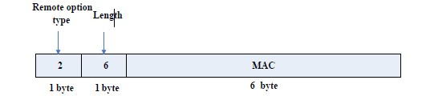
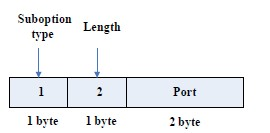
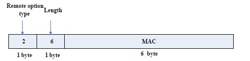

# DHCP 配置命令

## DHCP 服务器配置命令

### `bootfile`

- 命令：
  + `bootfile <filename>`
  + `no bootfile` 
- 功能：配置 DHCP 客户机启动时的导入文件名；本命令的 `no` 操作删除配置的导入文件。
- 参数：`<filename>` 为导入文件的名字，最长不超过 255 个字节。
- 命令模式：DHCP 地址池模式。
- 缺省情况：交换机缺省没有配置 DHCP 客户机启动时的导入文件名。
- 使用指南：
  为客户机指定导入文件名。一般用在无盘工作站，系统启动时需要从服务器上下载配置文件，与 `next-server` 结合使用。
- 举例：导入文件地址及文件名为 `C:\temp\nos.img`。
  ```text
  Switch(dhcp-1-config)#bootfile c:\temp\nos.img
  ```
- 相关命令：`next-server`

### `clear ip dhcp binding`

- 命令：`clear ip dhcp binding {<address> | all }`
- 功能：删除某指定的 IP 地址与其硬件地址的绑定记录或所有 IP 地址与相应的硬件地址的绑定记录。
- 参数：
  + `<address>` 为指定的有绑定记录的 IP 地址，点分十进制格式；
  + `all` 通指为有绑定记录的所有的 IP 地址。
- 命令模式：特权用户配置模式。
- 使用指南：
  通过 `show ip dhcp binding` 命令可以查看 IP 地址与相应的 DHCP 客户机硬件地址的绑定信息，当 DHCP 服务器得知某 DHCP 客户机因为特殊原因没有使用分配的 IP 地址但规定的租期未到，DHCP 服务器不会自动解除该绑定信息，此时系统管理员可以使用本命令手工删除该 IP 地址与客户机硬件地址的自动绑定；
  如果使用 `all`，将删除所有自动绑定记录，这样 DHCP 地址池中的所有地址将被重新分配。
- 举例：删除所有 IP 地址与硬件地址的绑定记录。
  ```text
  Switch#clear ip dhcp binding all
  ```
- 相关命令：`show ip dhcp binding`

### `clear ip dhcp conflict`

- 命令：`clear ip dhcp conflict {<address> | all }`
- 功能：删除在地址冲突日志中有冲突记录的地址。
- 参数：`<address>` 为某指定的有冲突记录的地址；`all` 通指为有冲突记录的所有地址。
- 命令模式：特权用户配置模式。
- 使用指南：
  通过 `show ip dhcp conflict` 命令可以查看哪些 IP 地址在使用上有冲突，使用本命令可以删除某一地址的冲突记录，如果使用 `all` 则是删除日志中所有的地址的冲突记录。
  在日志中删除冲突记录后，这些地址可被 DHCP 服务器重新使用。
- 举例：网络管理员查看冲突日志文件，发现文件中有冲突记录的 `10.1.128.160` 地址现已无人使用，将该地址的记录从地址冲突文件中删除。
  ```text
  Switch#clear ip dhcp conflict 10.1.128.160
  ```
- 相关命令：
  + `ip dhcp conflict logging`
  + `show ip dhcp conflict`

### `clear ip dhcp server statistics`

- 命令：`clear ip dhcp server statistics`
- 功能：删除 DHCP 服务器的统计记录，将 DHCP 服务器的计数器清零。
- 参数：无。
- 命令模式：特权用户配置模式。
- 使用指南：
  通过 `show ip dhcp server statistics` 命令可以查看 DHCP 服务器的计数器的统计信息，所有的统计信息都是一个累计值，使用本命令可以将计数器清零，方便统计信息的查看。
- 举例：将 DHCP 服务器的计数器清零。
  ```text
  Switch#clear ip dhcp server statistics
  ```
- 相关命令：`show ip dhcp server statistics` 

### `client-identifier`

- 命令：
  + `client-identifier <unique-identifier>`
  + `no client-identifier`
- 功能：在手工绑定地址时，指定用户的唯一标识；本命令的 no 操作为删除用户标识。
- 参数：`<unique-identifier>` 为用户的标识，格式为连字符十六进制 `(xx-xx-xx-xx-xx-xx)`。
- 命令模式：DHCP 地址池模式。
- 使用指南：
  本命令在手工绑定地址时结合命令host一起使用。
  当发出请求的客户机的标识恰好和指定的标识相吻合，DHCP 服务器就将 host 命令中定义的 IP 地址分配给客户机。
- 举例：手工绑定时，将 IP 地址 `10.1.128.160` 与用户唯一标识为 `00-10-5a-60-af-12` 的用户绑定。
  ```text
  Switch(dhcp-1-config)#client-identifier 00-10-5a-60-af-12
  Switch(dhcp-1-config)#host 10.1.128.160 24
  ```
- 相关命令：`host`

### `debug ip dhcp client`

- 命令：
  + `debug ip dhcp client {event | packet}`
  + `no debug ip dhcp server {event | packet}`
- 功能：打开 DHCP 客户端的调试信息；本命令的 no 操作为关闭 DHCP 客户端的调试信息。
- 缺省情况：缺省调试开关是关闭的。
- 命令模式：特权用户配置模式。

### `debug ip dhcp relay`

- 命令：
  + `debug ip dhcp server packet`
  + `no debug ip dhcp server packet`
- 功能：打开 DHCP 中继的调试信息；本命令的 no 操作为关闭 DHCP 中继的调试信息。
- 缺省情况：缺省调试开关是关闭的。
- 命令模式：特权用户配置模式。

### `debug ip dhcp server`

- 命令：
  + `debug ip dhcp server { events|linkage|packets }`
  + `no debug ip dhcp server { events|linkage|packets }`
- 功能：打开 DHCP 服务器的调试信息；本命令的 no 操作为关闭 DHCP 服务器的调试信息。
- 缺省情况：缺省调试开关是关闭的。
- 命令模式：特权用户配置模式。

### `default-router`

- 命令：
  + `default-router <address1>[<address2>[…<address8>]]`
  + `no default-router`
- 功能：为 DHCP 客户机配置缺省网关；本命令的 no 操作为删除缺省网关。
- 参数：`address1…address8` 为 IP 地址，均为点分十进制格式。
- 缺省情况：系统没有给 DHCP 客户机配置缺省网关。
- 命令模式：DHCP 地址池模式。
- 使用指南：缺省网关的 IP 地址应与 DHCP 客户机的 IP 地址在一个子网网段内，交换机最多可支持 8 个网关地址，最先设置的网关地址优先级最高，因此 `address1` 优先级最高，依次 `address2`、`address3`……。
- 举例：设置 DHCP 客户机的缺省网关为 `10.1.128.2` 和 `10.1.128.100`。
  ```text
  Switch(dhcp-1-config)#default-router 10.1.128.2 10.1.128.100
  ```

### `dns-server`

- 命令：
  + `dns-server <address1>[<address2>[…<address8>]]`
  + `no dns-server`
- 功能：为 DHCP 客户机配置 DNS 服务器；本命令的 no 操作为删除 DNS 服务器。
- 参数：`address1…address8` 为 IP 地址，均为点分十进制格式。
- 缺省情况：系统没有给 DHCP 客户机配置 DNS 服务器。
- 命令模式：DHCP 地址池模式。
- 使用指南：系统最多可支持配置 8 个 DNS 服务器地址，最先设置的 DNS 服务器的地址优先级最高，因此 `address1` 优先级最高，依次 `address2`、`address3`……。
- 举例：设置 DHCP 客户机的 DNS 服务器的地址为 `10.1.128.3`。
  ```text
  Switch(dhcp-1-config)#dns-server 10.1.128.3
  ```

### `domain-name`

- 命令：
  + `domain-name <domain>`
  + `no domain-name`
- 功能：为 DHCP 客户机配置域名；本命令的 no 操作为删除域名。
- 参数：`<domain>` 为域的名称，最长不超过 255 个字符。
- 命令模式：DHCP 地址池模式。
- 缺省情况：无。
- 使用指南：为客户机指定域名。
- 举例：指定 DHCP 客户机的域名为 `digitalchina.com.cn`。
  ```text
  Switch(dhcp-1-config)#domain-name digitalchina.com.cn
  ```

### `hardware-address`

- 命令：
  + `hardware-address <hardware-address> [{Ethernet | IEEE802|<type-number>}]`
  + `no hardware-address`
- 功能：在手工分配地址时，指定用户的硬件地址；本命令的 no 操作为删除该项配置。
- 参数：`<hardware-address>` 为硬件地址，十六进值表示的数值；`Ethernet | IEEE802` 为以太网协议类型，`<type-number>` 为 RFC 定义的协议类型的数字表示，取值范围为 1~255，如参数 Ethernet 的数字表示为 1，IEEE802 的数字表示形式为 6。
- 缺省情况：缺省为协议类型为 Ethernet 协议。
- 命令模式：DHCP 地址池模式。
- 使用指南：
  本命令在手工绑定地址时结合命令host一起使用。
  当发出请求的客户机的硬件地址恰好和指定的硬件地址相吻合，DHCP 服务器就将 host 命令中定义的 IP 地址分配给客户机。
- 举例：手工绑定时，将 IP 地址 `10.1.128.160` 与硬件地址为 `00-00-e2-3a-26-04` 的用户绑定。
  ```text
  Switch(dhcp-1-config)#hardware-address 00-00-e2-3a-26-04
  Switch(dhcp-1-config)#host 10.1.128.160 24
  ```
- 相关命令：`host` 

### `host`

- 命令：
  + `host <address> [<mask> | <prefix-length> ]`
  + `no host`
- 功能：在手工绑定地址时，分配给指定客户机的用户的 IP 地址；本命令的 no 操作为删除 IP 地址。
- 参数：
  + `<address>` 为 IP地址，点分十进制格式；
  + `<mask>` 为掩码，点分十进制格式；
  + `<prefix-length>` 为用前缀表示法，如掩码为 `255.255.255.0` 用前缀法表示为“24”，掩码为 `255.255.255.252` 用前缀法表示为“30”。
- 命令模式：DHCP 地址池模式。
- 缺省情况：无。
- 使用指南：
  如果在配置 IP 地址时，仅配置了 IP 地址，没有配置掩码和前缀，并且在 IP 地址池中也没有任何有关掩码的信息，缺省系统会按有类地址自动分配掩码。
  本命令在手工绑定地址时结合 `hardware-address` 命令或者 `client-identifier` 命令一起使用。
  当发出请求的客户机的标识或硬件地址恰好和指定的标识或硬件地址相吻合，DHCP 服务器就将 host 命令中定义的 IP 地址分配给客户机。
- 举例：手工绑定时，将 IP 地址 `10.1.128.160` 与硬件地址为 `00-10-5a-60-af-12` 的用户绑定。
  ```text
  Switch(dhcp-1-config)#hardware-address 00-10-5a-60-af-12
  Switch(dhcp-1-config)#host 10.1.128.160 24
  ```
- 相关命令：
  + `hardware-address`
  + `client-identifier`

### 1.1.14 ip dhcp conflict logging 

命令：`ip dhcp conflict logging
     no ip dhcp conflict logging` 
- 功能：打开 DHCP 服务器检测地址冲突的日志功能；本命令的 no 操作为关闭该日志功能。
- 参数：无。
- 缺省情况：缺省情况下，记录地址冲突的日志功能是打开的。
- 命令模式：全局配置模式。
- 使用指南：当日志功能是打开的，一旦 DHCP 服务器检测到有地址冲突时，就会将该冲突
- 地址记录到日志中。对于在日志中出现的有冲突记录的地址，DHCP 服务器将不再对其进行
- 动态分配，直到把这些冲突记录删除。
- 举例：关闭 DHCP 服务器的日志功能。

  ```text
  Switch(config)#no ip dhcp conflict logging 
  ```
- 相关命令：`clear ip dhcp conflict` 

### 1.1.15 ip dhcp disable 

  S5750E交换机不支持该命令。

### 1.1.16 ip dhcp excluded-address 

- 命令：`ip dhcp excluded-address <low-address> [<high-address>] 
      no ip dhcp excluded-address <low-address> [<high-address>]` 
- 功能：排除地址池中的不用于动态分配的地址；本命令的no操作为取消该项配置。
- 参数：`<low-address>` 为起始的IP地址；`[<high-address>]`为结束的IP地址。
- 缺省情况：缺省为仅排除单个地址。
- 命令模式：全局配置模式。
- 使用指南：使用本命令可以将地址池中的一个地址或连续的几个地址排除，这些地址由系统
- 管理员留作其它用途。
- 举例：将10.1.128.1到10.1.128.10之间的地址保留，不用于动态分配。

  ```text
  Switch(config)#ip dhcp excluded-address 10.1.128.1 10.1.128.10
  ```
  
### 1.1.17 ip dhcp pool 

- 命令：`ip dhcp pool <name> 
       no ip dhcp pool <name>` 
- 功能：配置 DHCP 地址池，进入 dhcp 地址池模式；本命令的 no 操作为删除该地址池。
- 参数：`<name>` 为地址池名，最长不超过32个字符。
- 命令模式：全局配置模式。
- 使用指南：在全局模式下定义一个 DHCP 地址池，进入到 DHCP 地址池配置模式。
- 举例：定义一个地址池，取名1。

  ```text
  Switch(config)#ip dhcp pool 1 
  Switch(dhcp-1-config)# 
  ```

### 1.1.18 ip dhcp conflict ping-detection enable 

- 命令：`ip dhcp conflict ping-detection enable 
      no ip dhcp conflict ping-detection enable` 
- 功能：打开 DHCP 服务器 Ping 方式检测地址冲突的功能；本命令的 no 操作为关闭该检测功能。
- 参数：无。
- 缺省情况：缺省情况下，Ping 方式检测地址冲突的功能是关闭的。
- 命令模式：全局配置模式。
- 使用指南：打开 Ping 方式地址冲突检测功能前需打开记录地址冲突的日志功能；当关闭该
          日志功能时，Ping 方式地址冲突检测功能同时被关闭。当客户端无法接收 Ping 请求报文时
          （比如防火墙屏蔽了 Ping 请求报文），本功能根据分配 IP 对本地 ARP 进行检查：若选择的
          IP存在对应的 ARP ，则判定为地址冲突；反之，则分配该 IP 给客户端。
- 举例：打开Ping方式检测地址冲突的功能。

  ```text
  Switch(config)#ip dhcp conflict ping-detection enable
  ```
- 相关命令：`ip dhcp conflict logging, ip dhcp ping packets, ip dhcp ping timeout` 

### 1.1.19 ip dhcp ping packets 

- 命令：`ip dhcp ping packets <request-num> 
        no ip dhcp ping packets`
- 功能：设置 DHCP 服务器 Ping 方式检测地址冲突时，尝试发送 Ping 请求报文（Echo Request）
-        的最大个数，默认为2个；本命令的 no 操作为恢复默认发送 Ping 请求报文的个数。
- 参数：`<request-num>` 是Ping方式检测地址冲突时尝试发送的 Ping 请求报文个数。
- 缺省情况：缺省情况下，最多发送2个 Ping 请求报文。
- 命令模式：全局配置模式。
- 举例：设置 DHCP 服务器 Ping 方式检测地址冲突时发送 Ping 请求报文最大个数为3。

  ```text
  Switch(config)#ip dhcp ping packets 3 
  ```
- 相关命令：`ip dhcp conflict ping-detection enable, ip dhcp ping timeout` 

### 1.1.20 ip dhcp ping timeout 

- 命令：`ip dhcp ping timeout <timeout-value> 
      no ip dhcp ping timeout` 
- 功能：设置 DHCP 服务器 Ping 方式检测地址冲突时，每次发送 Ping 请求报文（Echo Request）
       后，等待回应报文（Echo Reply）的超时时长（单位为ms），默认为500ms；本命令的 no
       操作为恢复默认超时时长。
- 参数：`<timeout-value>` 是 Ping 方式检测地址冲突时每次 Ping 请求等待回应的超时时长。
- 缺省情况：缺省情况下，超时时长为500ms。
- 命令模式：全局配置模式。
- 举例：设置 DHCP 服务器 Ping 方式检测地址冲突时等待每个回应报文的超时时长为600ms。

  ```text
  Switch(config)# ip dhcp ping time out 600 
  ```
- 相关命令：`ip dhcp conflict ping-detection enable, ip dhcp ping packets` 

### 1.1.21 lease 

- 命令：`lease { [<days>] [<hours>][<minutes>] | infinite } 
        no lease` 
- 功能：配置地址池中地址的租用期限；本命令的 no 操作为恢复缺省值。
- 参数：`<days>` 为天数，取值范围为0~365；`<hours>`为小时数，取值范围为0~23；`<minutes>`
       为分数，取值范围为0~59；infinite 为永久的使用。
- 缺省情况：缺省的租期设置为1天。
- 命令模式：DHCP 地址池模式。
- 使用指南：DHCP 是动态的分配网络配置参数，并非永久分配，因此有租期的限制。租期设
          置过长，难以发挥 DHCP 灵活、动态的优势；租期设置过短，有会造成网络通信量的增加，
          加大网络开销，因此租期的设置可由网络管理员根据自身网络的特点设定。交换机缺省的租
          期设置为1天。
- 举例：DHCP 地址池1的租期设置为3天12个小时30分钟。

  ```text
  Switch(dhcp-1-config)#lease 3 12 30 
  ```
  
### 1.1.22 max-lease-time 

- 命令：`max-lease-time {[<days>] [<hours>][<minutes>] | infinite} 
      no max-lease-time` 
- 功能：配置地址池中地址的最大租用期限；本命令的no操作为恢复缺省值。
- 参数：`<days>` 为天数，取值范围为0~365；`<hours>` 为小时数，取值范围为0~23；`<minutes>`
为分数，取值范围为0~59；infinite 为永久的使用。
缺省情况：缺省的租期设置为1天。
命令模式：DHCP 地址池模式。

- 使用指南：该配置命令使用于带有 option51 选项的 DHCP 请求报文场景中，如果用户请求
          地址租期的时间超过配置的最大租用期限，则 DHCP 服务器分配该地址的租期为配置最大
          租期时间，如果用户请求地址的租期时间小于配置的最大租期时间，则 DHCP 服务器分配
          该地址的租期为用户请求报文携带的请求租用期限。最大租用期限的设置可由网络管理员根
          据自身网络的特点进行设定。交换机缺省的最大租用期限设置为1天。
- 举例：DHCP地址池1的最大租期设置为3天12个小时30分钟。

  ```text
  Switch(dhcp-1-config)#max-lease-time 3 12 30
  ```

### 1.1.23 netbios-name-server 

- 命令：`netbios-name-server <address1>[<address2>[…<address8>]] 
        no netbios-name-server`
- 功能：配置 Wins 服务器的地址；本命令的 no 操作为删除 Wins 服务器。
- 参数：address1…address8 为IP地址，均为点分十进制格式。
- 缺省情况：系统缺省没有配置 Wins 服务器。
- 命令模式：DHCP 地址池模式。
- 使用指南：为客户机指定 Wins 服务器，最多可设置8个 Wins 服务器，最先设置的 Wins 服
          务器的地址优先级最高，因此 address1 优先级最高，依次address2、address3……。
- 举例：配置地址池1的Wins服务器的地址为192.168.1.1。

  ```text
  Switch(dhcp-1-config)#netbios-name-server 192.168.1.1
  ```

### 1.1.24 netbios-node-type 

- 命令：`netbios-node-type {b-node|h-node|m-node|p-node|<type-number>} 
        no netbios-node-type` 
- 功能：配置 DHCP 客户机的节点类型；本命令的 no 操作为取消该项配置。
- 参数：b-node 为广播型；h-node 为先点对点后广播的混合型；m-node 为先广播后点对点的
- 混合型；p-node 为点对点型；`<type-number>` 为节点类型的十六进值表示法，取值范围为
  0~255。
- 缺省情况：没有为客户机指定节点类型。
- 命令模式：DHCP 地址池模式。
- 使用指南：如果要为客户机指定节点类型，建议把客户机的节点类型配置为先点对点后广播
          的混合型节点类型。
- 举例：地址池1的客户机的节点类型为广播型。

  ```text
  Switch(dhcp-1-config)#netbios-node-type b-node
  ```

### 1.1.25 network-address 

- 命令：`network-address <network-number> [<mask> | <prefix-length>] 
        no network-address` 
- 功能：配置地址池可分配的地址范围；本命令的 no 操作为取消该项配置。
- 参数：`<network-number>` 为网络号码；`<mask>` 为掩码，点分十进制格式；`<prefix-length>`
       为用前缀表示法，如掩码为255.255.255.0用前缀法表示为“24”，掩码为255.255.255.252
       用前缀法表示为“30”。注意：在使用 DHCP-SERVER 的时候，配置地址掩码的时候，应该
       使地址池中掩码长于或等于交换机上对应网段的三层接口 IP 地址的掩码，DHCP 地址池配
       置时无法配置掩码为31位和32位的地址池。
- 缺省情况：如果不带掩码，缺省掩码为按照有类地址自动分配。
- 命令模式：DHCP 地址池模式。
- 使用指南：DHCP 服务器用于动态分配IP地址时使用本命令配置可分配的IP地址范围，一
          个地址池只能对应一个网段。本命令与手工绑定地址的命令即 hardware-address 命令、host
          命令互斥。
- 举例：地址池1的可分配的地址为10.1.128.0/24。

  ```text
  Switch(dhcp-1-config)#network-address 10.1.128.0 24
  ```
相关命令：`ip dhcp excluded-address` 

1.1.26 next-server 

命令：`next-server <address1>[<address2>[…<address8>]
      no next-server` 
功能：配置客户机导入文件存放的服务器地址；本命令的 no 操作为取消该项配置。
参数：address1…address8 为IP地址，均为点分十进制格式。
命令模式：DHCP 地址池模式。
缺省情况：无。
使用指南：为客户机指定导入文件存放的服务器地址。一般用在无盘工作站，系统启动时需
要从服务器上下载配置文件，和 bootfile 结合使用。
举例：文件存放的服务器地址为10.1.128.4。

  ```text
  Switch(dhcp-config)#next-server 10.1.128.4 
  ```
相关命令：`bootfile` 

### 1.1.27 option 

- 命令：`option <code> {ascii <string> | hex <hex> | ipaddress <ipaddress>} 
      no option <code>` 
- 功能：配置 option 所指定代码的网络参数的值；本命令的 no 操作为取消对该 option 的配置。
- 参数：`<code>` 为网络参数的代码值；`<string>` 为 ASC Ⅱ型字符串，最长不超过255个字符；
       `<hex>` 为十六进值表示的数值，最长不超过510，且长度必须为偶数；`<ipaddress>` 为IP地址，
       点分十进制格式，最长可以设置63个IP地址。
- 命令模式：DHCP 地址池模式。
- 缺省情况：无。
- 使用指南：系统不仅提供多项在网络配置中常用的命令，还提供了配置网络参数的通用命令，
          满足用户的多方面的配置需求。Option 的代码定义在 RFC2132 中有详细介绍。
- 举例：配置 WWW 服务器的地址为10.1.128.240。

  ```text
  Switch(dhcp-1-config)#option 72 ip 10.1.128.240
  ```

### 1.1.28 service dhcp 

- 命令：`service dhcp 
     no service dhcp` 
- 功能：启动 DHCP 服务器功能；本命令的 no 操作为关闭 DHCP 服务。
- 参数：无。
- 缺省情况：DHCP 服务缺省是关闭的。
- 命令模式：全局配置模式。
- 使用指南：DHCP 服务包括 DHCP 服务器功能和DHCP中继的功能。当打开 DHCP 服务时，
          DHCP 服务器功能和 DHCP 中继功能都被打开。只有打开 DHCP 服务器功能，交换机才能
          给 DHCP 客户机分配IP地址及开启 DHCP 的 RELAY 功能。
- 举例：打开DHCP服务器。

  ```text
  Switch(config)#service dhcp 
  ```

### 1.1.29 show ip dhcp binding 

- 命令：`show ip dhcp binding [ [<ip-addr>] [type {all | manual | dynamic}] [count]` 
- 功能：显示IP地址与MAC地址的绑定情况。
- 参数：`<ip-addr>` 为某指定的IP地址，点分十进制格式；all 表示所有的绑定类型（手工绑定
       与动态分配）；manual 表示手工绑定类型；dynamic 表示动态分配类型；count 表示显示 DHCP
       地址绑定表项数量信息。
- 命令模式：特权和配置模式。
- 举例:

  ```text
  Switch#sh ip dhcp binding 
  IP address           Hardware address         Lease expiration       Type 
  10.1.1.233            00-00-E2-3A-26-04                 Infinite             Manual 
  10.1.1.254            00-00-E2-3A-5C-D3                    60              Automatic 
  
  |     显示信息     |                解释                |
  | :--------------: | :--------------------------------: |
  |    IP address    |     分配给DHCP客户机的IP地址；     |
  | Hardware address |       DHCP客户机的硬件地址；       |
  | Lease expiration | DHCP客户机拥有该IP地址的有效时间； |
  |       Type       |  类型，指手工绑定还是动态分配的。  |
  ```

### 1.1.30 show ip dhcp conflict 

- 命令：`show ip dhcp conflict` 
- 功能：显示有冲突记录的地址的日志信息。
- 命令模式：特权和配置模式。
- 举例：

  ```text
  Switch#sh ip dhcp conflict 
  IP Address     Detection method    Detection Time 
  10.1.1.1           Ping           FRI JAN 02 00:07:01 2002
  |     显示信息     |        解释        |
  | :--------------: | :----------------: |
  |    IP Address    |  有冲突的IP地址。  |
  | Detection method | 检测到冲突的方式。 |
  |  Detection Time  | 检测到冲突的时间。 |
  ```

### 1.1.31 show ip dhcp relay information option 

- 命令：`show ip dhcp relay information option` 
- 功能：显示 DHCP 中继 option 82 选项相关配置信息。
- 命令模式：特权和配置模式。
- 举例:

  ```text
  Switch#show ip dhcp relay information option 
  ip dhcp server relay information option(i.e. option 82) is enabled 
  ip dhcp relay information option(i.e. option 82) is enabled 
  ```

### 1.1.32 show ip dhcp server statistics 

- 命令：`show ip dhcp server statistics` 
- 功能：显示DHCP服务器的对各种DHCP数据包的统计信息。
- 命令模式：特权和配置模式。
- 举例：

  ```text
  Switch#show ip dhcp server statistics 
  Address pools       3
  Database agents     0
  Automatic bindings   2
  Manual bindings       0
  Conflict bindings      0
  Expiried bindings       0
  Malformed message      0
  
  Message         Recieved
  BOOTREQUEST       3814
  DHCPDISCOVER      1899 
  DHCPREQUEST        6 
  DHCPDECLINE        0 
  DHCPRELEASE        1 
  DHCPINFORM         1
  
  Message           Send
  BOOTREPLY         1911 
  DHCPOFFER          6 
  DHCPACK            6 
  DHCPNAK            0 
  DHCPRELAY         1907 
  DHCPFORWARD        0
  
  Switch#
  | 显示信息           | 解释                      |
  | ------------------ | ------------------------- |
  | Address pools      | 配置的DHCP地址池个数；    |
  | Database agents    | 代理数据库的个数；        |
  | Automatic bindings | 自动分配地址的个数；      |
  | Manual bindings    | 手工绑定地址的个数；      |
  | Conflict bindings  | 有地址冲突的个数；        |
  | Expiried bindings  | 绑定超期的个数；          |
  | Malformed message  | 错误信息的个数；          |
  | Message Recieved   | 接收DHCP数据包的统计      |
  | BOOTREQUEST        | 接收的数据包总数；        |
  | DHCPDISCOVER       | 其中DHCPDISCOVER包个数；  |
  | DHCPREQUEST        | 其中DHCPREQUEST包个数；   |
  | DHCPDECLINE        | 其中DHCPDECLINE包个数；   |
  | DHCPRELEASE        | 其中DHCPRELEASE包个数；   |
  | DHCPINFORM         | 其中DHCPINFORM包个数；    |
  | Message Send       | 发送DHCP数据包的统计      |
  | BOOTREPLY          | 发送的数据包的总数；      |
  | DHCPOFFER          | 其中DHCPOFFER包的个数；   |
  | DHCPACK            | 其中DHCPACK包的个数；     |
  | DHCPNAK            | 其中DHCPNAK包的个数；     |
  | DHCPRELAY          | 其中DHCPRELAY包的个数；   |
  | DHCPFORWARD        | 其中DHCPFORWARD包的个数。 |
  ```
  
## 1.2 DHCP中继配置命令

### 1.2.1 ip dhcp broadcast suppress

- 命令：`ip dhcp broadcast suppress no ip dhcp broadcast suppress`
- 功能：开启 DHCP 广播报文抑制功能；no 命令为关闭 DHCP 广播报文抑制功能。
- 参数：无。
- 缺省情况：默认不启动 DHCP 广播报文抑制功能。
- 命令模式：全局配置模式
- 使用指南：抑制 DHCP 广播报文的转发，以及 DHCP 广播报文丢弃和复制至CPU。
- 举例： 在交换机上开启 DHCP 广播报文抑制功能。

  ```text
  Switch(config)#ip dhcp broadcast suppress
  ```
  
### 1.2.2 `ip dhcp relay share-vlan <vlanid> sub-vlan <vlanlist>`

- 命令：`ip dhcp relay share-vlan <vlanid> sub-vlan <vlanlist> no ip dhcp relay share-vlan`
- 功能：指定一个 share-vlan 的 sub-vlan；本命令的 no 操作为取消 share-vlan 的 sub-vlan。
- 参数：`<vlanid>` 为 share-vlan 的 vlan 号， `<vlanlist>` 为 sub-vlan 的列表。
- 缺省情况：无。 
- 命令模式：全局配置模式。
- 使用指南：share-vlan 可以有许多的 sub-vlan，但一个 sub-vlan 只能对应一个 share-vlan。
         当DHCP Relay 二层设备收到 DHCP Request 时，首先判断收到的包中 vlan 是否有三层接口，如果有
         就用此三层接口进行 DHCP Relay。如果收到包中的 vlan 没有三层接口，但此 vlan 是某个 share-vlan
         的 sub-vlan，则用 share-vlan 的三层接口进行 DHCP Relay。
         
### 1.2.3 ip forward-protocol udp bootps

- 命令：`ip forward-protocol udp bootps no ip forward-protocol udp bootps`
- 功能：配置 DHCP 中继转发指定端口的 UDP 广播报文；本命令的 no 操作为取消该项服务。
- 参数：bootps 标识转发UDP端口为67 DHCP 广播报文。
- 缺省情况：DHCP 中继缺省不转发 DHCP 广播报文。
- 命令模式：全局配置模式。
- 使用指南：该命令的转发目的地址在随后的 ip helper-address 命令里设定。
- 举例：转发 DHCP 包，且目的服务器地址为 192.168.1.5。

  ```text
  Switch(config)#ip forward-protocol udp bootps 
  Switch(config)# interface vlan 1
  Switch(Config-if-Vlan1)#ip helper-address 192.168.1.5
  ```
  
### 1.2.4 ip helper-address

- 命令：`ip helper-address <ipaddress> no ip helper-address <ipaddress>` 
- 功能：指定 DHCP 中继转发 UDP 报文的目标地址；本命令的 no 操作为取消该项设置。
- 参数：`<ipaddress>` 为 DHCP 中继转发 UDP 报文的目标 IP 地址。
- 缺省情况：无。
- 命令模式：接口配置模式。
- 使用指南：DHCP 中继转发的服务器地址是与转发 UDP 的端口相对应的，即 DHCP 中继只转发相应 UDP 协
          议的报文给相应的服务器，并不是把所有 UDP 报文转发给所有的服务器。当使用 ip forward-protocol 
          udp `<port>` 命令后，再配置本命令时，本命令所配置的转发地址接收到的是端口号为` <port> `的 UDP 报文。

### 1.2.5 show ip forward-protocol

- 命令：`show ip forward-protocol`
- 功能：显示已配置的支持广播报文转发的协议端口号，主要指 DHCP 报文转发的端口号。
- 命令模式：特权和配置模式。
- 举例： 

  ```text
  Switch#show ip forward-protocol Forward protocol(UDP port): 67(active)
  ```
  
### 1.2.6 show ip helper-address

- 命令：`show ip helper-address`
- 功能：显示可转发广播报文的协议端口号、支持转发功能的接口以及转发的目的IP的配置关系
- 命令模式：特权和配置模式。
- 举例：

  ```text
  Switch#show ip helper-address 
  Forward protocol       Interface       Forward server 
  67(active)               Vlan1           192.168.1.1
  ```
  
# 第2章 DHCPv6配置命令

### 2.1 clear ipv6 dhcp binding

- 命令：`clear ipv6 dhcp binding [<ipv6-address>] [pd <ipv6-prefix|prefix-length>]` 
- 功能：删除某指定 DHCPv6 分配地址或前缀的绑定记录或所有 IPv6 地址和前缀的绑定记录。
- 参数：`<ipv6-address>` 为指定的有绑定记录的IPv6地址；`<ipv6-prefix|prefix-length>` 为指定的有绑定记录的 IPv6 前缀；没有指定参数时认为清除所有 IPv6 地址和前缀的绑定记录。
- 命令模式：特权用户配置模式。
- 使用指南：通过 show ipv6 dhcp binding 命令可以查看 IPv6 地址和前缀与相应的 DHCPv6 绑定信息，当 DHCPv6 服务器得知某 DHCPv6 客户机因为特殊原因没有使用分配的 IPv6 地址或前缀但规定的租期未到，DHCPv6 服务器不会自动解除该绑定信息，此时系统管理员可以使用本命令手工删除该 IP 地址或前缀与客户机硬件地址的自动绑定；如果没有任何参数，本命令将删除所有自动绑定记录，这样 HCPv6 地址池中的所有地址和前缀将被重新分配。
- 举例：删除所有 IPv6 地址和前缀的绑定记录。

  ```text
  Switch#clear ipv6 dhcp binding
  ```

- 相关命令：`show ipv6 dhcp binding`

### 2.2 clear ipv6 dhcp conflict

- 命令：`clear ipv6 dhcp conflict [<address>]`
- 功能：删除在地址冲突日志中有冲突记录的地址
- 参数：`<address>` 为某指定的有冲突记录的地址；不指定地址则清除所有冲突记录。
- 命令模式：特权用户配置模式。
- 使用指南：通过 show ipv6 dhcp conflict 命令可以查看哪些IP地址在使用上有冲突，使用本命令可以删除某一地址的冲突记录，如果不指定具体地址则是删除日志中所有地址的冲突记录。在日志中删除冲突记录后，这些地址可被 DHCPv6 服务器重新使用。
- 举例：网络管理员查看冲突日志，发现有冲突记录的2001::1地址现已无人使用，将该地址的记录从地址冲突文件中删除。

  ```text
  Switch#clear ipv6 dhcp conflict 2001::1
  ```
  
### 2.3 clear ipv6 dhcp statistics

- 命令：`clear ipv6 dhcp statistics` 
- 功能：删除 DHCPv6 报文统计记录，将 DHCPv6 报文统计计数器清零。
- 参数：无。
- 命令模式：特权用户配置模式。
- 使用指南：通过 show ipv6 dhcp statistics 命令可以查看 DHCPv6 报文计数器的统计信息，所有的统计信息都是一个累计值，使用本命令可以将计数器清零，方便调试查看。
- 举例：将 DHCPv6 报文计数器清零。

  ```text
  Switch#clear ipv6 dhcp statistics 
  ```
- 相关命令：`show ipv6 dhcp statistics`

### 2.4 debug ipv6 dhcp client packet

- 命令：`debug ipv6 dhcp client { event | packet } no debug ipv6 dhcp client { event | packet }` 
- 功能：显示 DHCPv6 前缀请求客户端收发报文的 debug 显示，本命令的 no 操作关闭 DHCPv6 前缀请求客户端的 debug 显示信息
- 缺省情况：缺省调试开关是关闭的
- 命令模式：特权用户配置模式
- 举例：

  ```text
  Switch# debug ipv6 dhcp client packet
  ```
  
### 2.5 debug ipv6 dhcp detail

- 命令：`debug ipv6 dhcp detail no debug ipv6 dhcp detail`
- 功能：显示DHCPv6收发各类报文详细内容的 debug 显示，本命令的 no 操作关闭 DHCPv6 收发报文内容的 debug 显示信息
- 缺省情况：缺省调试开关是关闭的
- 命令模式：特权用户配置模式
- 举例：

  ```text
  Switch# debug ipv6 dhcp detail
  ```
  
### 2.6 debug ipv6 dhcp relay packet

- 命令：`debug ipv6 dhcp relay packet no debug ipv6 dhcp relay packet`
- 功能：显示 DHCPv6 中继代理收发报文的 debug 显示，本命令的 no 操作关闭 DHCPv6 中继代理的 debug 显示信息
- 缺省情况：缺省调试开关是关闭的
- 命令模式：特权用户配置模式
- 举例：

  ```text
  Switch# debug ipv6 dhcp relay packet
  ```
  
### 2.7 debug ipv6 dhcp server

- 命令：`debug ipv6 dhcp server {event | packet} no debug ipv6 dhcp server {event | packet}`
- 功能：显示 DHCPv6 服务器的事件和收发报文的情况，本命令的 no 操作关闭 DHCPv6 服务器的 debug 显示信息
- 参数：event 表示开启/关闭 DHCPv6 服务器事件的 debug 显示，如地址分配情况；packet 表示开启/关闭 DHCPv6 服务器收发报文的 debug 显示
- 缺省情况：缺省调试开关是关闭的
- 命令模式：特权用户配置模式
- 举例：

  ```text
  Switch#debug ipv6 dhcp server packet
  ```
  
### 2.8 dns-server

- 命令：`dns-server <ipv6-address> no dns-server <ipv6-address>`
- 功能：为DHCPv6客户机配置 DNS 服务器 IPv6 地址；本命令的 no 操作为删除 DNS 服务器 IPv6 地址
- 参数：`<ipv6-address>`为DNS服务器的 IPv6 地址
- 缺省情况：系统默认没有配置地址池的DNS服务器地址
- 命令模式：DHCPv6 地址池模式
- 使用指南：本命令最多可配置3次，即每个地址池最多允许3个 DNS 服务器地址，而且服务器地址只能是 IPv6 地址
- 举例：设置 DHCPv6 客户机的DNS服务器的地址为2001:da8::1

  ```text
  Switch(dhcp-1-config)#dns-server 2001:da8::1
  ```
  
### 2.9 domain-name

- 命令：`domain-name <domain-name> no domain-name <domain-name>`
- 功能：为 DHCPv6 客户机配置域名；本命令的 no 操作为删除域名
- 参数：`<domain-name>` 为域的名称，最长不超过32字符
- 命令模式：DHCPv6 地址池模式
- 缺省情况：系统默认没有配置地址池的域名参数
- 使用指南：本命令最多可配置 3 次，即每个地址池最多允许 3 个域名参数
- 举例：指定 DHCPv6 客户机的域名为 test.com.cn

  ```text
  Switch(dhcp-1-config)#domain-name test.com.cn
  ```
  
### 2.10 excluded-address

- 命令：`excluded-address <ipv6-address> no excluded-address <ipv6-address>`
- 功能：配置地址池中不用于动态分配的 IPv6 地址，以避免某些专用地址不被分配；本命令的 no 操作为取消该项配置
- 参数：`<ipv6-address>` 为不用于动态分配的地址池中的某个 IPv6 地址
- 缺省情况：地址池缺省没有配置不用于动态分配的 IPv6 地址。
- 命令模式：DHCPv6 地址池模式
- 使用指南：使用本命令可以将地址池中的一个或多个地址排除不做 DHCPv6 分配，这些地址由系统管理员留作其它用途。本命令在一个地址池中可以配置多次
- 举例：将 2001:da8:123::1 地址保留，不用于动态分配。

  ```text
  Switch(config)#excluded-address 2001:da8:123::1
  ```
  
### 2.11 ipv6 address

- 命令：`ipv6 address <prefix-name> <ipv6-prefix/prefix-length> no ipv6 address <prefix-name> <ipv6-prefix/prefix-length>`
- 功能：在指定接口上配置使用代理前缀生成的 IPv6 地址。本命令的 no 操作在指定接口上删除使用代理前缀生成的 IPv6 地址
- 参数：`<prefix-name>`是一个长度小于32的字符串，表示前缀请求客户端获得前缀或手动配置而保存在通用前缀池中的前缀名。`<ipv6-prefix/prefix-length>`表示 IPv6 地址中排除`<prefix-name>`前缀部分的后续地址位
- 命令模式：接口配置模式
- 缺省情况：系统默认不在接口配置全局地址
- 使用指南：接口IPv6地址将由`<prefix-name>`和`<ipv6-prefix/prefix-length>`组合而成，最终 IPv6 地址的前缀长度将由`<prefix-length>`指定。如果开启了路由器公告，将公告前64位前缀。系统在接口上删除由`<prefix-name>`和`<ipv6-prefix/prefix-length>`组合而成的 IPv6 地址，并停止公告该前缀。一个接口的一个前缀名只能配置唯一的`<ipv6-prefix/prefix-length>`.
- 举例：如果前缀名 my-prefix 表示 2001:da8:221::/48，本命令将在 Vlan1 接口生成 2001:da8:221:2008::2008

  ```text
  Switch(Config-if-Vlan1)# ipv6 address my-prefix 0:0:0:2008::2008/64
  ```
  
### 2.12 ipv6 dhcp client pd

- 命令：`ipv6 dhcp client pd <prefix-name> [rapid-commit] no ipv6 dhcp client pd`
- 功能：在指定接口上启动客户端前缀代理请求功能。本命令的 no 操作在指定接口上关闭客户端前缀代理请求功能，并删除获得的前缀
- 参数：`<prefix-name>`是一个长度小于32的字符串，表示成功获得代理前缀后，使用该名称保存在通用前缀池中。如果指定了 rapid-commit 选项，且前缀代理服务器端也使能了 rapid-commmit 功能，则前缀代理服务器将向前缀请求客户端直接发出 REPLY 报文，通过一次消息交换完成前缀代理请求过程
- 命令模式：接口配置模式
- 缺省情况：系统默认不启动客户端前缀代理请求功能。
- 使用指南：系统在接口上启动客户端前缀代理请求功能，发出 SOLICIT 报文，希望从服务器获得代理前缀。一旦获得了前缀，就可以通
        过其他命令（比如ipv6 address 命令）引用通用前缀池中的这个前缀。本命令与 ipv6 dhcp server 和 ipv6 dhcp relay de
        stination 命令互斥。如果系统在接口上关闭客户端前缀代理请求功能，则从通用前缀池中删除获得的前缀，同时删除使用该前缀生成
        的接口地址，不再使用该前缀进行路由公告。如果已经通过 ipv6general-prefix 命令配置了同一通用前缀名，则不能注册此通用前缀名。
- 举例：

  ```text
  Switch(Config-if-Vlan1)#ipv6 dhcp client pd ClientA rapid-commit
  ```
  
### 2.13 ipv6 dhcp client pd hint

- 命令：`ipv6 dhcp client pd hint <prefix|prefix-length> no ipv6 dhcp client pd hint <prefix|prefix-length>`
- 功能：在指定接口上指定客户端希望获取的前缀和前缀长度的功能。本命令的 no 操作在指定接口上删除客户端希望获取的前缀和前缀长度
- 参数：`<prefix|prefix-length>` 表示客户端希望获取的前缀和前缀长度
- 命令模式：接口配置模式
- 缺省情况：系统默认不指定客户端希望获取的前缀和前缀长度的功能
- 使用指南：系统在接口上为客户端指定了其希望获取的前缀和前缀长度，如果在接口上启动了客户端前缀代理请求功能且前缀服务器使能了 hint 功能，则服务器端优先把客户端希望获取得前缀和前缀长度分配给客户端。系统目前只允许配置一个 hint 前缀
- 举例：
  ```text
  Switch(vlan-1-config)#ipv6 dhcp client pd hint 2001::/48
  ```
  
### 2.14 ipv6 dhcp pool

- 命令：`ipv6 dhcp pool <poolname> no ipv6 dhcp pool <poolname>`
- 功能：配置 DHCPv6 地址池，进入 DHCPv6 地址池模式，在此模式下配置可分配给客户端的地址前缀、DNS 服务器、域名等信息；本命令的 no 操作为删除该地址池
- 参数：`<poolname>`为DHCPv6地址池名，最长不超过32个字符
- 缺省情况：系统默认不配置任何DHCPv6地址池
- 命令模式：全局配置模式
- 使用指南：在全局模式下定义一个 DHCPv6 地址池，进入到 DHCPv6 地址池配置模式。如果想要删除一个地址池，则需要先解除与该地址相关的接口绑定，并且清除所有相关的地址绑定
- 举例：定义一个地址池，取名1。

  ```text
  Switch(config)#ipv6 dhcp pool 1
  ```
  
### 2.15 ipv6 dhcp relay destination

- 命令：`ipv6 dhcp relay destination { [<ipv6-address>] [ interface { <interface-name> | vlan <1-4096> } ] } no ipv6 dhcp relay destination { [<ipv6-address>] [ interface { <interface-name> | vlan <1-4096> } ] }`
- 功能：配置 DHCPv6 接口中继代理为客户端递交中继报文的目的 IPv6 地址，可以是另外的 DHCPv6 中继代理的地址也可以是 DHCPv6 服务器的地址。本命令的 no 操作取消该项配置。
- 参数：`<ipv6-address>`为DHCPv6中继代理转发中继报文的目的 IPv6 地址；`<interface-name>`或 vlan 参数是转发出报文的交换机接口名或接口号，`<interface-name>`只能为三层接口 vlan 名称，vlan 接口号的取值范围为1～4096。当`<ipv6-address>`为全球单播地址时，不配置转发的接口参数；当`<ipv6-address>`为本地链路地址时，必须配置转发的接口名称；当只配置报文转发出的接口名称时，此时默认转发目的地址为所有 DHCPv6 服务器的本地站点多播地址 All_DHCP_Servers (FF05::1:3)。
- 命令模式：接口配置模式。
- 缺省情况：系统默认没有配置 DHCPv6 中继代理的目的 IPv6 地址。
- 使用指南：配置本命令指示本接口启用 DHCPv6 中继代理功能，以后把配置的地址作为 RELAY-FORWARD 报文的目的地址，该地址可以是另外的 DHCPv6 中继代理的地址也可以是 DHCPv6 服务器的地址。系统最多允许配置3个中继代理的目的地址。注意只有该接口所有 DHCPv6 中继代理的目的地址都被删除，该接口的 DHCPv6 中继代理功能才不可用。本命令与 ipv6 dhcp server 和 ipv6 dhcp client pd 命令互斥
- 举例：

  ```text
  Switch(Config-if-Vlan1)#ipv6 dhcp relay destination 2001:da8::1
  ```
  
### 2.16 ipv6 dhcp server

- 命令：`ipv6 dhcp server <poolname> [preference <value>] [rapid-commit] [allow-hint] no ipv6 dhcp server <poolname>`
- 功能：配置本命令绑定了 DHCPv6 服务器在接口使用的 DHCPv6 地址池。本命令的 no 操作删除指定接口上的 DHCPv6 地址池，停止本接口的 DHCPv6 服务
- 参数：`<poolname>` 是一个长度小于32的字符串，表示与本接口关联的 DHCPv6 地址池名称。如果指定了 rapid-commit 选项，则DHCPv6服务器收到客户端的 SOLICIT 报文后，向客户端直接发出 REPLY 报文，通过一次消息交换完成地址或前缀请求过程。如果指定了 preference 选项，则`<value>`表示本服务器的优先值，取值范围是 0～255，默认值是 0，值越大服务器优先级越高。如果指定了 allow-hint 选项，表示优先满足客户端期望分配的配置参数，这些期望参数在客户端发出的请求报文中给出
- 命令模式：接口配置模式
- 缺省情况：系统默认没有配置接口的 DHCPv6 地址池
- 使用指南：配置本命令记录了 DHCPv6 服务器在接口使用的 DHCPv6 地址池，及在该接口提供 DHCPv6 服务的相关参数。一个接口上可以绑定多个 DHCPv6 地址池，可以同时为直连链路的 DHCPv6 请求以及来自中继代理的 DHCPv6 请求报文分配地址
- 举例：

  ```text
  Switch(Config-if-Vlan1)#ipv6 dhcp server PoolA preference 80 rapid-commit allow-hint
  ```
  
### 2.17 ipv6 general-prefix

- 命令：`ipv6 general-prefix <prefix-name> <ipv6-prefix/prefix-length> no ipv6 general-prefix <prefix-name>`
- 功能：定义一个IPv6 通用前缀。本命令的no操作取消该项配置
- 参数：`<prefix-name>`是一个长度小于32的字符串，表示 IPv6 通用前缀名称。`<ipv6-prefix/prefix-length>`表示定义的 IPv6 通用前缀
- 命令模式：全局配置模式
- 缺省情况：系统默认没有配置 IPv6 通用前缀
- 使用指南：定义了 IPv6 通用前缀后，在接口上可以引用该通用前缀生成接口 IPv6 地址。在使用上通用前缀一般表示企业级的 IPv6 前缀，这样在接口上输入地址时只需要给出通用前缀名加上接口前缀后续部分，简化了用户书写。定义的通用前缀将保存在通用前缀池中。系统最多可配置 8 个通用前缀。当删除指定的通用前缀名称时，如果有接口引用了这个通用前缀，本命令执行不成功。一个通用前缀名只能配置一个通用前缀。如果有接口使能 IPv6 dhcp 前缀代理客户端占用了通用前缀名，则不能使用此命令配置相同的通用前缀名
- 举例：把 2001:da8:221::/48 前缀分配给通用前缀名 my-prefix

  ```text
  Switch(config)# ipv6 general-prefix my-prefix 2001:da8:221::/48
  ```
  
### 2.18 ipv6 local pool

- 命令：`ipv6 local pool <poolname> <prefix/prefix-length> <assigned-length> no ipv6 local pool <poolname>`
- 功能：配置 IPv6 代理前缀池。本命令的 no 操作删除 IPv6 代理前缀池
- 参数：`<poolname>`表示 IPv6 代理前缀池的名字，它是长度小于 32 的字符串。`<prefix/prefix-length>`表示分配给这个代理前缀池的前缀和前缀长度。`<assigned-length>`表示分配给使用这个代理前缀池的前缀请求客户端的前缀长度，它不能小于`<prefix-length>`
- 命令模式：全局配置模式
- 缺省情况：系统默认没有配置 IPv6 代理前缀池
- 使用指南：本命令将与 prefix-degation pool 命令配合使用，向前缀请求客户端分配前缀。删除 IPv6 代理前缀池后，地址池中与之关联的 prefix-delegation 命令将无效。

### 2.19 lifetime

- 命令：`lifetime {<valid-time> | infinity} {<preferred-time> | infinity} no lifetime` 
- 功能：配置 DHCPv6 地址池动态分配地址或前缀的生存期。本命令的 no 操作恢复默认配置
- 参数：`<valid-time>` 和`<preferred-time>`分别为本地址池分配 IPv6 地址的有效生存期和优选生存期，单位为秒，取值范围是 1-31536000，但`<preferred-time>`必须不大于`<valid-time>`。参数 infinity 表示生存期为无限值
- 命令模式：DHCPv6 地址池模式
- 缺省情况：地址池有效生存期和优选生存期默认为 2592000秒(30天) 和 604800秒(7天)
- 举例：配置有效生存期为 1000秒，优选生存期为 600秒

  ```text
  Switch(config)#lifetime 1000 600
  ```
  
### 2.20 network-address

- 命令：`network-address <ipv6-pool-start-address> {<ipv6-pool-end-address> | <prefix-length>} [eui-64] no network-address`
- 功能：配置 DHCPv6 地址池可分配的 IPv6 地址范围；本命令的 no 操作为取消该项配置
- 参数：`<ipv6-pool-start-address>`为地址池IPv6起始地址；`<ipv6-pool-end-address>`为地址池IPv6终止地址；`<prefix-length>`为前缀长度，取值范围为3-128，建议配置为64，依据`<prefix-length>`计算出地址池 IPv6 终止地址。`<ipv6-pool-end-address>` 和`<prefix-length>`二者取其一。如果配置的`<prefix-length>`为64，同时配置了 eui-64 选项，则 DHCPv6 服务器向客户端分配基于 EUI-64 规范的 IPv6 地址，否则将按自然顺序为客户端分配地址
- 缺省情况：DHCPv6 地址池默认没有配置可分配的 IPv6 地址范围
- 命令模式：DHCPv6 地址池模式
- 使用指南：DHCPv6 服务器使用本命令配置可分配的 IPv6 地址范围，一个地址池只能分配一个地址范围。注意在使用 DHCPv6 服务器并配置前缀长度的时候，应该使地址池中前缀长度大于或等于交换机上对应网段的三层接口 IPv6 地址的前缀长度。如果`<ipv6-pool-end-address>`比`<ipv6-pool-start-address>`大，本命令立即返回
- 举例：地址池1的可分配的地址范围为 2001:da8:123::100-2001:da8:123::200

  ```text
  Switch(dhcp-1-config)#network-address 2001:da8:123::100 2001:da8:123::200
  ```
  
### 2.21 prefix-delegation

- 命令：`prefix-delegation <ipv6-prefix/prefix-length> <client-DUID> [iaid <iaid>] [lifetime <valid-time> <preferred-time>] no prefix-delegation <ipv6-prefix/prefix-length> <client-DUID> [iaid <iaid>]`
- 功能：配置分配给特定前缀请求客户端的代理前缀。本命令的 no 操作删除分配给特定前缀请求客户端的代理前缀
- 参数：`<ipv6-prefix/prefix-length>` 为分配给特定前缀请求客户端的代理前缀。`<client-DUID>` 为指定前缀请求客户端的 DUID，本文支持 DUID-LLT 类型的 DUID，它是长度为14的字符串， 同时支持 DUID-LL 类型的 DUID。`<iaid>` 是客户端请求报文中 IA_PD 选项中指定的 IAID 值。`<valid-time>` 和 `<preferred-time>` 分别为客户分配 IPv6 前缀的有效生存期和优选生存期，单位为秒，取值范围是 1-31536000，但`<preferred-time>`必须小于`<valid-time>`，如果不配置，默认的值`<valid-time>`为2592000，`<preferred-time>`为604800
- 命令模式：DHCPv6 地址池配置模式
- 缺省情况：系统默认没有配置分配给特定前缀请求客户端的代理前缀
- 使用指南：本命令指定 IPv6 前缀与某个前缀请求客户端静态绑定。如果没有配置IAID则客户端的任何IA都可以获取此前缀。一个地址池最多可以配置8个静态绑定的代理前缀。在前缀代理服务中，静态绑定前缀优先于前缀池被使用
- 举例：以下命令把 2001:da8::/48 分配给 DUID 为 0001000600000005000BBFAA2408 ，IAID 为12的前缀请求客户端。

  ```text
  Switch(dhcp-1-config)#prefix-delegation      2001:da8::/48 
  0001000600000005000BBFAA2408 12
  ```

### 2.22 prefix-delegation pool

- 命令：`prefix-delegation pool <poolname> [lifetime <valid-time> <preferred-time>] no prefix-delegation pool <poolname>`
- 功能：配置 DHCPv6 地址池使用的代理前缀池名称。本命令的 no 操作删除 DHCPv6 地址池使用的代理前缀池名称
- 参数：`<poolname>`为代理前缀池的名称，它是长度小于32的字符串。`<valid-time>` 和`<preferred-time>`分别为从该前缀池分配 IPv6 前缀的有效生存期和优选生存期，单位为秒，取值范围是 1-31536000，但`<preferred-time>`必须不大于`<valid-time>`，如果不配置，默认的值`<valid-time>`为2592000，`<preferred-time>`为604800。参数 infinity 表示生存期为无限值
- 命令模式：DHCPv6 地址池配置模式。
- 缺省情况：系统默认没有配置 DHCPv6 地址池使用的代理前缀池名称
- 使用指南：本命令指定 DHCPv6 地址池使用的代理前缀池名称，服务器提供代理前缀服务时将从该前缀池中分配可用的前缀给客户端。本命令与 ipv6 local pool 命令配合使用。一个地址池最多可以绑定1个代理前缀池。在删除 DHCPv6 地址池使用的代理前缀池名称时，如果地址池已不关联代理前缀池，也没有配置静态绑定代理前缀，则服务器的前缀代理服务将不可用
- 举例：

  ```text
  Switch(dhcp-1-config)#prefix-delegation pool abc
  ```
  
### 2.23 service dhcpv6

- 命令：`service dhcpv6 no service dhcpv6`
- 功能：启动DHCPv6服务器功能；本命令的 no 操作为关闭 DHCPv6 服务
- 参数：无
- 缺省情况：DHCPv6 服务缺省是关闭的
- 命令模式：全局配置模式
- 使用指南：DHCPv6 服务包括 DHCPv6 服务器功能、DHCPv6 中继的功能和 DHCPv6 前缀代理功能。DHCPv6 服务器功能、DHCPv6 中继功能和 DHCPv6 前缀代理功能配置在接口上。只有打开 DHCPv6 服务器功能，交换机才能在接口上给 DHCPv6 客户机分配 IP 地址、开启 DHCPv6 的 RELAY 功能以及开启 DHCPv6 前缀代理功能
- 举例：打开 DHCPv6 服务器。

  ```text
  Switch(config)#service dhcpv6
  ```
  
### 2.24 show ipv6 dhcp

- 命令：`show ipv6 dhcp`
- 功能：显示交换机 DHCPv6 服务的使能开关以及 DUID
- 命令模式：特权和配置模式
- 使用指南：显示交换机 DHCPv6 服务的使能开关以及 DUID，服务器标识符选项只会使用 DUID-LLT 类型的 DUID
- 举例：

  ```text
  Switch#show ipv6 dhcp
  DHCPv6 is enabled 
  LLT DUID is <00:01:00:01:43:b7:1b:81:00:03:0f:01:5f:9d>
  LL DUID is <00:03:00:01:00:03:0f:01:5f:9d>
  ```
  
### 2.25 show ipv6 dhcp binding

- 命令：`show ipv6 dhcp binding [<ipv6-address> | pd <ipv6-prefix|prefix-length> | count]`
- 功能：显示 DHCPv6 所有的地址或前缀绑定信息
- 参数：`<ipv6-address>`为某指定的 IPv6 地址；count 表示显示 DHCPv6 地址绑定表项数量信息
- 命令模式：特权和配置模式
- 使用指南：显示 DHCPv6 所有的地址或前缀绑定信息，包括类型、DUID、IAID、前缀、超时时间等
- 举例: 

  ```text
  Switch#show ipv6 dhcp binding 
  Client: iatype IANA, iaid 0x0e001d92 
  DUID: 00:01:00:01:0f:55:82:4f:00:19:e0:3f:d1:83 
  IANA leased address: 2001:da8::10 
  Preferred lifetime 604800 seconds, valid lifetime 2592000 seconds 
  Lease obtained at %Jan 01 01:34:44 1970 
  Lease expires at %Jan 31 01:34:44 1970 (2592000 seconds left) 
  The number of DHCPv6 bindings is 1
  ```
  
### 2.26 show ipv6 dhcp conflict

- 命令：`show ipv6 dhcp conflict`
- 功能：显示有冲突记录的地址的日志信息
- 命令模式：特权和配置模式
- 举例：

  ```text
  witch#show ipv6 dhcp conflict
  ```
  
### 2.27 show ipv6 dhcp interface

- 命令：`show ipv6 dhcp interface [<interface-name>]`
- 功能：显示交换机DHCPv6接口的信息
- 参数：`<interface-name>` 为交换机接口名称及接口号，如果没有提供`<interface-name>`参数，则系统显示当前所有 DHCPv6 接口的信息。
- 命令模式：特权和配置模式
- 使用指南：显示交换机DHCPv6接口的信息，包括接口工作模式（Prefix delegation client、DHCPv6 server、DHCPv6 relay），以及各种模式下的相关配置信息
- 举例

    ```text
    Switch#show ipv6 dhcp interface vlan10
    Vlan10 is in server mode 
    Using pool: poolv6 
    Preference value: 20 
    Rapid-Commit is disabled
    ```

### 2.28 show ipv6 dhcp pool

- 命令：`show ipv6 dhcp pool [<poolname>]`
- 功能：显示DHCPv6地址池的信息
- 参数：`<poolname>`为系统当前已配置 DHCPv6 地址池名称，长度小于32个字符。如果不提供`<poolname>`参数，则系统显示所有 DHCPv6 地址池的信息
- 命令模式：特权和配置模式
- 使用指南：显示交换机 DHCPv6 地址池的配置信息以及动态分配信息，包括 DHCPv6 地址池的名称，DHCPv6 地址池的前缀信息，排除地址，DNS server 等配置信息，以及关联的前缀池信息。对于用作地址分配服务器模式的地址池，显示已经分配的地址绑定个数。对于用作前缀代理服务器模式的地址池，显示已分配的前缀个数
- 举例：

  ```text
  Switch#show ipv6 dhcp pool poolv6
  ```
  
### 2.29 show ipv6 dhcp statistics

- 命令：`show ipv6 dhcp statistics`
- 功能：显示 DHCPv6 服务器的对各种 DHCPv6 数据包的统计信息
- 命令模式：特权和配置模式。
- 举例：

    ```text
    Switch#show ipv6 dhcp statistics
    Address pools               1 
    Active bindings             0 
    Expiried bindings           0 
    Malformed message           0
    
    Message Recieved
    DHCP6SOLICIT                0 
    DHCP6ADVERTISE              0 
    DHCP6REQUEST                0 
    DHCP6REPLY                  0 
    DHCP6RENEW                  0 
    DHCP6REBIND                 0
    DHCP6RELEASE                0 
    DHCP6DECLINE                0 
    DHCP6CONFIRM                0 
    DHCP6RECONFIGURE            0 
    DHCP6INFORMREQ              0 
    DHCP6RELAYFORW              0 
    DHCP6RELAYREPLY             0
    
    Message Send
    DHCP6SOLICIT                0 
    DHCP6ADVERTISE              0 
    DHCP6REQUEST                0 
    DHCP6REPLY                  0 
    DHCP6RENEW                  0 
    DHCP6REBIND                 0 
    DHCP6RELEASE                0 
    DHCP6DECLINE                0 
    DHCP6CONFIRM                0 
    DHCP6RECONFIGURE            0 
    DHCP6INFORMREQ              0 
    DHCP6RELAYFORW              0 
    DHCP6RELAYREPLY             0
    
    
    
    | 显示信息          | 解释                           |
    | ----------------- | ------------------------------ |
    | Address pools     | 配置的DHCPv6地址池个数         |
    | Active bindings   | 自动分配地址的个数             |
    | Expiried bindings | 绑定超期的个数                 |
    | Malformed message | 错误信息的个数；               |
    | Message Recieved  | 接收DHCPv6数据包的统计         |
    | DHCP6SOLICIT      | 其中DHCPv6 SOLICIT报文个数     |
    | DHCP6ADVERTISE    | 其中DHCPv6 ADVERTISE报文个数   |
    | DHCPv6REQUEST     | 其中DHCPv6 REQUEST报文个数     |
    | DHCP6REPLY        | 其中DHCPv6 REPLY报文个数       |
    | DHCP6RENEW        | 其中DHCPv6 RENEW报文个数       |
    | DHCP6RELEASE      | 其中DHCPv6 RELEASE报文个数     |
    | DHCP6DECLINE      | 其中DHCPv6 DECLINE报文个数     |
    | DHCP6CONFIRM      | 其中DHCPv6 CONFIRM报文个数     |
    | DHCP6RECONFIGURE  | 其中DHCPv6 RECONFIGURE报文个数 |
    | DHCP6INFORMREQ    | 其中DHCPv6 INFORMREQ报文个数   |
    | DHCP6RELAYFORW    | 其中DHCPv6 RELAYFORW报文个数   |
    | Message Send      | 发送DHCPv6数据包的统计         |
    | DHCP6SOLICIT      | 其中DHCPv6 SOLICIT报文个数     |
    | DHCP6ADVERTISE    | 其中DHCPv6 ADVERTISE报文个数   |
    | DHCPv6REQUEST     | 其中DHCPv6 REQUEST报文个数     |
    | DHCP6REPLY        | 其中DHCPv6 REPLY报文个数       |
    | DHCP6RENEW        | 其中DHCPv6 RENEW报文个数       |
    | DHCP6REBIND       | 其中DHCPv6 REBIND报文个数      |
    | DHCP6RELEASE      | 其中DHCPv6 RELEASE报文个数     |
    | DHCP6DECLINE      | 其中DHCPv6 DECLINE报文个数     |
    | DHCP6CONFIRM      | 其中DHCPv6 CONFIRM报文个数     |
    | DHCP6RECONFIGURE  | 其中DHCPv6 RECONFIGURE报文个数 |
    | DHCP6INFORMREQ    | 其中DHCPv6 INFORMREQ报文个数   |
    | DHCP6RELAYFORW    | 其中DHCPv6 RELAYFORW报文个数   |
    ```

### 2.30 show ipv6 general-prefix

- 命令：`show ipv6 general-prefix`
- 功能：显示 IPv6 通用前缀池的信息
- 命令模式：特权和配置模式
- 使用指南：显示 IPv6 通用前缀池的信息，包括通用前缀池中的前缀数目，每个前缀的名称，获取该前缀的接口，具体的前缀值
- 举例：

  ```text
  Switch#show ipv6 general-prefix
  ```
  
### 2.31 show ipv6 local pool

- 命令：`show ipv6 local pool`
- 功能：显示 DHCPv6 前缀池的信息和统计
- 命令模式：特权和配置模式
- 使用指南：显示 DHCPv6 前缀池的信息和统计，包括前缀池的名称，DHCPv6 池中的前缀、前缀长度、分配的前缀长度，可以自由分配前缀的个数，已经分配的前缀的个数和前缀信息
- 举例：

  ```text
  Switch#show ipv6 local pool 
  Pool        Prefix            Free          In use 
    a         2010::1/0/48      65536            0
  ```
  
## 第3章 DHCP option 82配置命令

### 3.1 debug ip dhcp relay packet

- 命令：`debug ip dhcp relay packet`
- 功能：使用本命令显示 DHCP 中继代理处理数据包的信息，包括 option 82 选项的添加和剥离动作信息
- 参数：无
- 命令模式：特权配置模式使用指南：运行时使用本命令显示中继代理处理中继数据包的过程，并显示相应的 option82 动作信息
- 举例：配置显示 DHCP 中继代理处理数据包的信息

  ```text
  Switch#debug ip dhcp relay packet
  ```
  
### 3.2 ip dhcp relay information option

- 命令：`ip dhcp relay information option no ip dhcp relay information option`
- 功能：设置本命令启用交换机中继代理的 option82 功能，本命令的 no 操作关闭交换机中继代理的 option82 功能
- 参数：无
- 缺省情况：系统默认关闭 option82 功能
- 命令模式：全局配置模式
- 使用指南：只有配置本命令 DHCP 中继代理才能在 DHCP 请求报文中添加 option82 选项交给服务器处理。启用本功能之前确保系统已经使能 DHCP 服务并配置转发目的端口67的 udp 广播报文
- 举例：开启交换机中继代理的 option82 功能

  ```text
  Switch(config)#service dhcp 
  Switch(config)#ip forward-protocol udp bootps 
  Switch(config)#ip dhcp relay information option
  ```
  
### 3.3 ip dhcp relay information option delimiter

- 命令：`ip dhcp relay information option delimiter [colon | dot | slash | space] no ip dhcp relay information option delimiter`
- 功能：该命令用来配置用户在全局定义的用来生成 option82 子选项的各参数的分隔符，该命令的 no 形式恢复分隔符为默认值，即 slash
- 参数：无
- 缺省情况：系统默认分隔符为 slash (“/”)。
- 命令模式：全局配置模式
- 使用指南：当用户在全局自定义了用来生成 option82 子选项（remote-id，circuit-id）的各参数后，该命令配置的分隔符用来分隔这些参数。
- 举例：配置 option82 子选项各参数分隔符为dot（“.”）。

  ```text
  Switch(config)#ip dhcp relay information option delimiter dot
  ```
  
### 3.4 ip dhcp relay information option remote-id

- 命令：`ip dhcp relay information option remote-id {standard | <remote-id>} no ip dhcp relay information option remote-id`
- 功能：本命令用于设置从接口接收的 DHCP 请求报文添加 option 82 子选项2(远程ID选项)的具体内容。本命令的 no 操作把添加 option 82子选项2(远程ID选项)的形式设置为 standard
- 参数：standard 表示默认的交换机 VLAN MAC 格式，`<remote-id>`为用户自己指定的 option 82 的 remote-id 内容，它是一个长度小于等于64的字符串
- 命令模式：全局配置模式
- 缺省情况：系统默认使用 standard 形式设置 option 82 中的 remote-id
- 使用指南：因为交换机添加的 option 82 信息要配合第三方的 DHCP 服务器使用，在交换机的标准 remote-id 形式不能满足服务器的要求时，提供一种手段由用户依据服务器情况自己指定 remote-id 的内容
- 举例：设置 DHCP option82 选项的子选项 remote-id 为 street-1-1。

  ```text
  Switch(config)# ip dhcp relay information option remote-id street-1-1
  ```
  
### 3.5 ip dhcp relay information option remote-id format

- 命令：`ip dhcp relay information option remote-id format {default | vs-hp}`
- 功能：本命令设置交换机中继代理的 option82 功能 remote-id 默认格式
- 参数：default 表示 remote-id 为十六进制格式的交换机 VLAN MAC 地址，vs-hp 表示 remote-id 兼容设备厂商HP的 remote-id 格式
- 缺省情况：系统默认 option82 功能 remote-id 格式为 default
- 命令模式：全局配置模式
- 使用指南：默认 remote-id 格式定义如下：
          
          其中MAC为交换机VLAN MAC地址。
          兼容设备厂商HP的remote-id格式定义如下：
          
          其中IP为DHCP报文来自三层接口的主IP地址。
- 举例：配置交换机中继代理 option82 功能 remote-id 为兼容设备厂商HP格式。

  ```text
  Switch(config)#ip dhcp relay information option remote-id format vs-hp
  ```
  
### 3.6 ip dhcp relay information option self-defined remote-id

- 命令：`ip dhcp relay information option self-defined remote-id {hostname | mac | string WORD} no ip dhcp relay information option self-defined remote-id`
- 功能：该命令用来配置 option82 的生成方式，用户可以自定义用来生成 option82 子选项 remote-id 的参数（集）
- 参数： WORD 自定义的 remote-id 字符串，最大长度为64。缺省情况：缺省采用标准生成方式
- 命令模式：全局配置模式
- 使用指南：配置本命令后，若用户没有在接口上配置 remote-id，则根据本命令的自定义生成方式来生成 option82 子选项 remote-id。对于 mac，如果是用 ascii 的形式填到报文中则采用形如 00-02-d1-2e-3a-0d 的形式。对于 mac，如果是用 ascii 的形式填到报文中则采用形如 00-02-d1-2e-3a-0d 的形式，如果是 hex 形式则占6个字节。各个选项按照命令配置的顺序填入报文，中间用分隔符分隔（分隔符为 ip dhcp relay information option delimiter 配置）
- 举例：配置 option82 子选项 remote-id 的生成方式为 hostname 和字符串“abc”。

  ```text
  Switch(config)#ip dhcp relay information option self-defined remote-id hostname string abc
  ```
  
### 3.7 ip dhcp relay information option self-defined remote-id format

- 命令：`ip dhcp relay information option self-defined remote-id format [ascii | hex]`
- 功能：该命令用来配置 relay option82 中 remote-id 的生成格式
- 参数：无。
- 缺省情况：系统默认生成格式为 ascii
- 命令模式：全局配置模式使用指南：本命令的生成格式指定了用命令 ip dhcp relay information option type self-defined remote-id 生成 remote-id 的格式。
- 举例：配置 relay option82 中 remote-id 的生成格式为hex。

  ```text
  Switch(config)# ip dhcp relay information option self-defined remote-id format hex
  ```
  
### 3.8 ip dhcp relay information option self-defined subscriber-id

- 命令：`ip dhcp relay information option self-defined subscriber-id {vlan | port | id (switch-id (mac | hostname)| remote-mac)| string WORD } no ip dhcp relay information option self-defined subscriber-id`
- 功能：该命令用来配置 option82 的生成方式，用户可以自定义用来生成 option82 子选项 circuit-id 的参数（集）。参数：WORD 自定义的 circuit-id 字符串，最大长度为64
- 缺省情况：缺省采用标准生成方式
- 命令模式：全局配置模式
- 使用指南：配置本命令后，若用户没有在接口上配置 circuit-id，则根据本命令的自定义生成方式来生成 option82 子选项 circuit-id。用该命令生成的 circuit-id 的格式为：若 self-defined format为ascii，则填入的 vlan 选项形如“Vlan2”，port选项形如“Ethernet1/0/1”，mac 选项和 remote-mac 选项形如 “00-02-d1-2e-3a-0d” ；若 self-defined format 为 hex ，则填入的 vlan 选项占两个字节，port 选项占4个字节，一个字节表示slot（对于机架式交换机，表示插槽号；对于盒式交换机，为1），一个字节表示 Module（默认为0），两个字节表示端口号，从1开始，mac 选项和 remote-mac 选项占6个字节。各个选项按照命令配置的顺序填入报文，中间用分隔符分隔（分隔符为ip dhcp relay information option delimiter配置）
- 举例：配置生成 option82 子选项 circuit-id 的生成方式为 port，mac。

  ```text
  Switch(config)# ip dhcp relay information option self-defined subscriber-id port id switch-id mac
  ```
  
### 3.9 ip dhcp relay information option self-defined subscriber-id format

- 命令：`ip dhcp relay information option self-defined subscriber-id format [ascii | hex]`
- 功能：该命令用来配置 relay option82中circuit-id 的生成格式
- 参数：无
- 缺省情况：系统默认生成格式为 ascii
- 命令模式：全局配置模式使用指南：本命令的生成格式指定了用命令 ip dhcp relay information option type self-defined subscriber-id 生成 circuit-id 的格式
- 举例：配置 relay option82中circuit-id 的生成格式为 hex。

  ```text
  Switch(config)# ip dhcp relay information option self-defined subscriber-id format hex
  ```
  
### 3.10 ip dhcp relay information option subscriber-id

- 命令：`ip dhcp relay information option subscriber-id {standard | <circuit-id>} no ip dhcp relay information option subscriber-id`
- 功能：本命令用于设置从接口接收的 DHCP 请求报文添加 option 82 子选项1(电路ID选项)的形式，standard 表示标准的 vlan 名加物理端口名形式，如“Vlan2+Ethernet1/0/12”，`<circuit-id>`为用户自己指定的 option 82 的 circuit-id 内容，它是一个长度小于64的字符串。本命令的 no 操作把添加 option 82 子选项1(电路ID选项)的形式设置为 standard 形式
- 参数：无
- 命令模式：接口配置模式
- 缺省情况：系统默认使用 standard 形式设置 option 82 中的 circuit-id
- 使用指南：因为交换机添加的 option 82 信息要配合第三方的 DHCP 服务器使用，在交换机的标准 circuit-id 形式不能满足服务器的要求时，提供一种手段由用户依据服务器情况自己指定 circuit-id 的内容
- 举例：设置 DHCP option82 选项的子选项 circuit-id为foobar 

  ```text
  Switch(config-if-vlan1)#ip dhcp relay information option subscriber-id foobar
  ```
  
### 3.11 ip dhcp relay information option subscriber-id format

- 命令：`ip dhcp relay information option subscriber-id format {hex | acsii | vs-hp}`
- 功能：本命令设置交换机中继代理的option82功能subscriber-id默认格式
- 参数：hex表示subscriber-id为十六进制格式的VLAN和端口信息，acsii表示subscriber-id为ACSII格式的VLAN和端口信息，vs-hp表示subscriber-id兼容设备厂商HP的格式
- 缺省情况：系统默认option82功能subscriber-id格式为acsii
- 命令模式：全局配置模式
- 使用指南：ASCII格式的VLAN和端口信息形如“Vlan1+Ethernet1/0/11”。十六进制格式的
          VLAN和端口信息定义如下：
          
          其中，VLAN字段填写交换机VLAN ID。Slot对于机架式交换机，表示插槽号；对于盒式交换机，为1。Module默认为0。Port表示端口号，从1开始。
          兼容设备厂商HP的subscriber-id格式定义如下：
          
          其中Port表示端口号，从1开始
- 举例：配置交换机中继代理option82功能subscriber-id格式为十六进制格式

  ```text
  Switch(config)#ip dhcp relay information option subscriber-id format hex
  ```
  
### 3.12 ip dhcp relay information policy

- 命令：`ip dhcp relay information policy {drop | keep | replace} no ip dhcp relay information policy`
- 功能：本命令用于设置系统对于接收到的含有 option82 选项的 DHCP 请求报文的重转发策略，其中 drop 模式表示如果报文中含有 option82 选项，则系统丢弃该 DHCP 报文不作处理；keep 模式表示系统保持现有报文中的 option82 选项不变转发给服务器处理；replace 模式表示系统使用自己的 option82 选项替换现有报文中的 option82 选项，然后转发给服务器处理。本命令的no操作设置 option82 选项DHCP报文的重转发策略为 replace
- 参数：无
- 命令模式：接口配置模式
- 缺省情况：系统默认使用 replace 模式使用本系统的 option82 选项替换现有报文中的 option 选项。使用指南：由于 DHCP 客户端报文向 DHCP 服务器传递的过程中可能经过多个 DHCP 中继代理，该路径上后续中继需要设置策略决定如何对先前中继添加的 option82 选项进行处理。Option 82 重转发策略的选择要配合 DHCP 服务器的配置策略而定
- 举例：设置 DHCP 报文 option82 选项的重转发策略为 keep
 
  ```text
  Switch(config-if-vlan1)#ip dhcp relay information policy keep
  ``` 
  
### 3.13 ip dhcp server relay information enable

- 命令：`ip dhcp server relay information enable no ip dhcp server relay information enable`
- 功能：本命令用于设置交换机 DHCP 服务器支持对 option82 选项的识别。本命令的 no 操作使服务器忽略处理 option 82 选项
- 参数：无
- 命令模式：全局配置模式
- 缺省情况：系统默认不启用 option82 选项识别功能
- 使用指南：如果希望交换机 DHCP 服务器识别 option82 选项并在应答报文中返回 option 82 信息，需要配置本命令，否则交换机 DHCP 服务器会忽视 option82 选项的存在
- 举例：设置 DHCP 服务器支持 option82 选项

  ```text
  Switch(config)# ip dhcp server relay information enable
  ```
  
### 3.14 show ip dhcp relay information option

- 命令：`show ip dhcp relay information option`
- 功能：本命令显示系统DHCP option 82的状态信息，包括option82使能开关，接口重转发策略，接口电路ID模式，以及交换机DHCP服务器option82使能开关
- 参数：无
- 命令模式：特权和全局配置模式
- 使用指南：运行时使用本命令检查中继代理option82状态信息。
- 举例：

  ```text
  Switch#show ip dhcp relay information option 
  ip dhcp server relay information option(i.e. option 82) is disabled 
  ip dhcp relay information option(i.e. option 82) is enabled
   
  Vlan2: 
        ip dhcp relay information policy keep 
        ip dhcp relay information option subscriber-id standard 
  Vlan3: 
        ip dhcp relay information policy replace 
        ip dhcp relay information option subscriber-id foobar
  ```
  
## 第4章 DHCP option 60和option 43命令

### 4.1 option 43 ascii LINE

- 命令：`option 43 ascii LINE no option 43`
- 功能：在 ip dhcp pool 模式下以 ascii 格式配置 option 43 字符串。本命令的 no 操作为删除配置的 option 43
- 参数：LINE：以 ascii 格式配置的 option 43 字符串，字符串长度范围为 1-255
- 缺省情况：默认没有配置 option 43 字符串
- 命令模式：ip dhcp pool 模式
- 使用指南：无
- 举例：以 ascii 格式配置 option 43 为"AP 1000"

  ```text
  switch(config)#ip dhcp pool a 
  switch (dhcp-a-config)#option 43 ascii AP 1000
  ```
  
### 4.2 option 43 hex WORD

- 命令：`option 43 hex WORD no option 43`
- 功能：在 ip dhcp pool 模式下以 hex 格式配置 option 43 字符串。本命令的 no 操作为删除配置的 option 43
- 参数：WORD：以 hex 格式配置的 option 43字符串，如 a1241b
- 缺省情况：默认没有配置 option 43
- 命令模式：ip dhcp pool 模式
- 使用指南：当使用 hex 方式配置 option 43 时，字符串需要按照 TLV（Type-Length-Value）的格式填写。比如通过 option 43 下发 ip 地址10.1.1.1，则此处的 hex 字符串应该为 01040A010101，其中 Type=0x01，表示 IP 地址；Length=0x04，即 IP 地址的长度为4字节；Value=0x0A010101，即10.1.1.1的十六进制格式
- 举例：以 hex 格式配置 option 43 为"01040a010101"

  ```text
  switch(config)#ip dhcp pool a 
  switch (dhcp-a-config)#option 43 hex 01040a010101
  ```
  
### 4.3 option 43 ip A.B.C.D

- 命令：`option 43 ip A.B.C.D no option 43`
- 功能：在 ip dhcp pool 模式下以IP格式配置 option 43 字符串。本命令的 no 操作为删除配置的 option 43
- 参数：A.B.C.D：以IP格式配置的 option 43，如 192.168.1.1
- 缺省情况：默认没有配置 option 43。
- 命令模式：ip dhcp pool 模式
- 使用指南：用该命令配置形如"192.168.1.1"的 option 43，则填入报文中的 option 43 为"C0A80101"。
- 举例：以IP格式配置 option 43 为"192.168.1.1"。

  ```text
  switch(config)#ip dhcp pool a 
  switch (dhcp-a-config)#option 43 ip 192.168.1.1
  ```
  
### 4.4 option 60 ascii LINE

- 命令：`option 60 ascii LINE no option 60`
- 功能：在 ip dhcp pool 模式下以 ascii 格式配置 option 60 字符串。本命令的 no 操作为删除配置的 option 60
- 参数：LINE：以 ascii 格式配置的 option 60 字符串，字符串长度范围为1-255
- 缺省情况：默认没有配置 option 60 字符串
- 命令模式：ip dhcp pool 模式
- 使用指南：无
- 举例：以 ascii 格式配置 option 60 为"AP 1000"。

  ```text
  switch(config)#ip dhcp pool a 
  switch (dhcp-a-config)#option 60 ascii AP 1000
  ```
  
### 4.5 option 60 hex WORD

- 命令：`option 60 hex WORD no option 60`
- 功能：在 ip dhcp pool 模式下以 hex 格式配置 option 60 字符串。本命令的 no 操作为删除配置的 option 60
- 参数：WORD：以 hex 格式配置的 option 60 字符串，如a1241b
- 缺省情况：默认没有配置 option 60
- 命令模式：ip dhcp pool 模式
- 使用指南：无。
- 举例：以 hex 格式配置 option 60 为"41502031303030"。

  ```text
  switch(config)#ip dhcp pool a 
  switch(dhcp-a-config)#option 60 hex 41502031303030
  ```
  
### 4.6 option 60 ip A.B.C.D

- 命令：`option 60 ip A.B.C.D no option 60`
- 功能：在 ip dhcp pool 模式下以IP格式配置 option 60 字符串。本命令的 no 操作为删除配置的 option 60
- 参数：A.B.C.D：以IP格式配置的 option 60，如192.168.1.1
- 缺省情况：默认没有配置 option 60。
- 命令模式：ip dhcp pool 模式
- 使用指南：用该命令配置形如"192.168.1.1"的 option 60，则匹配报文中的 option 60 为"C0A80101"。
- 举例：以IP格式配置 option 60 为"192.168.1.1"。

  ```text
  switch(config)#ip dhcp pool a 
  switch (dhcp-a-config)#option 60 ip 192.168.1.1
  ```

## 第5章 DHCPv6 option37，38配置命令

### 5.1.1 address range

- 命令：`address range <start-ip> <end-ip> no address range <start-ip> <end-ip>`
- 功能：本命令在 DHCPv6 地址池配置模式下用来为 DHCPv6 服务器地址池中的一个 DHCPv6 class 设置一个地址范围，no 命令用来移除这个地址范围。不支持 prefix/plen 形式
- 参数：
     + start-ip：定义地址池中地址范围的起始地址
     + end-ip：定义地址池中地址范围的结束地址
- 缺省情况：无
- 命令模式：DHCPv6 地址池 class 配置模式使用指南：使用该命令为 class 分配的地址范围应做地址检查，保证分配到的地址范围不超出所在地址池的地址范围。一个 class 仅分配一段地址范围，在同一地址池中的多个 class 所分配的地址范围是可以有重叠的。如果不用该命令为一个 DHCPv6 class 在DHCPv6服务器地址池中分配地址范围，那么默认这个 class 的地址范围是地址池中的整个子网
- 举例：将名为 CLASS1 的 DHCPv6 class 关联到 dhcpv6 pool 1 中，为 CLASS1 分配地址范围为 2001:da8:100:1::2 到2001:da8:100:1::30

  ```text
  Switch(Config)#ipv6 dhcp pool 1
  Switch(dhcp-1-config)#class CLASS1
  Switch(dhcp-1-class-CLASS1-config)#address   range   2001:da8:100:1::2 2001:da8:100:1::30
  ```
  
### 5.1.2 class

- 命令：`class <class-name> no class <class-name>`
- 功能：本命令在DHCPv6地址池配置模式下将 class 关联到地址池中，并进入地址池中 class 的配置模式，用 no 命令删除这种关联
- 参数：class-name：DHCPv6 class的名字
- 缺省情况：无
- 命令模式：DHCPv6 地址池配置模式使用指南：应该首先用 IPv6 DHCP Class 全局配置命令定义好这个 class。如果用 class 命令输入了一个尚不存在的 class 名，那么将不创建该 class
- 举例：将名为 CLASS1 的 DHCPv6 class 关联到 dhcpv6 pool 1 中

  ```text
  Switch(Config)#ipv6 dhcp pool 1 
  Switch(dhcp-1-config)#class CLASS1
  ```
  
### 5.1.3 ipv6 dhcp class

- 命令：`ipv6 dhcp class <class-name> no ipv6 dhcp class <class-name>`
- 功能：本命令用于定义一个 DHCPv6 class 并进入 DHCPv6 class 配置模式，no 命令用于删除这个 DHCPv6 class
- 参数：class-name：DHCPv6 class 的名字，它是一个长度小于32的字符串
- 缺省情况：无
- 命令模式：全局配置模式
- 使用指南：在一个 DHCPv6 class 中可以配置一组 option 37 或者 option 38 选项内容，或者同时配置 option 37 和 option 38 选项内容。该命令当服务器端支持 DHCPv6 class 的时候才能使用
- 举例：定义一个名为 CLASS1 的 DHCPv6 class。

  ```text
  witch(Config)# ipv6 dhcp class CLASS1
  ```

### 5.1.4 ipv6 dhcp relay remote-id

- 命令：`ipv6 dhcp relay remote-id <remote-id> no ipv6 dhcp relay remote-id`
- 功能：
  本命令用于设置从接口接收的 DHCPv6 请求报文添加 option 37 选项的形式，`<remote-id>` 为用户自定义的 option 37 的 remote-id 内容，它是一个长度小于 128 的字符串。
  本命令的no操作恢复 option 37 的 remote-id 选项的形式为默认的 enterprise-number 和 vlan MAC 地址
- 参数：remote-id：用户自定义的 option 37 的内容
- 缺省情况：系统默认使用 vlan MAC 地址作为 remote-id 的内容，vlan MAC 形式如 “00-01-ac-12-23”，中间的连字符为 ‘-’
- 命令模式：接口配置模式使用指南：因为交换机添加的 option 37 信息有可能配合第三方的 DHCPv6 服务器使用，在交换机的默认 remote-id 形式不能满足服务器的要求时，提供一种手段由用户依据服务器情况自己指定 remote-id 的内容。系统默认使用 enterprise-number 和 vlan MAC 地址作为 remote-id 的内容
- 举例：设置 DHCPv6 option 37 选项的 remote-id为abc

  ```text
  Switch(Config-if-vlan1)# ipv6 dhcp relay remote-id abc
  ```
  
### 5.1.5 ipv6 dhcp relay remote-id option

- 命令：`ipv6 dhcp relay remote-id option no ipv6 dhcp relay remote-id option`
- 功能：设置本命令允许交换机中继支持 option 37 选项功能，本命令的 no 操作关闭交换机中继的 option 37 选项功能
- 参数：无
- 缺省情况：系统默认关闭交换机中继的 option 37 选项功能。
- 命令模式：全局配置模式
- 使用指南：只有配置本命令 DHCPv6 中继代理才能在 DHCPv6 请求报文中添加 option 37 选项交给服务器或下一级中继代理处理。执行本命令之前确保系统已经使能 DHCPv6 服务
- 举例：开启交换机中继支持 option 37 选项功能。

  ```text
  Switch(Config)#service dhcpv6 
  Switch(Config)#ipv6 dhcp relay remote-id option
  ```
  
### 5.1.6 ipv6 dhcp relay subscriber-id

- 命令：`ipv6 dhcp relay subscriber-id <subscriber-id> no ipv6 dhcp relay subscriber-id`
- 功能：本命令用于设置从接口接收的 DHCPv6 请求报文添加 option 38 选项的形式，`<subscriber-id>` 为用户自定义的 option 38 的 subscriber-id 内容，它是一个长度小于 128 的字符串。本命令的 no 操作恢复 option 38 的 subscriber-id 选项的形式为默认的VLAN名加物理端口名形式，如 “Vlan2+Ethernet1/0/2”
- 参数：subscriber-id：用户自定义的 option 38 的内容
- 缺省情况：系统默认使用 VLAN 名加物理端口名形式的形式设置 option 38 中的 subscriber-id
- 命令模式：接口配置模式
- 使用指南：因为交换机添加的 option 38 信息有可能配合第三方的 DHCPv6 服务器使用，在交换机的标准 subscriber-id 形式不能满足服务器的要求时，提供一种手段由用户依据服务器情况自己指定 subscriber-id 的内容。系统默认使用VLAN名加物理端口名形式的形式设置 option 38 中的 subscriber-id
- 举例：设置 DHCPv6 option 38 选项的 subscriber-id 为 abc

  ```text
  Switch(Config-if-vlan1)# ipv6 dhcp relay subscriber-id abc
  ```
  
### 5.1.7 ipv6 dhcp relay subscriber-id option

- 命令：`ipv6 dhcp relay subscriber-id option no ipv6 dhcp relay subscriber-id optio`
- 功能：设置本命令允许交换机中继支持 option 38 选项功能，本命令的 no 操作关闭交换机中继的 option 38 选项功能
- 参数：无
- 缺省情况：系统默认关闭交换机中继的 option 38选项功能
- 命令模式：全局配置模式使用指南：只有配置本命令 DHCPv6 中继代理才能在 DHCPv6 请求报文中添加 option 38 选项交给服务器或下一级中继代理处理。执行本命令之前确保系统已经使能 DHCPv6 服务。系统默认关闭交换机中继的 option 38 选项功能
- 举例：开启交换机中继支持 option 38 选项功能

  ```text
  Switch(Config)#service dhcpv6
  Switch(Config)#ipv6 dhcp relay subscriber-id option
  ```
  
### 5.1.8 ipv6 dhcp relay subscriber-id select delimiter

- 命令：`ipv6 dhcp relay subscriber-id select (sp | sv | pv | spv) delimiter WORD (delimiter WORD | ) no ipv6 dhcp relay subscriber-id select delimiter`
- 功能：配置用户配置选项来生成 subscriber-id，no 命令恢复为最初的默认配置即 VLAN 名加端口名的形式
- 参数：(sp | sv | pv | spv)：此选项是对 slot，port，vlan 的组合形式的选择，sp 代表 slot 和 port，sv 代表 slot 和 vlan，pv 代表 port 和 vlan，spv 代表 slot、port 和 vlan。WORD：slot，port，vlan 分隔符，取值范围是(#|.|,|;|:|/|space)，注意，这里有两个 delimiter WORD，第一个是 slot 和 port 间的分隔符，第二个是 port 和 vlan 间的分隔符
- 缺省情况：默认此配置为空
- 命令模式：全局配置模式
- 使用指南：该命令对已经自定义 subscriber-id 的端口不起作用，如果配置该命令后，用户又自定义端口的 subscriber-id，则以用户自定义为准。默认此配置为空
- 举例： 

  ```text
  Swithch(config)# ipv6 dhcp relay subscriber-id select sp delimiter 
  ```
  
### 5.1.9 ipv6 dhcp server remote-id option

- 命令：`ipv6 dhcp server remote-id option no ipv6 dhcp server remote-id option`
- 功能：本命令用于设置 DHCPv6 服务器支持对 option 37 选项的识别。本命令的 no 操作使系统不支持 option 37 选项
- 参数：无
- 缺省情况：系统默认不支持 option 37 选项功能
- 命令模式：全局配置模式
- 使用指南：如果希望交换机 DHCPv6 服务器识别 option 37 选项并做处理，需要配置本命令，否则交换机 DHCPv6 服务器会忽视 option 37 选项的存在。系统默认不支持 option 37 选项功能
- 举例：设置 DHCPv6 服务器支持 option 37 选项。

  ```text
  Switch(Config)# ipv6 dhcp server remote-id option
  ```
  
### 5.1.10 ipv6 dhcp server select relay-forw

- 命令：`ipv6 dhcp server select relay-forw no ipv6 dhcp server select relay-forw`
- 功能：本命令用于设置 DHCPv6 服务器支持对报文中存在多个 option 37 选项或者 option38 选项时对其进行选择，选择最里层 relay-forw 中的 option 37 选项和 option38 选项。本命令的no操作恢复默认设置，即选择原始报文中的 option 37 选项和 option38 选项
- 参数：无
- 缺省情况：系统默认选择原始报文中的 option 37 选项和 option38 选项。
- 命令模式：接口配置模式
- 使用指南：使用该命令前确定服务器端已开启对 option 37 选项和 option38 选项的支持。系统默认选择原始报文中的 option 37 选项和 option38 选
- 举例：设置 DHCPv6 服务器 vlan1 接口选择最里层 relay-forw 中的 option 37 和 option38 选项选项

  ```text
  Switch(Config-if-vlan1)# ipv6 dhcp server select relay-forw
  ```
  
### 5.1.11 ipv6 dhcp server subscriber-id option

- 命令：`ipv6 dhcp server subscriber-id option no ipv6 dhcp server subscriber-id option`
- 功能：本命令用于设置 DHCPv6 服务器支持对 option 38 选项的识别。本命令的 no 操作使系统不支持 option 38 选项
- 参数：无
- 缺省情况：系统默认不支持 option 38 选项功能
- 命令模式：全局配置模式使用指南：如果希望交换机 DHCPv6 服务器识别 option 38 选项并做处理，需要配置本命令，否则交换机 DHCPv6 服务器会忽视 option 38 选项的存在。系统默认不支持 option 38 选项功能
- 举例：设置 DHCPv6 服务器支持 option 38 选项

  ```text
  Switch(Config)# ipv6 dhcp server subscriber-id option
  ```
  
### 5.1.12 ipv6 dhcp snooping information option remote-id format

- 命令：`ipv6 dhcp snooping information option remote-id format {hex | acsii }`
- 功能：本命令设置交换机中继代理的 DHCPV6 option37 功能 remote-id 格式
- 参数：hex 表示 remote-id 为十六进制格式的交换机 VLAN MAC 地址，acsii 表示 remote-id 为为 ACSII 格式的交换机 VLAN MAC 地址
- 缺省情况：系统默认 option37 功能 remote-id 格式为 acsii
- 命令模式：全局配置模式使用指南：十六进制的 remote-id 格式定义如下：
  
  其中MAC为交换机 VLAN MAC 地址。
- 举例：配置交换机 DHCP snooping option37 功能 remote-id 为默认格式

  ```text
  Switch(config)#ipv6 dhcp snooping information option remote-id format acsii
  ```5555555555555
  
### 5.1.13 ipv6 dhcp snooping information option subscriber-id format

- 命令：`ipv6 dhcp snooping information option subscriber-id format {hex | acsii }`
- 功能：本命令设置 DHCPv6 snooping option38 功能 subscriber-id 默认格式
- 参数：hex 表示 subscriber-id 为十六进制格式的 VLAN 和端口信息，acsii 表示 subscriber-id 为 ACSII 格式的 VLAN 和端口信息
- 缺省情况：系统默认 option38 功能 subscriber-id 格式为 acsii
- 命令模式：全局配置模式
- 使用指南：ASCII 格式的VLAN和端口信息形如 Vlan1+Ethernet1/0/11。十六进制格式的 VLAN 和端口信息定义如下
          的 VLAN 和端口信息定义如下：
          ！[6.jpg](./img/6.jpg)
          其中，VLAN 字段填写交换机 VLAN ID。Slot 对于机架式交换机，表示插槽号；对于盒式交换机，为1。Module 默认为0。Port 表示端口号，从1开始
- 举例：配置交换机 DHCP snooping option38 功能 subscriber-id 格式为十六进制格式。

  ```text
  Switch(config)#ipv6 dhcp snooping information option subscriber-id format hex
  ```
  
### 5.1.14 ipv6 dhcp snooping remote-id

命令：`ipv6 dhcp snooping remote-id <remote-id> no ipv6 dhcp snooping remote-id`
功能：本命令用于设置在接收的DHCPv6请求报文中添加 option 37 选项的形式，`<remote-id>`为用户自定义的 option 37 中 remote-id 的内容，它是一个长度小于128的字符串。本命令的 no 操作恢复 option 37 中 remote-id 的内容为默认的 enterprise-number 和 vlan MAC 地址
参数：remote-id：用户自定义的 option 37 的内容
缺省情况：系统默认使用 vlan MAC 地址作为 remote-id 的内容，vlan MAC 形式如“00-01-ac-12-23”，中间的连字符为‘-’
命令模式：端口配置模式
使用指南：因为交换机添加的 option 37 信息有可能配合第三方的 DHCPv6 服务器使用，在交换机的标准 remote-id 形式不能满足服务器的要求时，提供一种手段由用户依据服务器情况自己指定 remote-id 的内容。系统默认使用 enterprise-number 和 vlan MAC 地址作为 remote-id 的内容
举例：设置 DHCPv6 option 37 选项的 remote-id为abc。

  ```text
  Switch(Config-if-Ethernet1/0/1)#ipv6 dhcp snooping remote-id abc
  ```

### 5.1.15 ipv6 dhcp snooping remote-id option

- 命令：`ipv6 dhcp snooping remote-id option no ipv6 dhcp snooping remote-id option`
- 功能：设置本命令允许 DHCPv6 SNOOPING 支持 option 37 选项功能，本命令的 no 操作关闭 DHCPv6 SNOOPING 的 option 37 选项功能
- 参数：无
- 缺省情况：系统默认关闭 DHCPv6 SNOOPING 中的 option 37 选项功能
- 命令模式：全局配置模式
- 使用指南：只有配置本命令 DHCPv6 SNOOPING 才能在 DHCPv6 报文中添加 option 37 选项交给中继代理或服务器。执行本命令之前确保系统已经使能 DHCPv6 SNOOPING。系统默认关闭 DHCPv6 SNOOPING 中的 option 37 选项功能
- 举例：开启 DHCPv6 SNOOPING 的 option 37 选项功能

  ```text
  Switch(Config)#ipv6 dhcp snooping enable
  Switch(Config)#ipv6 dhcp snooping remote-id option
  ```
  
### 5.1.16 ipv6 dhcp snooping remote-id policy

- 命令：`ipv6 dhcp snooping remote-id policy {drop | keep | replace} no ipv6 dhcp snooping remote-id policy`
- 功能：本命令用于设置系统对于接收到的含有 option 37 选项的 DHCPv6 报文的重转发策略，其中drop模式表示如果报文中含有 option 37 选项，则系统丢弃该 DHCPv6 报文不作处理；keep 模式表示系统保持现有报文中的 option 37 选项不变转发给服务器处理；replace模式表示系统使用自己的 option 37 选项替换现有报文中的 option 37 选项，然后转发给服务器处理。本命令的no操作设置 option 37 选项 DHCPv6 报文的重转发策略为 replace
- 参数：无
- 缺省情况：系统默认使用 replace 模式使用本系统的 option 37 选项替换现有报文中的 option 选项
- 命令模式：全局配置模式使用指南：由于 DHCPv6 客户端报文可能已经含有 option 37 选项信息，所以须制定 DHCPv6 SNOOPING 对该信息的处理策略。如果重转发策略设置为 replace，系统预先必须开启 option 37 选项功能。系统默认使用 replace 模式使用本系统的 option 37 选项替换现有报文中的 option 选项
- 举例：设置 DHCPv6 SNOOPING 对 DHCPv6 报文的 ption 37 选项的重转发策略为 keep

  ```text
  Switch(Config)# ipv6 dhcp snooping remote-id policy keep
  ```
  
### 5.1.17 ipv6 dhcp snooping subscriber-id

- 命令：`ipv6 dhcp snooping subscriber-id <subscriber-id> no ipv6 dhcp snooping subscriber-id`
- 功能：本命令用于设置在接收的 DHCPv6 请求报文中添加 option 38 选项的形式，`<subscriber-id>`为用户自定义的 option 38 中 subscriber-id 的内容，它是一个长度小于 128 的字符串。本命令的 no 操作恢复 option 38 中 subscriber-id 的内容为默认的 VLAN 名加物理端口名形式，如 “Vlan2+Ethernet1/0/2”
- 参数：subscriber-id：用户自定义的 option 38 的内容
- 缺省情况：系统默认使用 VLAN 名加物理端口名形式的形式设置 option 38 中的 subscriber-id
- 命令模式：端口配置模式
- 使用指南：因为交换机添加的 option 38 信息有可能配合第三方的 DHCPv6 服务器使用，在交换机的标准 subscriber-id 形式不能满足服务器的要求时，提供一种手段由用户依据服务器情况自己指定 subscriber-id 的内容。系统默认使用VLAN名加物理端口名形式的形式设置 option 38 中的 subscriber-id
- 举例：设置 DHCPv6 option 38 选项的 subscriber-id 为 abc

  ```text
  Switch(Config-if-Ethernet1/0/1)#ipv6 dhcp snooping subscriber-id abc
  ```
  
### 5.1.18 ipv6 dhcp snooping subscriber-id option

- 命令：`ipv6 dhcp snooping subscriber-id option no ipv6 dhcp snooping subscriber-id option`
- 功能：设置本命令允许 DHCPv6 SNOOPING 支持 option 38 选项功能，本命令的 no 操作关闭 DHCPv6 SNOOPING 的 option 38 选项功能
- 参数：无
- 缺省情况：系统默认关闭 DHCPv6 SNOOPING 中的 option 38 选项功能
- 命令模式：全局配置模式
- 使用指南：只有配置本命令 DHCPv6 SNOOPING 才能在 DHCPv6 报文中添加 option 38 选项交给中继代理或服务器。执行本命令之前确保系统已经使能 DHCPv6 SNOOPING。系统默认关闭 DHCPv6 SNOOPING 中的 option 38 选项功能
- 举例：开启 DHCPv6 SNOOPING 的 option 38 选项功能

  ```text
  Switch(Config)#ipv6 dhcp snooping enable
  Switch(Config)#ipv6 dhcp snooping subscriber-id option
  ```
  
### 5.1.19 ipv6 dhcp snooping subscriber-id policy

- 命令：`ipv6 dhcp snooping subscriber-id policy {drop | keep | replace} no ipv6 dhcp snooping subscriber-id policy`
- 功能：本命令用于设置系统对于接收到的含有 option 38 选项的 DHCPv6 报文的重转发策略，其中 drop 模式表示如果报文中含有 option 38 选项，则系统丢弃该 DHCPv6 报文不作处理；keep 模式表示系统保持现有报文中的 option 38 选项不变转发给服务器处理；replace 模式表示系统使用自己的 option 38 选项替换现有报文中的 option 38 选项，然后转发给服务器处理。本命令的 no 操作设置 option 38 选项 DHCPv6 报文的重转发策略为 replace
- 参数：无
- 缺省情况：系统默认使用 replace 模式使用本系统的 option 38 选项替换现有报文中的 option 38 选项
- 命令模式：全局配置模式
- 使用指南：由于 DHCPv6 客户端报文可能已经含有 option 38 选项信息，所以须制定 DHCPv6SNOOPING 对该信息的处理策略。如果重转发策略设置为 replace，系统预先必须开启 option 38 选项功能。系统默认使用 replace 模式使用本系统的 option 38 选项替换现有报文中的 option 38 选项
- 举例：设置 DHCPv6 SNOOPING 对 DHCPv6 报文的 option 38 选项的重转发策略为 keep

  ```text
  Switch(Config)# ipv6 dhcp snooping subscriber-id policy keep
  ```
  
### 5.1.20 ipv6 dhcp snooping subscriber-id select delimiter

- 命令：`ipv6 dhcp snooping subscriber-id select (sp | sv | pv | spv) delimiter WORD (delimiter WORD | ) no ipv6 dhcp snooping subscriber-id select delimiter`
- 功能：配置用户配置选项来生成 subscriber-id，no 命令恢复为最初的默认配置即 VLAN 名加端口名的形式
- 参数：(sp | sv | pv | spv)：此选项是对 slot，port，vlan 的组合形式的选择，sp 代表 slot 和 port，sv 代表 slot 和 vlan，pv 代表 port 和 vlan，spv 代表 slot、port 和 vlan。WORD：slot，port，vlan 分隔符，取值范围是(#|.|,|;|:|/|space)，注意，这里有两个 delimiter WORD，第一个是 slot 和 port 间的分隔符，第二个是 port 和 vlan 间的分隔符
- 缺省情况：默认此配置为空
- 命令模式：全局配置模式
- 使用指南：该命令对已经自定义 subscriber-id 的端口不起作用，如果配置该命令后，用户又自定义端口的 subscriber-id，则以用户自定义为准。默认此配置为空
- 举例：

  ```text
  Swithc(config)# ipv6 dhcp snooping subscriber-id select sv delimiter #
  ```
  
### 5.1.21 `ipv6 dhcp use class`

- 命令：`ipv6 dhcp use class
       no ipv6 dhcp use class`
- 功能：本命令用于设置 DHCPv6 服务器在进行地址分配时支持使用 DHCPv6  class，本命令的 no 操作使服务器在进行地址分配时不支持使用 DHCPv6  
     class，但是却并不删除已经配置的有关 DHCPv6 class 的信息。
- 参数：无。
- 缺省情况：系统默认 DHCPv6 服务器在进行地址分配时支持使用 DHCPv6 class。命令模式：全局配置模式
- 使用指南：默认 DHCPv6 服务器在进行地址分配时支持使用DHCPv6 class，进行 no 命令操作时并不删除已配置的 DHCPv6 class 信息。执行本命令之前确保系统已经使能 
        DHCPv6服务。系统默认 DHCPv6 服务器在进行地址分配时支持使用 DHCPv6 class。
- 举例：设置 DHCPv6 服务器在进行地址分配时支持使用 DHCPv6 class。

  ```text
  Switch(Config)# ipv6 dhcp use class
  ```
  
### 5.1.22 `remote-id subscriber-id`

- 命令：`{remote-id [*] <remote-id> [*] | subscriber-id [*] <subscriber-id> [*]}
       no {remote-id [*] <remote-id> [*] | subscriber-id [*] < subscriber-id> [*]}`
- 功能：本命令在 IPv6 DHCP Class 配置模式下配置匹配该 class 的option37 选项和 option38选项。
- 参数：`<remote-id>`:  字符串，用来匹配 37 选项中 remote-id 的内容，范围在 1-128 字节。
       `<subscriber-id>`:字符串，用来匹配 38 选项中 subscriber-id 的内容，范围在 1-128字节。
       [*]:可匹配 0 个或多个字符。
- 缺省情况：无。
- 命令模式：IPv6 DHCP Class 配置模式
- 使用指南：该命令用来设置一个与已经定义的 DHCPv6  class  相匹配的模式。可以在一个 DHCPv6  class 配置多条命令。如果忽略该命令，在 IPv6  DHCP Class 
        模式下不配置任何模式， 那么就认为任何一个 remote-id 或者 subscriber-id 都与这个 DHCPv6 class 相匹配，但是这个 remote-id 或者 
        subscriber-id 必须是在 DHCPv6 packet 中存在的。
- 举例：在名为 CLASS1  的 DHCPv6  class  中配置若干属于该 class  的 remote-id  或者
subscriber-id 内容。

  ```text
  Switch(Config)# ipv6 dhcp class CLASS1 Switch(Dhcpv6-class)#remote-id abc* subscriber-id bcd* 
  Switch(Dhcpv6-class)#remote-id edf*
  Switch(Dhcpv6-class)#subscriber *mmn
  ```

## 5.2 监测和调试命令

### 5.2.1 `debug ipv6 dhcp detail`

- 命令：`debug ipv6 dhcp detail`
- 功能：显示 DHCPv6 收发各类报文详细内容的 debug 显示，如果报文中携带 option  37、 option 38，其内容也会显示出来。这个命令在 server 端和 relay 端均适用。
- 参数：无。
- 命令模式：特权用户配置模式
- 使用指南：开启/关闭 DHCPv6 收发报文详细内容的 debug 显示。
举例：

  ```text
  Switch# debug ipv6 dhcp detail
  %Jan 01 01:38:45 2006 DHCPv6 DETAILS: contents of SOLICIT packet
  %Jan 01 01:38:45 2006         transaction-ID: 0x00b2d47c
  %Jan 01 01:38:45 2006     elapsed time option(8), option-len 2
  %Jan 01 01:38:45 2006         elapsed time: 0
  %Jan 01 01:38:45 2006     client ID option(1), option-len 14
  %Jan 01 01:38:45 2006         DUID: 00:01:00:01:0f:55:82:4f:00:19:e0:3f:d1:83
  %Jan 01 01:38:45 2006     identity association option(3), option-len 12
  %Jan 01 01:38:45 2006         IANA: 0x0e001d92, T1 0, T2 0
  %Jan 01 01:38:45 2006     vendor class option(16), option-len 14
  %Jan 01 01:38:45 2006         enterprise number : 311
  %Jan 01 01:38:45 2006     option request option(6), option-len 6
  %Jan 01 01:38:45 2006         requested-option: domain search list
  %Jan 01 01:38:45 2006         requested-option: DNS server list
  %Jan 01 01:38:45 2006         requested-option: vendor specific info
  %Jan 01 01:38:45 2006     remote-id option(37), option-len 14
  %Jan 01 01:38:45 2006         remote-id : 0x0a0b0c
  %Jan 01 01:38:45 2006     subscriber-id option(38), option-len 16
  %Jan 01 01:38:45 2006         subscriber-id : 0x0a0b0c0d
  ```
  
### 5.2.2 `debug ipv6 dhcp relay packet`

- 命令：`debug ip dhcp relay packet`
- 功能：使用本命令显示系统处理中继数据包的信息
- 参数：无。
- 命令模式：特权配置模式
- 使用指南：运行时使用本命令显示中继代理处理中继数据包的过程，并显示相应的 option 37
          和 option 38 的动作
- 举例：

  ```text
  Switch# debug ip dhcpv6 relay packet
  %May    19    16:45:34    2010    DHCPv6    RELAY    PACKET:    received    msg0    from
  <fe80::211:22ff:fe33:4455> on <Vlan8>
  %May   19   16:45:34   2010   DHCPv6   RELAY   PACKET:   add   subscriber-id   option
  “Vlan8+Ethernet1/0/12”
  ```

### 5.2.3 `debug ipv6 dhcp snooping packet`

- 命令：`debug ipv6 dhcp snooping packet`
- 功能：调试 DHCPv6 SNOOPING 报文信息，如果添加、删除option37 与 option38，相应信息也会显示。
- 参数：无。
- 命令模式：特权用户配置模式
- 使用指南：开启/关闭 DHCPv6 snooping  处理dhcpv6 报文的信息，包括接收报文类型，报文源 MAC，目的 MAC，客户端标识 client DUID，IA 
- 地址，优先生存期（preferred lifetime），有效生存期（valid lifetime），报文丢弃等。
- 举例：

  ```text
  switch#debug ipv6 dhcp snooping packet dhcpv6 snooping packet debug is on
  switch#%Jan  05  00:26:40  2006  DHCP6SNP  EVENT:  Parse  packet  SOLICIT  from fe80::200:ff:fe00:1
  src MAC 00-00-00-00-00-01 interface Ethernet1/0/23 vlan 24
  %Jan 05 00:26:40 2006 DHCP6SNP PACKET: Receive DHCPv6 packet SOLICIT from fe80::200:ff:fe00:1 src MAC 00-00-00-00-00-01, dst MAC 33-33-00-01-00-02, interface Ethernet1/0/23 vlan 24, transaction-ID 6137412, smac host flag 0, dmac host flag 0 %Jan 05 00:26:40 2006 DHCP6SNP PACKET: Forward packet SOLICIT (protocol 0x37) %Jan 05 00:26:40 2006 DHCP6SNP PACKET: to vlan 24 except port Ethernet1/0/23 (designPort flag 0) %Jan 05 00:26:40 2006 DHCP6SNP PACKET: and return packet to network stack switch#
  ```
  
### 5.2.4 `show ipv6 dhcp relay option`

- 命令：`show ipv6 dhcp relay option`
- 功能：本命令显示系统中继代理的配置信息，包括中继代理 option  37 和 option  38 使能开关。
- 参数：无。
- 命令模式：特权配置模式
- 使用指南：运行时使用本命令检查中继代理对 option 37 和option 38 选项的配置状态
- 举例：

  ```text
  Switch#show ipv6 dhcp relay option remote-id option enable
  subscriber-id option enable
  Interface Vlan 1: remote-id option configure “abc”
  ```

### 5.2.5 `show ipv6 dhcp snooping option`

- 命令：`show ipv6 dhcp snooping option`
- 功能：本命令显示系统 snooping 的配置信息，包括其中的 option 37 和option 38 使能开关。参数：无。
- 命令模式：特权配置模式
- 使用指南：运行时使用本命令检查中 snooping 对 option 37 和option 38 选项的配置状态
- 举例：

  ```text
  Switch#show ipv6 dhcp snooping option remote-id option enable
  subscriber-id option enable
  The slot port vlan select option is : port and vlan
  The delimiter is : #
  ```

##  第6章 DHCP Snooping 配置命令

### 6.1 `debug ip dhcp snooping binding`

- 命令：
  - `debug ip dhcp snooping binding`
  - `no debug ip dhcp snooping binding`
- 功能：该命令用来打开 DHCP snooping 调试开关，调试 DHCP snooping 绑定数据的状态。命令模式：特权用户配置模式。
- 使用指南：主要用于调试 DHCP snooping 任务根据绑定数据添加 ARP 表项，dot1x 用户，信任用户表项的状态。

### 6.2 `debug ip dhcp snooping event`

- 命令：
  + `debug ip dhcp snooping event`
  + `no debug ip dhcp snooping event`
- 功能：该命令用来打开 DHCP snooping 调试开关，调试 DHCP snooping 任务的状态。命令模式：特权用户配置模式。
- 使用指南：主要用于调试 DHCP snooping 任务状态，可以输出 DHCP snooping 检查绑定数据，执行端口动作等状态。

### 6.3 `debug ip dhcp snooping packet interface`

- 命令：`debug ip dhcp snooping packet interface {[ethernet] <InterfaceName>} no debug ip dhcp snooping packet {[ethernet] <InterfaceName>}`
- 功能：该命令用来打开 DHCP snooping 调试开关，调试 DHCP snooping 接收报文的消息。
- 参数：`<InterfaceName>`：接口名称。
- 命令模式：特权用户配置模式。
- 使用指南： DHCP snooping 从特定端口接收报文的消息。

### 6.4 `debug ip dhcp snooping packet`

- 命令：`debug ip dhcp snooping packet no debug ip dhcp snooping packet`
- 功能：该命令用来打开DHCP snooping调试开关，调试DHCP snooping处理报文的流程
- 命令模式：特权用户配置模式
- 使用指南： DHCP snooping处理DHCP报文的调试信息。这些调试信息包括报文处理流程的每个步骤：添加报警信息、添加绑定信息、转发DHCP报文、添加/剥离option 82等等。

### 6.5 `debug ip dhcp snooping update`

- 命令：`debug ip dhcp snooping update no debug ip dhcp snooping update`
- 功能：该命令用来打开DHCP snooping调试开关，调试 DHCP snooping 和 HELPER SERVER 之间的通讯信息
- 命令模式：特权配置模式
- 使用指南： 调试 DHCP snooping 接收、发送与 HELPER SERVER 之际的通讯报文消息。

### 6.6 `enable trustview key`

- 命令：
  + `enable trustview key {0|7} <password>`
  + `no enable trustview key`
- 功能：配置私有报文的 DES 加密密钥，本命令同时也是交换机启用私有报文加密/散列功能的开关。
- 参数：`<password>`是长度小于 16 的字符串，用作 DES 加密密钥。0 表示以明文方式显示密钥，7 表示以密文方式显示密钥。
- 命令模式：全局配置模式。
- 缺省情况：交换机默认没有配置 DES 加密密钥，即交换机默认不启用私有报文加密/散列功能。
- 使用指南：交换机与 DCN 内网安全管理后台系统通过私有报文进行私有信息的传输，在默认情况下，私有报文是以明文传递的，为了防止私有报文被窃听破解，可选择对私有报文的内容进行加密，同时，管理员也需要在 DCN 内网安全管理后台配置相同的密钥。
- 举例：使能私有报文的加密/散列功能。

  ```text
  witch(config)#enable trustview key 0 digitalchina
  ```
  
### 6.7 `ip dhcp snooping`

- 命令：`ip dhcp snooping enable no ip dhcp snooping enable`
- 功能：开启DHCP Snooping功能
- 参数：无
- 命令模式：全局配置模式
- 缺省情况：DHCP snooping默认关闭
- 使用指南： 开启后将监听所有非信任端口的DHCP Server包
- 举例：启动DHCP snooping功能

  ```text
  switch(config)#ip dhcp snooping enable
  ```
  
### 6.8 ip dhcp snooping action

命令：`ip dhcp snooping action {shutdown|blackhole} [recovery <second>]no ip dhcp snooping action`
功能：设置或删除端口上的自动防御动作。
参数：
  - shutdown:端口检测到伪装 DHCP Server 时，将 shutdown 此端口。
  - blackhole：端口检测到伪装 DHCP Server 时，将以伪装数据包的 vid 和源 mac 设置 blackhole 来阻止此 Mac 的流量。
  - recovery：用户可选设置自动防御动作执行后还可以自动恢复（no shut 端口或删除相应的 blackhole）。
  - `<second>`：用户指定多长时间后恢复防御动作，单位：秒，范围是 10-3600。
命令模式：端口配置模式。
缺省情况：没有默认的防御动作。
使用指南：必须全局开启 DHCP  snooping，才能配置此命令。信任端口不会检测 DHCP Server 
伪装，所以永远不会触发相应的防御动作。当端口从非信任端口变更为信任端口时，端口上原来的防御动作将自动去除。
举例：设置端口 ethernet1/0/1 的DHCP snooping 防御动作为设置 blackhole，自动恢复时间为 30 秒。
```text
switch(config)#interface ethernet 1/0/1
switch(Config- Ethernet 1/0/1)#ip dhcp snooping action blackhole recovery 30
```

