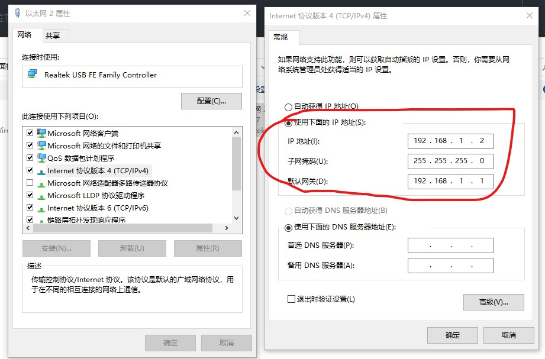
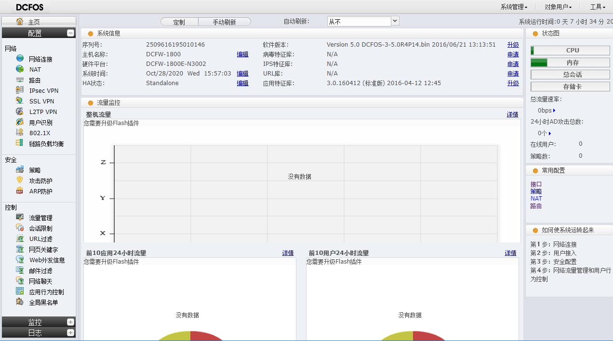

# 网络安全策略

> DCFW-1800 系列下一代防火墙，可精确识别数千种网络应用，并提供详 尽的应用风险分析和灵活的策略管控。
> 内置先进的威胁检测引擎及专业的WEB服务防护，能够抵御病毒、木马、 SQL 注入、XSS 跨站脚本、CC 攻击等网络攻击，有效保护 WEB 服务器安全。
> 可广泛适用于教育、政府、企业等 行业，为网络提供基于角色、深度应用 安全的访问控制、IPSec/SSL...

> [DCN DCFW-1800E-N3002-Pro下一代防火墙](http://www.dcnetworks.com.cn/goods/148.html)

## 基础操作

### 网线直连防火墙

将 RJ45 网线一头链接到电脑，另一头链接到防火墙的 `e0/0` 口。

将 Console 配置线连接到防火墙 CON 口，波特率（Baud rate）为 **9600**。

为防火墙 e0/0 口配置一个静态ip，配置代码如下

```sh
login: admin
password: admin # 输入密码不显示占位符
DCFW-1800# config
DCFW-1800(config)# interface ethernet0/0
DCFW-1800(config-if-eth0/0)# ip address 192.168.1.1 255.255.255.0
```

打开 `控制面板\网络和 Internet\网络连接`，点击已连接到防火墙的网线链接。

右键属性，设置使用以下 IP 地址：

- IP 地址：`192.168.1.2`
- 子网掩码：`255.255.255.0`
- 默认网关：`192.168.1.1`



打开浏览器 <http://192.168.1.1> 即可进入防火墙 Web 配置页面。



## 应用识别


## 防火墙

## 攻击防护

## 入侵防御

## 病毒过滤

## 网页访问控制

## 带宽流量管理

## 链路负载均衡

## 服务器负载均衡

## VPN

## IPV6

## 高可用性 (HA)

## 虚拟系统 (VSYS)

## 日志报表