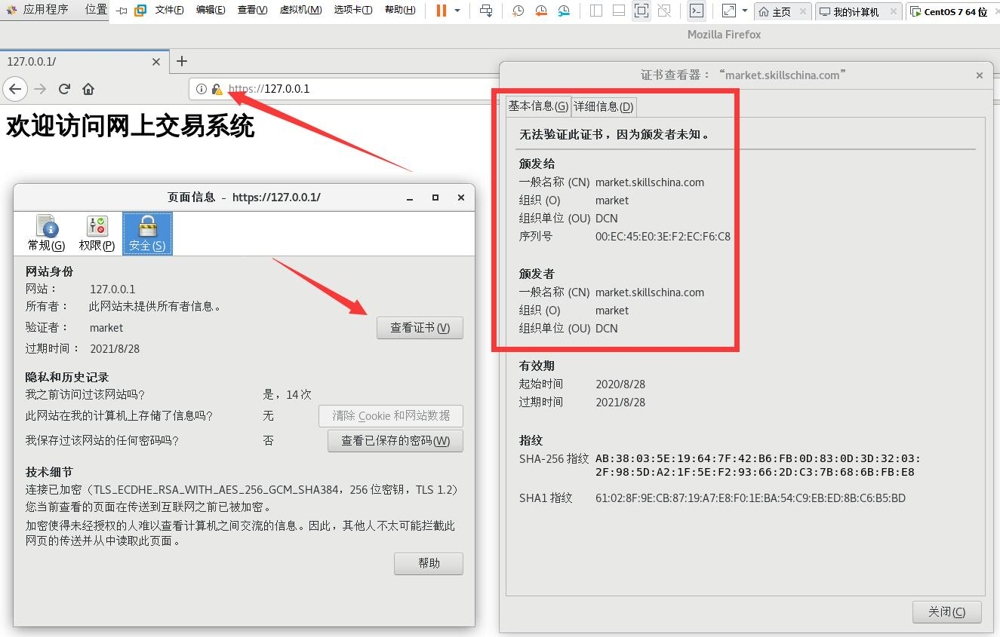

# Apache（Web 网站服务）

Apache 包含在 CentOS 的 `httpd` 服务中。

## 安装

输入：
```sh
sudo yum update                                   # 更新软件源
sudo yum install httpd                            # 安装 Apache
sudo firewall-cmd --add-service=http --permanent  # 开放 80 端口
sudo firewall-cmd --add-service=https --permanent # 开放 443 端口
```

## 启动

```sh
sudo systemctl start httpd.service  # 启动 Apache
sudo systemctl enable httpd.service # 设置开机启动 Apache
sudo systemctl status httpd.service # 查看 Apache 运行状态
```

启动后可以在虚拟机浏览器中访问 `http://127.0.0.1/` 测试，成功页面：


## 配置

### 配置简单网站

1. 网站主目录为 `/skillschina/market/`，网页的内容是“迎访问网上交易系统”；（2分）

   - 建立目录

     ```sh
     sudo mkdir -p /skillschina/market/
     ```

     > `mkdir` - 新建一个目录；
     > `mkdir -p` - 自动建立父级目录；详细说明请在终端输入 `man mkdir` 查看
   - 在 `/skillschina/market/` 目录下建立 `index.html` 文件，然后使用 **自己喜欢的** 文本编辑器编辑文件内容：

     ```html
     <h1>欢迎访问网上交易系统</h1>
     ```

     > 
     
     > 另外，推荐学习 [vi/vim 文本编辑器使用教程](https://www.runoob.com/linux/linux-vim.html)

2. 修改默认配置文件

   - 备份默认配置文件：

     ```sh
     cd /etc/httpd/conf/ # 改变工作目录
     sudo cp httpd.conf httpd.conf.bak # 备份原始配置文件
     ```

   - 修改配置文件 `httpd.conf`，第 119 行和第 131 行：

     ```diff
      113 
      114 #
      115 # DocumentRoot: The directory out of which you will serve your
      116 # documents. By default, all requests are taken from this directory, but
      117 # symbolic links and aliases may be used to point to other locations.
      118 #
     -119 DocumentRoot "/var/www/html"
     +119 DocumentRoot "/skillschina/market"
      120 
      121 #
      122 # Relax access to content within /var/www.
      123 #
      124 <Directory "/var/www">
      125     AllowOverride None
      126     # Allow open access:
      127     Require all granted
      128 </Directory>
      129 
      130 # Further relax access to the default document root:
     -131 <Directory "/var/www/html">
     +131 <Directory "/skillschina/market">
      132     #
      133     # Possible values for the Options directive are "None", "All",
      134     # or any combination of:
      135     #   Indexes Includes FollowSymLinks SymLinksifOwnerMatch ExecCGI MultiViews
      136     #
     ```

   - 配置 SELinux

     + 推荐方法：

       ```sh
       semanage fcontext -a -t httpd_sys_content_t '/skillschina/market/index.html'
       restorecon -v '/skillschina/market/index.html'
       ```

       > [鸟哥的 Linux 私房菜 - 16.5 SELinux 初探](http://linux.vbird.org/linux_basic/0440processcontrol.php#selinux)

     + 不推荐方法：

       ```sh
       setenforce 0 # 关闭 SELinux（立即生效，重启失效）；0-关；1-开
       ```

       将 `/etc/selinux/config` 文件的第7行：`SELINUX=enforcing`
       修改成：`SELINUX=disabled`（重启生效，重启有效）

   - 测试

     执行以下命令重启 Apache，然后使用浏览器访问 `http://127.0.0.1/` 测试是否修改成功。

     ```sh
     sudo systemctl restart httpd.service
     ```

### [创建 SSL 证书](../CA/#创建-ssl-证书)

### 配置 SSL 链接

```sh
sudo yum install mod_ssl.x86_64 # 安装 SSL 模块
sudo systemctl restart httpd.service # 重启 Apache
cd /etc/httpd/conf.d/
sudo cp ssl.conf ssl.conf.bak # 备份默认 SSL 配置文件
```

修改 `/etc/httpd/conf.d/ssl.conf`

```diff
  95 #   Server Certificate:
  96 # Point SSLCertificateFile at a PEM encoded certificate.  If
  97 # the certificate is encrypted, then you will be prompted for a
  98 # pass phrase.  Note that a kill -HUP will prompt again.  A new
  99 # certificate can be generated using the genkey(1) command.
-100 SSLCertificateFile /etc/pki/tls/certs/localhost.crt
+100 SSLCertificateFile /etc/pki/tls/certs/server.crt
 101 
 102 #   Server Private Key:
 103 #   If the key is not combined with the certificate, use this
 104 #   directive to point at the key file.  Keep in mind that if
 105 #   you've both a RSA and a DSA private key you can configure
 106 #   both in parallel (to also allow the use of DSA ciphers, etc.)
-107 SSLCertificateKeyFile /etc/pki/tls/private/localhost.key
+107 SSLCertificateKeyFile /etc/pki/tls/certs/server.key
```

重启 Apache 使配置文件生效

```sh
sudo systemctl restart httpd.service
```

访问 `https://127.0.0.1` 查看页面证书：



### 配置仅支持 https 协议链接

注释 `/etc/httpd/conf/httpd.conf` 文件，第 42 行：

```diff
 34 # Listen: Allows you to bind Apache to specific IP addresses and/or
 35 # ports, instead of the default. See also the <VirtualHost>
 36 # directive.
 37 #
 38 # Change this to Listen on specific IP addresses as shown below to 
 39 # prevent Apache from glomming onto all bound IP addresses.
 40 #
 41 #Listen 12.34.56.78:80
-42 Listen 80
+42 # Listen 80
```

重启 Apache 使配置文件生效

```sh
sudo systemctl restart httpd.service
```

现在 `http://127.0.0.1` 将无法访问，只能访问 `https://127.0.0.1`