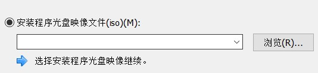

# Linux 基础

本章教程使用 CentOS 6.5/7 系统。

相关链接：

- [CentOS 官网](https://www.centos.org/download/)
- [Linux 教程 | 菜鸟教程](https://www.runoob.com/linux/linux-tutorial.html)
- [鳥哥的 Linux 私房菜](http://linux.vbird.org/)
  + 至少看看到 [第十章、認識與學習BASH](http://linux.vbird.org/linux_basic/0320bash.php)
- [Linux 就该这么学_w3cschool](https://www.w3cschool.cn/linuxprobe/)
- [vi/vim 文本编辑器](https://www.runoob.com/linux/linux-vim.html)

## 挂载软件源镜像

创建挂载目录：

```bash
mkdir /mnt/iso
```

挂载 ISO 镜像：

```bash
mount -t iso9660 -o loop /opt/CentOS-7-x86_64-Everything-1503-01.iso /mnt/iso
```

配置软件源

```bash
cd /etc/yum.repos.d
mv CentOS-Base.repo CentOS-Base.repo.bak
vi CentOS-Media.repo
```

编辑 `CentOS-Media.repo` 文件：

```diff
 # CentOS-Media.repo
 #
 # This repo is used to mount the default locations for a CDROM / DVD on
 #  CentOS-6.  You can use this repo and yum to install items directly off the
 #  DVD ISO that we release.
 #
 # To use this repo, put in your DVD and use it with the other repos too:
 #  yum --enablerepo=c6-media [command]
 #
 # or for ONLY the media repo, do this:
 #
 #  yum --disablerepo=\* --enablerepo=c6-media [command]
 
 [c6-media]
 name=CentOS-$releasever - Media
+baseurl=file:///mnt/iso/
-baseurl=file:///media/CentOS/
-        file:///media/cdrom/
-        file:///media/cdrecorder/
+gpgcheck=0
-gpgcheck=1
+enabled=1
-enabled=0
 gpgkey=file:///etc/pki/rpm-gpg/RPM-GPG-KEY-CentOS-6
```

更新软件源：

```bash
yum update
```

## SELinux

CentOS 中 SELinux 默认开启，可以使用以下指令查看状态：

``` bash
[root@host-10-20-70-107 ~]# sestatus -v
SELinux status:                 enabled
SELinuxfs mount:                /sys/fs/selinux
SELinux root directory:         /etc/selinux
Loaded policy name:             targeted
Current mode:                   enforcing
Mode from config file:          enforcing
Policy MLS status:              enabled
Policy deny_unknown status:     allowed
Max kernel policy version:      28

Process contexts:
Current context:                unconfined_u:unconfined_r:unconfined_t:s0-s0:c0.c1023
Init context:                   system_u:system_r:init_t:s0
/usr/sbin/sshd                  system_u:system_r:sshd_t:s0-s0:c0.c1023

File contexts:
Controlling terminal:           unconfined_u:object_r:user_devpts_t:s0
/etc/passwd                     system_u:object_r:passwd_file_t:s0
/etc/shadow                     system_u:object_r:shadow_t:s0
/bin/bash                       system_u:object_r:shell_exec_t:s0
/bin/login                      system_u:object_r:login_exec_t:s0
/bin/sh                         system_u:object_r:bin_t:s0 -> system_u:object_r:shell_exec_t:s0
/sbin/agetty                    system_u:object_r:getty_exec_t:s0
/sbin/init                      system_u:object_r:bin_t:s0 -> system_u:object_r:init_exec_t:s0
/usr/sbin/sshd                  system_u:object_r:sshd_exec_t:s0
```

## 设置时区

CentOS 可以使用 `timedatectl` 指令设置时区。

``` bash
[root@host-10-20-70-107 ~]# timedatectl -h
timedatectl [OPTIONS...] COMMAND ...

查询或更改系统时间和日期设置。

  -h --help                显示当前帮助信息
     --version             显示软件包版本
     --no-pager            不要将输出通过管道传给寻呼机
     --no-ask-password     不提示输入密码
  -H --host=[USER@]HOST    在远程主机上操作
  -M --machine=CONTAINER   在本地容器上操作
     --adjust-system-clock 更改本地 RTC 模式时调整系统时钟

Commands:
  status                   显示当前时间设置
  set-time TIME            设置系统时间
  set-timezone ZONE        设置系统时区
  list-timezones           显示已知时区
  set-local-rtc BOOL       控制 RTC 是否在当地时间
  set-ntp BOOL             控制是否启用 NTP
```

### 示例

将时区设置为亚洲上海：

``` bash
timedatectl set-timezone Asia/Shanghai
```

### 所有时区

::: details
```text
Africa/Abidjan
Africa/Accra
Africa/Addis_Ababa
Africa/Algiers
Africa/Asmara
Africa/Bamako
Africa/Bangui
Africa/Banjul
Africa/Bissau
Africa/Blantyre
Africa/Brazzaville
Africa/Bujumbura
Africa/Cairo
Africa/Casablanca
Africa/Ceuta
Africa/Conakry
Africa/Dakar
Africa/Dar_es_Salaam
Africa/Djibouti
Africa/Douala
Africa/El_Aaiun
Africa/Freetown
Africa/Gaborone
Africa/Harare
Africa/Johannesburg
Africa/Juba
Africa/Kampala
Africa/Khartoum
Africa/Kigali
Africa/Kinshasa
Africa/Lagos
Africa/Libreville
Africa/Lome
Africa/Luanda
Africa/Lubumbashi
Africa/Lusaka
Africa/Malabo
Africa/Maputo
Africa/Maseru
Africa/Mbabane
Africa/Mogadishu
Africa/Monrovia
Africa/Nairobi
Africa/Ndjamena
Africa/Niamey
Africa/Nouakchott
Africa/Ouagadougou
Africa/Porto-Novo
Africa/Sao_Tome
Africa/Tripoli
Africa/Tunis
Africa/Windhoek
America/Adak
America/Anchorage
America/Anguilla
America/Antigua
America/Araguaina
America/Argentina/Buenos_Aires
America/Argentina/Catamarca
America/Argentina/Cordoba
America/Argentina/Jujuy
America/Argentina/La_Rioja
America/Argentina/Mendoza
America/Argentina/Rio_Gallegos
America/Argentina/Salta
America/Argentina/San_Juan
America/Argentina/San_Luis
America/Argentina/Tucuman
America/Argentina/Ushuaia
America/Aruba
America/Asuncion
America/Atikokan
America/Bahia
America/Bahia_Banderas
America/Barbados
America/Belem
America/Belize
America/Blanc-Sablon
America/Boa_Vista
America/Bogota
America/Boise
America/Cambridge_Bay
America/Campo_Grande
America/Cancun
America/Caracas
America/Cayenne
America/Cayman
America/Chicago
America/Chihuahua
America/Costa_Rica
America/Creston
America/Cuiaba
America/Curacao
America/Danmarkshavn
America/Dawson
America/Dawson_Creek
America/Denver
America/Detroit
America/Dominica
America/Edmonton
America/Eirunepe
America/El_Salvador
America/Fort_Nelson
America/Fortaleza
America/Glace_Bay
America/Godthab
America/Goose_Bay
America/Grand_Turk
America/Grenada
America/Guadeloupe
America/Guatemala
America/Guayaquil
America/Guyana
America/Halifax
America/Havana
America/Hermosillo
America/Indiana/Indianapolis
America/Indiana/Knox
America/Indiana/Marengo
America/Indiana/Petersburg
America/Indiana/Tell_City
America/Indiana/Vevay
America/Indiana/Vincennes
America/Indiana/Winamac
America/Inuvik
America/Iqaluit
America/Jamaica
America/Juneau
America/Kentucky/Louisville
America/Kentucky/Monticello
America/Kralendijk
America/La_Paz
America/Lima
America/Los_Angeles
America/Lower_Princes
America/Maceio
America/Managua
America/Manaus
America/Marigot
America/Martinique
America/Matamoros
America/Mazatlan
America/Menominee
America/Merida
America/Metlakatla
America/Mexico_City
America/Miquelon
America/Moncton
America/Monterrey
America/Montevideo
America/Montserrat
America/Nassau
America/New_York
America/Nipigon
America/Nome
America/Noronha
America/North_Dakota/Beulah
America/North_Dakota/Center
America/North_Dakota/New_Salem
America/Ojinaga
America/Panama
America/Pangnirtung
America/Paramaribo
America/Phoenix
America/Port-au-Prince
America/Port_of_Spain
America/Porto_Velho
America/Puerto_Rico
America/Punta_Arenas
America/Rainy_River
America/Rankin_Inlet
America/Recife
America/Regina
America/Resolute
America/Rio_Branco
America/Santarem
America/Santiago
America/Santo_Domingo
America/Sao_Paulo
America/Scoresbysund
America/Sitka
America/St_Barthelemy
America/St_Johns
America/St_Kitts
America/St_Lucia
America/St_Thomas
America/St_Vincent
America/Swift_Current
America/Tegucigalpa
America/Thule
America/Thunder_Bay
America/Tijuana
America/Toronto
America/Tortola
America/Vancouver
America/Whitehorse
America/Winnipeg
America/Yakutat
America/Yellowknife
Antarctica/Casey
Antarctica/Davis
Antarctica/DumontDUrville
Antarctica/Macquarie
Antarctica/Mawson
Antarctica/McMurdo
Antarctica/Palmer
Antarctica/Rothera
Antarctica/Syowa
Antarctica/Troll
Antarctica/Vostok
Arctic/Longyearbyen
Asia/Aden
Asia/Almaty
Asia/Amman
Asia/Anadyr
Asia/Aqtau
Asia/Aqtobe
Asia/Ashgabat
Asia/Atyrau
Asia/Baghdad
Asia/Bahrain
Asia/Baku
Asia/Bangkok
Asia/Barnaul
Asia/Beirut
Asia/Bishkek
Asia/Brunei
Asia/Chita
Asia/Choibalsan
Asia/Colombo
Asia/Damascus
Asia/Dhaka
Asia/Dili
Asia/Dubai
Asia/Dushanbe
Asia/Famagusta
Asia/Gaza
Asia/Hebron
Asia/Ho_Chi_Minh
Asia/Hong_Kong
Asia/Hovd
Asia/Irkutsk
Asia/Jakarta
Asia/Jayapura
Asia/Jerusalem
Asia/Kabul
Asia/Kamchatka
Asia/Karachi
Asia/Kathmandu
Asia/Khandyga
Asia/Kolkata
Asia/Krasnoyarsk
Asia/Kuala_Lumpur
Asia/Kuching
Asia/Kuwait
Asia/Macau
Asia/Magadan
Asia/Makassar
Asia/Manila
Asia/Muscat
Asia/Nicosia
Asia/Novokuznetsk
Asia/Novosibirsk
Asia/Omsk
Asia/Oral
Asia/Phnom_Penh
Asia/Pontianak
Asia/Pyongyang
Asia/Qatar
Asia/Qyzylorda
Asia/Riyadh
Asia/Sakhalin
Asia/Samarkand
Asia/Seoul
Asia/Shanghai
Asia/Singapore
Asia/Srednekolymsk
Asia/Taipei
Asia/Tashkent
Asia/Tbilisi
Asia/Tehran
Asia/Thimphu
Asia/Tokyo
Asia/Tomsk
Asia/Ulaanbaatar
Asia/Urumqi
Asia/Ust-Nera
Asia/Vientiane
Asia/Vladivostok
Asia/Yakutsk
Asia/Yangon
Asia/Yekaterinburg
Asia/Yerevan
Atlantic/Azores
Atlantic/Bermuda
Atlantic/Canary
Atlantic/Cape_Verde
Atlantic/Faroe
Atlantic/Madeira
Atlantic/Reykjavik
Atlantic/South_Georgia
Atlantic/St_Helena
Atlantic/Stanley
Australia/Adelaide
Australia/Brisbane
Australia/Broken_Hill
Australia/Currie
Australia/Darwin
Australia/Eucla
Australia/Hobart
Australia/Lindeman
Australia/Lord_Howe
Australia/Melbourne
Australia/Perth
Australia/Sydney
Europe/Amsterdam
Europe/Andorra
Europe/Astrakhan
Europe/Athens
Europe/Belgrade
Europe/Berlin
Europe/Bratislava
Europe/Brussels
Europe/Bucharest
Europe/Budapest
Europe/Busingen
Europe/Chisinau
Europe/Copenhagen
Europe/Dublin
Europe/Gibraltar
Europe/Guernsey
Europe/Helsinki
Europe/Isle_of_Man
Europe/Istanbul
Europe/Jersey
Europe/Kaliningrad
Europe/Kiev
Europe/Kirov
Europe/Lisbon
Europe/Ljubljana
Europe/London
Europe/Luxembourg
Europe/Madrid
Europe/Malta
Europe/Mariehamn
Europe/Minsk
Europe/Monaco
Europe/Moscow
Europe/Oslo
Europe/Paris
Europe/Podgorica
Europe/Prague
Europe/Riga
Europe/Rome
Europe/Samara
Europe/San_Marino
Europe/Sarajevo
Europe/Saratov
Europe/Simferopol
Europe/Skopje
Europe/Sofia
Europe/Stockholm
Europe/Tallinn
Europe/Tirane
Europe/Ulyanovsk
Europe/Uzhgorod
Europe/Vaduz
Europe/Vatican
Europe/Vienna
Europe/Vilnius
Europe/Volgograd
Europe/Warsaw
Europe/Zagreb
Europe/Zaporozhye
Europe/Zurich
Indian/Antananarivo
Indian/Chagos
Indian/Christmas
Indian/Cocos
Indian/Comoro
Indian/Kerguelen
Indian/Mahe
Indian/Maldives
Indian/Mauritius
Indian/Mayotte
Indian/Reunion
Pacific/Apia
Pacific/Auckland
Pacific/Bougainville
Pacific/Chatham
Pacific/Chuuk
Pacific/Easter
Pacific/Efate
Pacific/Enderbury
Pacific/Fakaofo
Pacific/Fiji
Pacific/Funafuti
Pacific/Galapagos
Pacific/Gambier
Pacific/Guadalcanal
Pacific/Guam
Pacific/Honolulu
Pacific/Kiritimati
Pacific/Kosrae
Pacific/Kwajalein
Pacific/Majuro
Pacific/Marquesas
Pacific/Midway
Pacific/Nauru
Pacific/Niue
Pacific/Norfolk
Pacific/Noumea
Pacific/Pago_Pago
Pacific/Palau
Pacific/Pitcairn
Pacific/Pohnpei
Pacific/Port_Moresby
Pacific/Rarotonga
Pacific/Saipan
Pacific/Tahiti
Pacific/Tarawa
Pacific/Tongatapu
Pacific/Wake
Pacific/Wallis
UTC
```
:::

<!--
## 常用指令

### cd

```bash
cd <目标目录>
```

目标目录可以是 绝对路径 或 相对路径 

### mv

```bash
mv <原始目录> <目标目录>
```
-->

## 联网

点击右上角电源键处打开网络连接：


## 手动配置 IP 地址


## 添加中文输入法


## CentOS 软件包安装流程示例

输入：

```sh
sudo yum update # 更新软件源
sudo yum install httpd # 安装 Apache
[sudo] yueplus 的密码： # 输入管理员密码
```

> `sudo` - 以管理员身份运行（可以使用 `su root` 切换到 root 用户，就不用一直输 `sudo` 了）；

输出：

```sh
已加载插件：fastestmirror, langpacks
Loading mirror speeds from cached hostfile
 * base: mirrors.aliyun.com
 * extras: ftp.sjtu.edu.cn
 * updates: ftp.sjtu.edu.cn
正在解决依赖关系
--> 正在检查事务
---> 软件包 httpd.x86_64.0.2.4.6-93.el7.centos 将被 安装
--> 正在处理依赖关系 httpd-tools = 2.4.6-93.el7.centos，它被软件包 httpd-2.4.6-93.el7.centos.x86_64 需要
--> 正在处理依赖关系 /etc/mime.types，它被软件包 httpd-2.4.6-93.el7.centos.x86_64 需要
--> 正在处理依赖关系 libaprutil-1.so.0()(64bit)，它被软件包 httpd-2.4.6-93.el7.centos.x86_64 需要
--> 正在处理依赖关系 libapr-1.so.0()(64bit)，它被软件包 httpd-2.4.6-93.el7.centos.x86_64 需要
--> 正在检查事务
---> 软件包 apr.x86_64.0.1.4.8-5.el7 将被 安装
---> 软件包 apr-util.x86_64.0.1.5.2-6.el7 将被 安装
---> 软件包 httpd-tools.x86_64.0.2.4.6-93.el7.centos 将被 安装
---> 软件包 mailcap.noarch.0.2.1.41-2.el7 将被 安装
--> 解决依赖关系完成

依赖关系解决

===================================================================================================================================================================================================================
 Package                                             架构                                           版本                                                        源                                            大小
===================================================================================================================================================================================================================
正在安装:
 httpd                                               x86_64                                         2.4.6-93.el7.centos                                         base                                         2.7 M
为依赖而安装:
 apr                                                 x86_64                                         1.4.8-5.el7                                                 base                                         103 k
 apr-util                                            x86_64                                         1.5.2-6.el7                                                 base                                          92 k
 httpd-tools                                         x86_64                                         2.4.6-93.el7.centos                                         base                                          92 k
 mailcap                                             noarch                                         2.1.41-2.el7                                                base                                          31 k

事务概要
===================================================================================================================================================================================================================
安装  1 软件包 (+4 依赖软件包)

总下载量：3.0 M
安装大小：10 M
```

输入：

```sh
Is this ok [y/d/N]: Y
```

> - Y - Yes 下载并安装
> - D - Dowonload 仅下载
> - N - No 不做任何事

输出：

```sh
Downloading packages:
(1/5): apr-1.4.8-5.el7.x86_64.rpm                                                                                                                                                           | 103 kB  00:00:00     
(2/5): apr-util-1.5.2-6.el7.x86_64.rpm                                                                                                                                                      |  92 kB  00:00:00     
(3/5): mailcap-2.1.41-2.el7.noarch.rpm                                                                                                                                                      |  31 kB  00:00:00     
(4/5): httpd-tools-2.4.6-93.el7.centos.x86_64.rpm                                                                                                                                           |  92 kB  00:00:00     
(5/5): httpd-2.4.6-93.el7.centos.x86_64.rpm                                                                                                                                                 | 2.7 MB  00:00:02     
-------------------------------------------------------------------------------------------------------------------------------------------------------------------------------------------------------------------
总计                                                                                                                                                                               1.3 MB/s | 3.0 MB  00:00:02     
Running transaction check
Running transaction test
Transaction test succeeded
Running transaction
  正在安装    : apr-1.4.8-5.el7.x86_64                                                                                                                                                                         1/5 
  正在安装    : apr-util-1.5.2-6.el7.x86_64                                                                                                                                                                    2/5 
  正在安装    : httpd-tools-2.4.6-93.el7.centos.x86_64                                                                                                                                                         3/5 
  正在安装    : mailcap-2.1.41-2.el7.noarch                                                                                                                                                                    4/5 
  正在安装    : httpd-2.4.6-93.el7.centos.x86_64                                                                                                                                                               5/5 
  验证中      : apr-1.4.8-5.el7.x86_64                                                                                                                                                                         1/5 
  验证中      : httpd-tools-2.4.6-93.el7.centos.x86_64                                                                                                                                                         2/5 
  验证中      : mailcap-2.1.41-2.el7.noarch                                                                                                                                                                    3/5 
  验证中      : httpd-2.4.6-93.el7.centos.x86_64                                                                                                                                                               4/5 
  验证中      : apr-util-1.5.2-6.el7.x86_64                                                                                                                                                                    5/5 

已安装:
  httpd.x86_64 0:2.4.6-93.el7.centos                                                                                                                                                                               

作为依赖被安装:
  apr.x86_64 0:1.4.8-5.el7                      apr-util.x86_64 0:1.5.2-6.el7                      httpd-tools.x86_64 0:2.4.6-93.el7.centos                      mailcap.noarch 0:2.1.41-2.el7                     

完毕！
```

## `systemctl` 命令

```sh
# 立即启动一个服务
$ sudo systemctl start apache.service

# 立即停止一个服务
$ sudo systemctl stop apache.service

# 重启一个服务
$ sudo systemctl restart apache.service

# 杀死一个服务的所有子进程
$ sudo systemctl kill apache.service

# 重新加载一个服务的配置文件
$ sudo systemctl reload apache.service

# 重载所有修改过的配置文件
$ sudo systemctl daemon-reload

# 显示某个 Unit 的所有底层参数
$ systemctl show httpd.service

# 显示某个 Unit 的指定属性的值
$ systemctl show -p CPUShares httpd.service

# 设置某个 Unit 的指定属性
$ sudo systemctl set-property httpd.service CPUShares=500
```

> [Systemd 入门教程：命令篇](http://www.ruanyifeng.com/blog/2016/03/systemd-tutorial-commands.html)

## 解决 SELinux 报警


+ 直接关闭 SELinux：

  ```sh
  setenforce 0 # 关闭 SELinux（立即生效，重启失效）；0-关；1-开
  ```

  将 `/etc/selinux/config` 文件的第7行：`SELINUX=enforcing`
  修改成：`SELINUX=disabled`（重启生效，重启有效）

+ 添加正确的文件类型

  ```sh
  semanage fcontext -a -t httpd_sys_content_t '/skillschina/market/index.html'
  restorecon -v '/skillschina/market/index.html'
  ```

> [鸟哥的 Linux 私房菜 - 16.5 SELinux 初探](http://linux.vbird.org/linux_basic/0440processcontrol.php#selinux)

## `smbclient` 命令详解

语法：`smbclient [网络资源][密码][-EhLN][-B<IP地址>][-d<排错层级>][-i<范围>][-I<IP地址>][-l<记录文件>][-M<NetBIOS名称>][-n<NetBIOS名称>][-O<连接槽选项>][-p<TCP连接端口>][-R<名称解析顺序>][-s<目录>][-t<服务器字码>][-T<tar选项>][-U<用户名称>][-W<工作群组>]`

```text
[网络资源] [网络资源]的格式为//服务器名称/资源分享名称。
[密码] 输入存取网络资源所需的密码。
-B<IP地址> 传送广播数据包时所用的IP地址。
-d<排错层级> 指定记录文件所记载事件的详细程度。
-E 将信息送到标准错误输出设备。
-h 显示帮助。
-i<范围> 设置NetBIOS名称范围。
-I<IP地址> 指定服务器的IP地址。
-l<记录文件> 指定记录文件的名称。
-L 显示服务器端所分享出来的所有资源。
-M<NetBIOS名称> 可利用WinPopup协议，将信息送给选项中所指定的主机。
-n<NetBIOS名称> 指定用户端所要使用的NetBIOS名称。
-N 不用询问密码。
-O<连接槽选项> 设置用户端TCP连接槽的选项。
-p<TCP连接端口> 指定服务器端TCP连接端口编号。
-R<名称解析顺序> 设置NetBIOS名称解析的顺序。
-s<目录> 指定smb.conf所在的目录。
-t<服务器字码> 设置用何种字符码来解析服务器端的文件名称。
-T<tar选项> 备份服务器端分享的全部文件，并打包成tar格式的文件。
-U<用户名称> 指定用户名称。
-W<工作群组> 指定工作群组名称。
```

## 计划任务

### 使用 `at` 设置定时任务

> 参考 [鳥哥的 Linux 私房菜 -- 第十五章、例行性工作排程(crontab)](http://linux.vbird.org/linux_basic/0430cron.php#atjob)

#### 安装

```shell
sudo yum install atd      # 安装 at
sudo systemctl enable atd # 设置开机启动
sudo systemctl start atd  # 立即启动
sudo systemctl status atd # 查看状态
```

#### manpages

```text
AT(1)                      Linux Programmer's Manual                     AT(1)

NAME
       at, batch, atq, atrm - 排队、检查或删除以后要执行的作业。

总览
       at  [-V]  [-q  队列]  [-f 文件] [-mldbv] 时间 at -c 作业 [作业...]  atq
       [-V] [-q 队列] [-v]
       atrm [-V] 作业 [作业...]
       batch [-V] [-q 队列] [-f 文件] [-mv] [时间]
描述
       at 和 batch  从标准输入或一个指定的文件读取命令，这些命令在以后某个时间
       用 /bin/sh 执行。

       at      在指定的时间执行命令。

       atq     列出用户的等待执行的作业；在用户是超级用户的情况下，列出所有人
               的作业。

       atrm    删除作业。

       batch   在系统负载水平允许的时候执行命令；换句话说，当平均负   载降到低
               于0.8，或降到了在  atrun 文件中指定的期望值时运行。 译注：atrun
               文件参见 atd 手册页。

       At 允许相当复杂的时间指定，它扩展了 POSIX.2 标准。它接受 HH:MM 的时间式
       样，用来指定在一天的某个时间运行一个作业。  (如果时间已经过了则假定为第
       二天。)你可以指定  midnight  (午夜)、  noon  (中午)  或   teatime   (下
       午4点)，你可以用  AM  或 PM 后缀指定一天的上午或下午。你可以给出 month-
       name day 加上可选 的年份的式样用来指定运行 at  的日期，或者给出  MMDDYY
       、 MM/DD/YY 或 DD.MM.YY 式样用来指定运行 at 的日期。日期的指定 必须跟在
       时间指定的后面。你也可以给出象 now + 计数 时间单位 的式样，这里的时间单
       位可以是  minutes  、 hours 、 days 或 weeks， 你可以给时间加一个 today
       后缀来指定 at 今天运行作业，可以 给时间加一个 tomorrow 后缀来指定 at 明
       天运行作业。

       例如，要在三天以后的下午 4 点运行一个作业，at 时间参数可以 指定为 4pm +
       3 days。 要在7月31日上午10:00运行一个作业， at 时间参数可以指定为  10am
       Jul   31，   要在明天上午1点运行一个  作业，at  时间参数可以指定为  1am
       tomorrow。

       时间指定的精确的定义可以在 /usr/share/doc/at/timespec 找到。

       对于 at 和 batch 两者，从标准输入或以 -f 选项指定的文件中  读取命令并执
       行之。工作路径、环境变量(除了 TERM、 DISPLAY 和 _)、 umask 从所期望的时
       间起保持不变。从一个从执行 su(1) 命令得到的 shell  中调用的  at   -  或
       batch  - 命令将保持当前的 userid。 用户的命令的标准错误输出和标准输出将
       用邮件发给用户。发送邮件  使用命令  /usr/sbin/sendmail。   从一个从执行
       su(1)命令得到的  shell 中执行了 at ，登录 shell 的所有者将接到邮件。 译
       注：userid 是用户标识的意思。umask 是与每个进程相关联的文件  方式创建屏
       蔽字。

       超级用户可以在任何情况下使用这些命令。对于其他用户，使用  at 的权限由文
       件 /etc/at.allow 和 /etc/at.deny 确定。

       如果文件 /etc/at.allow 存在，在其中提及的用户名被允许使用 at 命令。

       如果 /etc/at.allow 不存在，而 /etc/at.deny 存在，所有在 /etc/at.deny 中
       未提及的用户被允许使用 at 命令。

       如果两者均不存在，只用超级用户可以使用 at 命令。

       一个空的 /etc/at.deny 意味着所有用户均被允许使用这些命令， 这是缺省的配
       置。
选项
       -V      在标准错误上输出版本号。

       -q queue
               使用指定的队列。一个队列用一个字母标定，有效的的队列标定的 范围
               是从a到z和从A到Z。at  的缺省队列是 a,batch 的缺省队列是 b。队列
               的字母顺序越高，则队列运行时越谦让(运行级别越低)。   指定的队列
               "=" 保留给当前运行的作业所在的队列。

       如果一个作业被提交到一个以大写字母标定的队列，则与提交到  batch  同样对
       待。如果给 atq 指定一个队列，则只显示在此指定 队列中的作业。

       -m      当作业完成时即使没有输出也给用户发邮件。

       -f file 从文件而不是标准输入中读取作业信息。

       -l      是 atq 的别名。

       -d      是 atrm 的别名。

       -v      对于 atq， 显示完整的在队列中未被删除的作业，对于其他  命令，显
               示作业将要执行的时间。

       显示的时间的格式类似于"1997-02-20  14:50"，但如果设置了 POSIXLY_CORRECT
       环境变量之后，格式类似于"Thu Feb 20 14:50:00 1996"。

       -c      连接命令行中列出的作业并输出到标准输出。

相关文件
       /var/spool/at
       /var/spool/at/spool
       /proc/loadavg
       /var/run/utmp
       /etc/at.allow
       /etc/at.deny

参见
       cron(1), nice(1), sh(1), umask(2), atd(8)

缺陷
       在 Linux 下正确的批处理操作依赖于挂装在/proc 上的一个 proc-  类型的目录
       的存在。

       如果文件  /var/run/utmp 不可获得或已经损坏，或者在 at 所期 待的时间用户
       没有登录，向在环境变量 LOGNAME 中找到的 userid 发送邮件。如果 LOGNAME未
       定义或是空的，假定为当前的userid。

       当前实现的  at 和 batch 在用户竞争资源的时候是不适合的。 如果你的站点是
       这种情况，你可以考虑其他的批处理系统， 例如 nqs。

著作者
       AT 大部分是由Thomas Koenig写的。ig25@rz.uni-karlsruhe.de.

[中文版维护人]
       mhss <jijingzhisheng@up369.com>
       主要参照了：  Linux实用大全  /  陈向阳，方汉  编著.  -北京：   科学出版
       社，1998.8

[中文版最新更新]
       2000/10/27

《中国linux论坛man手册页翻译计划》:
       http://cmpp.linuxforum.net

跋
       本页面中文版由中文 man 手册页计划提供。
       中文 man 手册页计划：https://github.com/man-pages-zh/manpages-zh

local                              Nov 1996                              AT(1)
```

#### 示例：两分钟后向全体已登入用户发送消息

```shell
at now + 2minutes
wall hello
```

<kbd>Ctrl</kbd> + <kbd>D</kbd> 完成输入。

#### 示例：20 分钟后重启系统

```shell
at now + 20minutes
reboot
```

<kbd>Ctrl</kbd> + <kbd>D</kbd> 完成输入。

### 使用 `crontab` 计划任务

使用 `crontab -e` 指令编辑计划任务

```bash {1,10}
ubuntu@VM-12-14-ubuntu:~$ crontab -e
no crontab for ubuntu - using an empty one

Select an editor.  To change later, run 'select-editor'.
1. /bin/nano        <---- easiest
2. /usr/bin/vim.basic
3. /usr/bin/vim.tiny
4. /bin/ed

Choose 1-4 [1]: 2
No modification made
```

#### 语法

```bash {1}
[root@study ~]# crontab [-u username] [-l|-e|-r]
選項與參數：
-u  ：只有 root 才能進行這個任務，亦即幫其他使用者建立/移除 crontab 工作排程；
-e  ：編輯 crontab 的工作內容
-l  ：查閱 crontab 的工作內容
-r  ：移除所有的 crontab 的工作內容，若僅要移除一項，請用 -e 去編輯。

範例一：用 dmtsai 的身份在每天的 12:00 發信給自己
[dmtsai@study ~]$ crontab -e
# 此時會進入 vi 的編輯畫面讓您編輯工作！注意到，每項工作都是一行。
0   12  *  *  * mail -s "at 12:00" dmtsai < /home/dmtsai/.bashrc
#分 時  日 月 週 |<==============指令串========================>|
```

> 参考 [鳥哥的 Linux 私房菜 -- 第十五章、例行性工作排程(crontab)](http://linux.vbird.org/linux_basic/0430cron.php#etc_crontab)

#### 示例，每天每小时的 30 分，将 `/home` 目录实施压缩打包

```shell
30 * * * * tar -cvf /home.tar.xz /home
```

> [Linux tar 命令 | 菜鸟教程](https://www.runoob.com/linux/linux-comm-tar.html)

## Linux 安装

1. 参考 [安装 VMware Workstation](/serve/VM/VMware/#安装-vmware)
2. 前往 [CentOS 官网](https://www.centos.org/download/) 下载系统镜像
   > 培训室内网共享文件夹：`\\WS22\Yue_plus 的共享\LinuxOS`

 可前往bilbil网站观看第三章
<iframe src="//player.bilibili.com/player.html?aid=99111795&bvid=BV187411y7hF&cid=169181090&page=1" scrolling="no" border="0" frameborder="no" framespacing="0" allowfullscreen="true" style="width: 100%; height: 380px;"> </iframe>

## VMware 虚拟机以及镜像安装

1.新建一个虚拟机


2.选择典型点击下一步



3.选择自己要安装的镜像，选择完毕直接点击下一步


4.此步骤是没有镜像的操作。建议使用镜像安装，有镜像可省略此步骤然后点击下一步


5.虚拟机命名以及选择他所需要储存的的位置，设置完后点击下一步


6.指定磁盘容量的大小，可默认，也可以自己设置


7.做完以上步骤之后，就可以开始安装虚拟机了，点击完成开始安装
