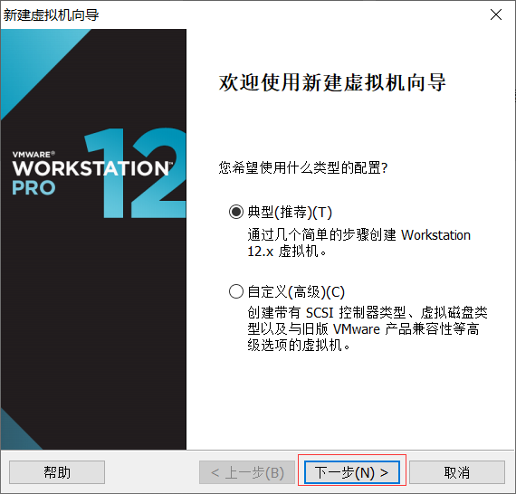
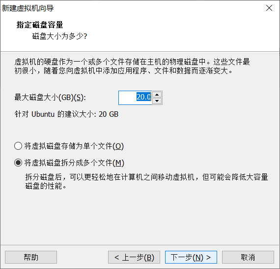
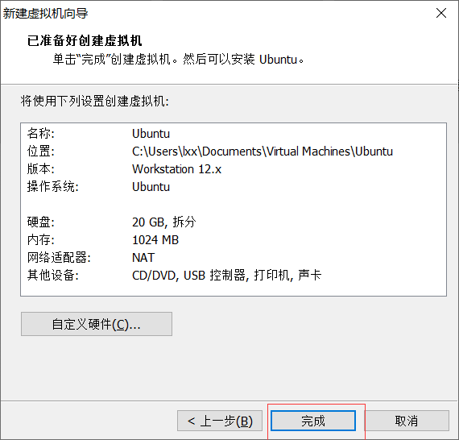

# Linux 安装

## 准备工作

1. 参考 [安装 VMware Workstation](/serve/VM/VMware/#安装-vmware)
2. 前往 [CentOS 官网](https://www.centos.org/download/) 下载系统镜像
   > 培训室内网共享文件夹：`\\WS19\Yue_plus 的共享\LinuxOS`

```
VMware 虚拟机以及镜像安装
```
```
1.新建一个虚拟机
```

```
2.选择典型点击下一步
```

```
3.选择自己要安装的镜像，选择完毕直接点击下一步
```

```
4.此步骤是没有镜像的操作。建议使用镜像安装，有镜像可省略此步骤然后点击下一步
```

```
5.虚拟机命名以及选择他所需要储存的的位置，设置完后点击下一步
```

```
6.指定磁盘容量的大小，可默认，也可以自己设置
```

```
7.做完以上步骤之后，就可以开始安装虚拟机了，点击完成开始安装
```