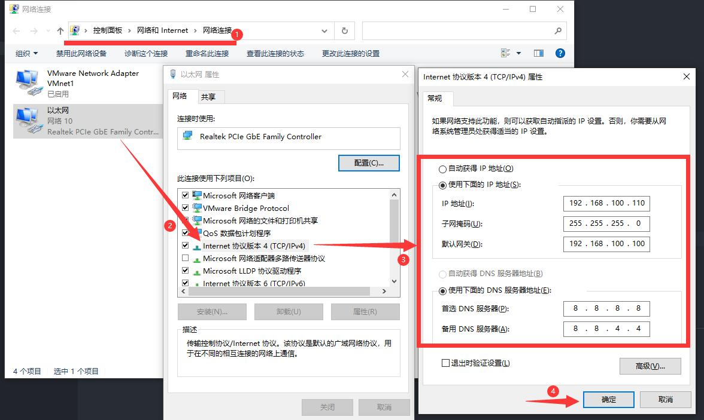

# DCC-CRL 1000 云服务实训平台

::: danger
**请妥善保管配套U盘！**
:::

>相关链接：
>
> - [DCN 产品中心 - DCC-CRL1000 云服务实训平台](http://www.dcnetworks.com.cn/goods/55.html)

## 安装系统

开机，看见 DCN Logo 后，按 <kbd>Ctrl</kbd> + <kbd>I</kbd>，进入 RAID 配置。

云平台中有两块 240G 的 Intel SSD 硬盘，配置 RAID 0。

<!-- 待补充图片 -->

保存并在重启前插入 UDisk 1（白色U盘），然后进入自动安装过程。

## 激活系统

1. 安装成功并开机后，使用默认 root 账户登入。
   输入 `getsn` 获取 SN 码。
2. 参考随机附带的 UDisk 2（黑色U盘）中的 `云服务实训平台License申请表.docx` 文件申请一个许可证文件。
3. 将下发的许可证文件放入 UDisk 2（黑色U盘）的 `licence` 文件夹中。
4. 开机登入 root 账号后，插入 UDisk 2（黑色U盘），输入 `setupcloud`，然后等待激活完成。

## 连接到云实训平台

### 网线直连

将网线一头接电脑，另一头接云平台 **左边** 的网线口。

如下设置自己的网络状态：

浏览器访问 <http://192.168.100.100/dashboard> 进入控制台。

## 附：默认 BIOS 设置

<!-- 待补充图片 -->