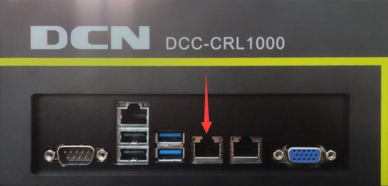
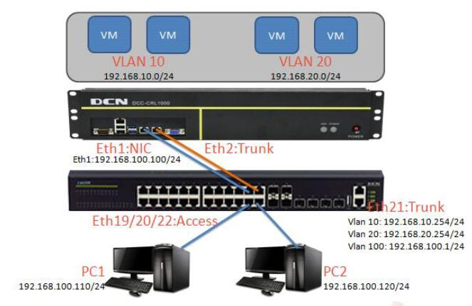
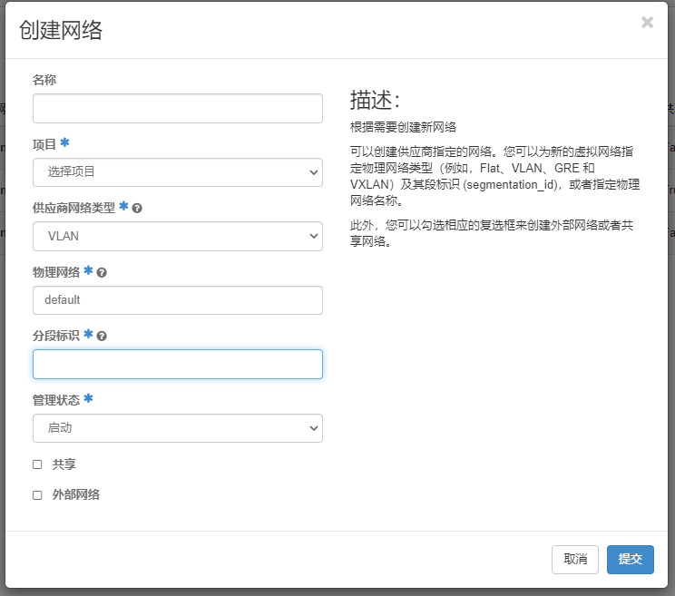
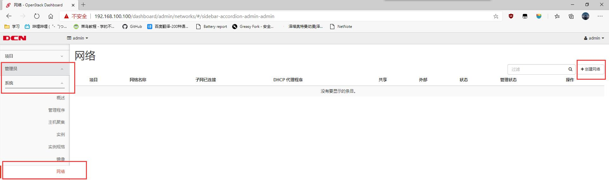
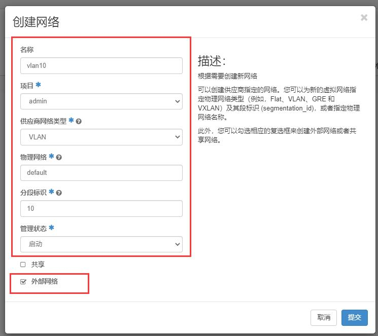

# DCC-CRL 1000 云服务实训平台

::: tip
神州数码云科信息的DCC-CRL1000是新一代的云服务实训平台。
它提供软硬件一体的系统，将一台服务器虚拟化为多台服务器使用，提供统一的WEB管理界面，以及底层的命令行管理功能，可以提供稳定、高速的实训环境。
云服务实训平台不但可以实现服务器的虚拟化，还可以实现块存储以及对象存储功能，为实训数据提供保存和传递服务。
:::

::: danger
**请妥善保管配套U盘！**
:::

>相关链接：
>
> - [DCN 产品中心 - DCC-CRL1000 云服务实训平台](http://www.dcnetworks.com.cn/goods/55.html)

## 配套视频

- [DCC-CRL1000 云服务实训平台配套视频 01 BIOS](https://www.bilibili.com/video/BV1444y1g7Sv/)
- [DCC-CRL1000 云服务实训平台配套视频 02 RAID](https://www.bilibili.com/video/BV1gB4y1m75C/)
- [DCC-CRL1000 云服务实训平台配套视频 03 安装系统-1](https://www.bilibili.com/video/BV1444y1g7Sv/)
- [DCC-CRL1000 云服务实训平台配套视频 04 安装系统-2](https://www.bilibili.com/video/BV1s44y1g7T8/)
- [DCC-CRL1000 云服务实训平台配套视频 05 脚本安装 openstack 及上传镜像](https://www.bilibili.com/video/BV1t34y1e7qG/)
- [DCC-CRL1000 云服务实训平台配套视频 06 完成安装重启](https://www.bilibili.com/video/BV17541117EB/)
- [DCC-CRL1000 云服务实训平台配套视频 07 用户安装手册视频操作](https://www.bilibili.com/video/BV1xA4y1X7V3/)

## 配套文档

- [`云服务实训平台安装手册v1.2.pdf`](./云服务实训平台安装手册v1.2.pdf)
- [`云服务实训平台用户操作手册v1.2.pdf`](./云服务实训平台用户操作手册v1.2.pdf)

## 安装系统

开机，看见 DCN Logo 后，按 <kbd>Ctrl</kbd> + <kbd>I</kbd>，进入 RAID 配置。

云平台中有两块 240G 的 Intel SSD 硬盘，配置 RAID 0。

<!-- 待补充图片 -->

保存并在重启前插入 UDisk 1（白色U盘），然后进入自动安装过程。

## 激活系统

1. 安装成功并开机后，使用默认 root 账户登入。
   输入 `getsn` 获取 SN 码。
2. 参考随机附带的 UDisk 2（黑色U盘）中的 `云服务实训平台License申请表.docx` 文件申请一个许可证文件。
3. 将下发的许可证文件放入 UDisk 2（黑色U盘）的 `licence` 文件夹中。
4. 开机登入 root 账号后，插入 UDisk 2（黑色U盘），输入 `setupcloud`，然后等待激活完成。

## 连接到云实训平台

::: tip
当前 IP：<http://192.168.100.100/dashboard>
:::



### 网线直连

将网线一头接电脑，另一头接云平台 **管理口**。

如下设置自己的网络状态：


浏览器访问 **<http://192.168.100.100/dashboard>** 进入控制台。

### 使用交换机

使用两根网线将云平台的 **管理口** 与 **业务口** 接交换机，并将电脑链接到交换机。

设置交换机 **业务口** 使用 `Trunk` 模式：

```text {5}
S5750E-28C-SI>enable 
S5750E-28C-SI#config          
S5750E-28C-SI(config)#interface ethernet 1/0/13
S5750E-28C-SI(config-if-ethernet1/0/13)#switchport mode trunk 
Set the port Ethernet1/0/13 mode Trunk successfully
```



**注意！** 创建网络时的 **分段标识** 要与交换机 Vlan 对应！详见[创建外部vlan网络](#创建外部vlan网络)



### 更新云平台 IP

将显示器与键盘插上云平台，使用 `root` 账户（默认密码：`dcncloud`）登入云平台系统。

使用以下命令更新云平台的静态 IP：

```sh
resetip
```

- 设置静态 IP：（<kbd>Enter</kbd> 确认）
- 设置子网掩码：（<kbd>Enter</kbd> 确认）
- 设置默认网关：（<kbd>Enter</kbd> 确认）


## 默认密码

Web 控制台默认管理员账号：
- 用户名：`admin`
- 密码：`dcncloud`

--------------------------------------

Windows 7 镜像系统密码：
- 用户名：`admin`
- 密码：`Qwer1234`

--------------------------------------

Windows 10；Windows Server 2008/2012/2016 镜像系统密码：
- 用户名：`administrator`
- 密码：`Qwer1234`

--------------------------------------

CentOS 6.5/7 镜像系统密码：
- 用户名：`root`
- 密码：`dcncloud`

<!-- ## 附：默认 BIOS 设置 -->

<!-- 待补充图片 -->

## 创建外部vlan网络

点击左侧“管理员”下面“系统“栏下面的“网络” 

点击网络右侧界面的“创建网络”按钮，



点击网络右侧界面的“创建网络”按钮

创建一个名称为“vlan10”的网络：

- 项目：admin
- 供应商网络类型：VLAN
- 物理网络：default
- 分段标识：10（此处与交换机 VLAN 对应）

ID 为“10”与交换机中需要开启 VLAN10，连接云服务实训平台的 eth2 的交换机端口必须是 trunk 口而且放行 vlan10 的流量，注意在外部网络前面方框中打“√”



点击“提交”按钮后，点击右侧界面“网络名称”下面的 vlan10


我们为 vlan10 网络添加子网，点击“创建子网”按钮。

- 名称为：vlan10-subnet
- 网络地址：192.168.100.0/24
- 网关：192.168.100.1（这里的网关要和外部交换机设置的网关相对应）
- 启用 DHCP 服务，分配池为:`192.168.100.100，192.168.100.200`


点击 **已创建**

## 创建实例

## 云平台关机与重启

点击 [管理员] → [系统] → [电源管理]，在电源管理页面中选择关机或重启，点击“确认”即可完成关机及重启操作。
如下图：

