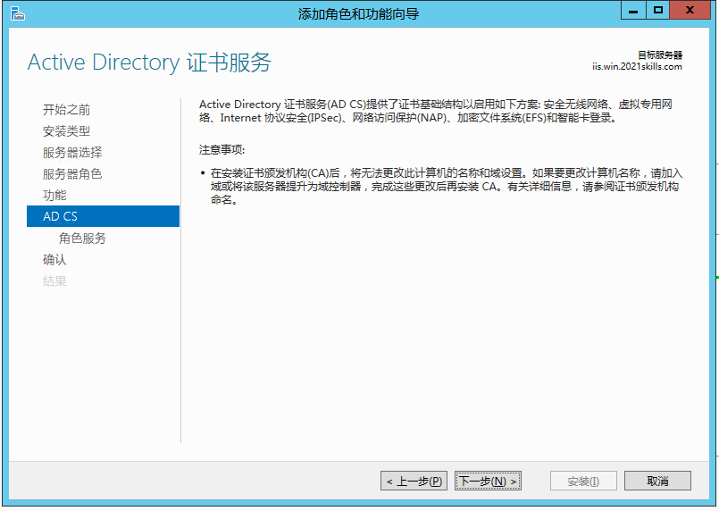
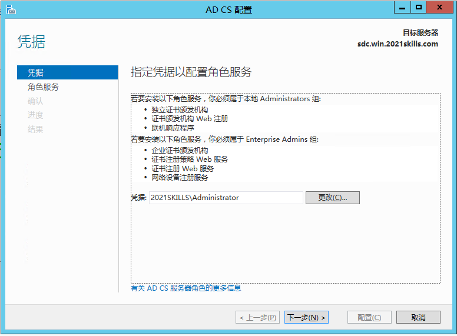
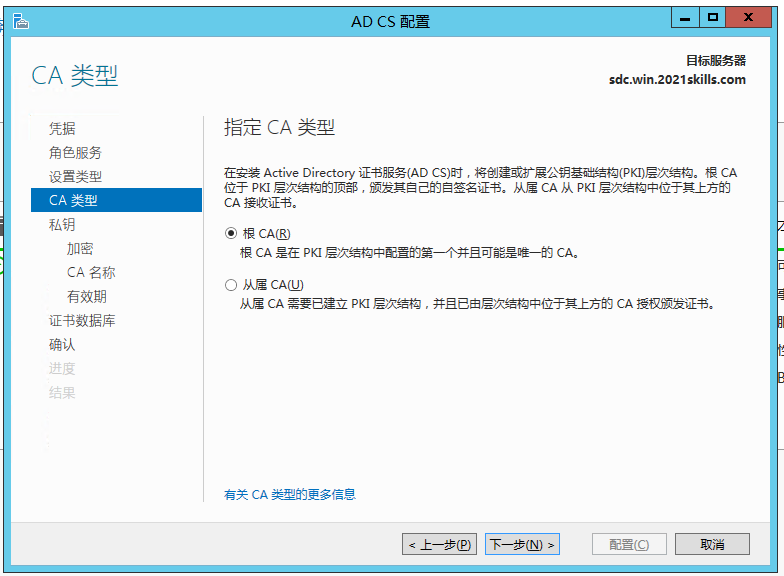
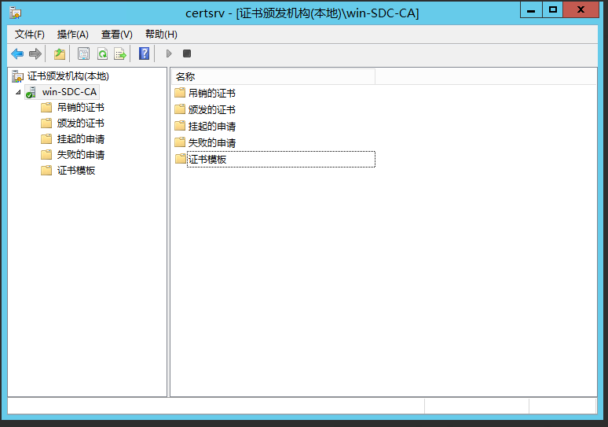

# Active Directory 证书服务

::: tip
AD CS 是允许构建公钥基础设施（PKI）并为您的组织提供公钥加密、数字证书和数字签名功能的服务器角色。
:::

## 链接

- [Active Directory Certificate Services Overview](https://docs.microsoft.com/zh-cn/previous-versions/windows/it-pro/windows-server-2012-r2-and-2012/hh831740(v=ws.11))
- [ADCS证书服务_Rainy`s IT Tech Blog的技术博客_51CTO博客_证书服务部署ADCS服务](https://blog.51cto.com/rainy0426/1788052)

## 安装

添加服务器角色 **Active Directory 证书服务**：

## 配置

### 自动证书申请设置

### 使用证书注册 Web 服务

首先需要安装并配置以下服务器角色：

- 证书颁发机构
- 证书颁发机构 Web 注册联机响应程序
- 网络设备注册服务证书注册 Web 服务

然后打开 <https://[host]/CertSrv>：

## 常见问题

### Error 001：找不到任何证书模板。你没有从该 CA 申请证书的权限，或者在访问 Active Directory 时发生错误。

[用户从 CA Web 注册页面请求证书时出错：找不到证书模板](https://docs.microsoft.com/zh-cn/troubleshoot/windows-server/windows-security/no-certificate-templates-be-found)
