# Active Directory RMS

## 链接

1. [ADRMS部署系列之（一）—ADRMS及环境简介_lianggj_51CTO博客](https://blog.51cto.com/lianggj/1843414)
2. [ADRMS部署系列之（二）—安装ADRMS【图文】_lianggj_51CTO博客](https://blog.51cto.com/lianggj/1843415)
3. [ADRMS部署系列之（三）—安装SQL Server【图文】_lianggj_51CTO博客](https://blog.51cto.com/lianggj/1843418)
4. [ADRMS部署系列之（四）—配置ADRMS【图文】_mxy00000_51CTO博客](https://blog.51cto.com/mxyit/1541879)
5. [ADRMS部署系列之（五）—配置并使用ADRMS权限模板进行加密【图文】_mxy00000_51CTO博客](https://blog.51cto.com/mxyit/1542376)
6. [ADRMS部署系列之（六）—为Win8+Office2013排错【图文】_mxy00000_51CTO博客](https://blog.51cto.com/mxyit/1543313)
7. [ADRMS部署系列之（七）—为Win7+Office2010排错【图文】_mxy00000_51CTO博客](https://blog.51cto.com/mxyit/1543874)
8. [ADRMS部署系列之（八）—公网上的ADRMS【图文】_mxy00000_51CTO博客](https://blog.51cto.com/mxyit/1544920)

## 安装

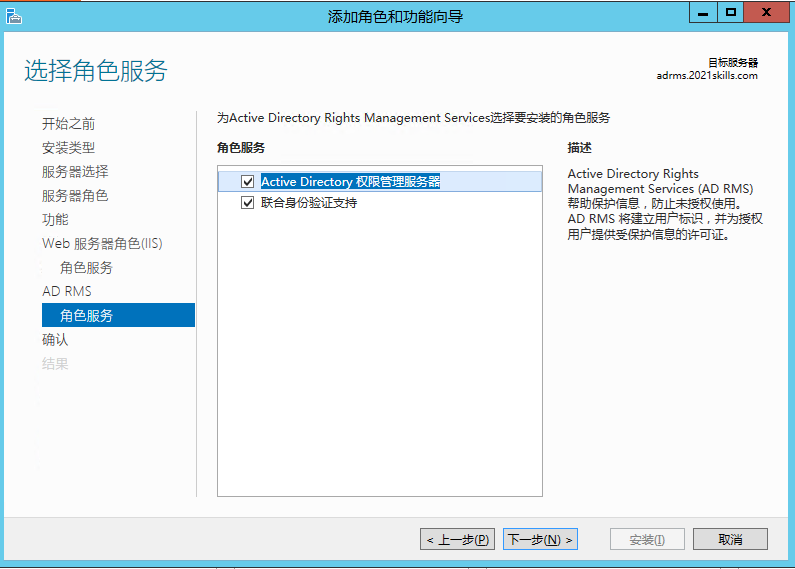

## 配置

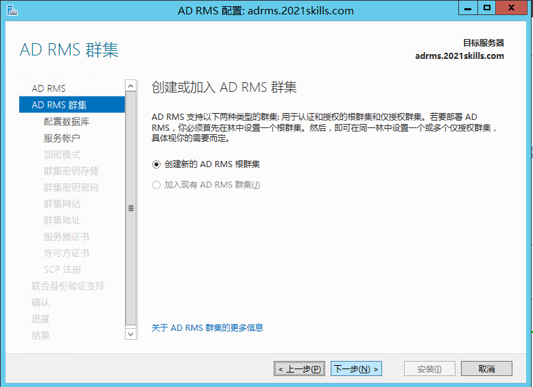

指定账户要使用 `Enterprise Admins` 组内的成员。

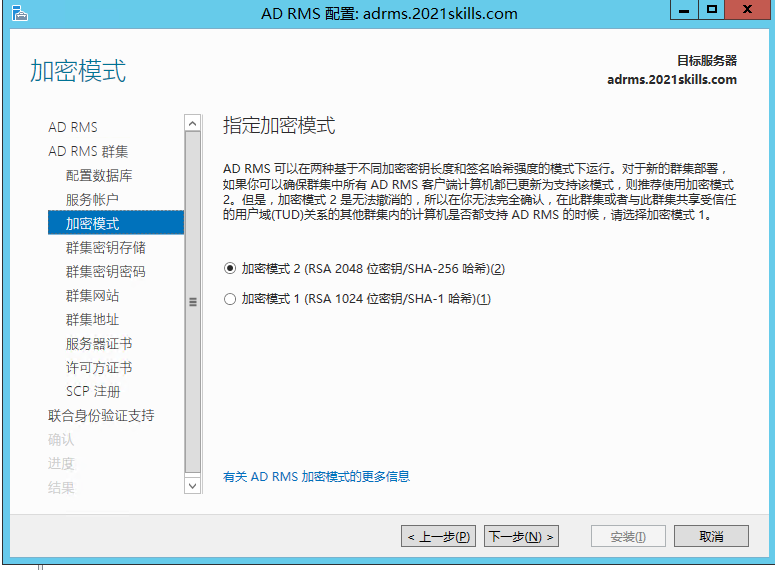
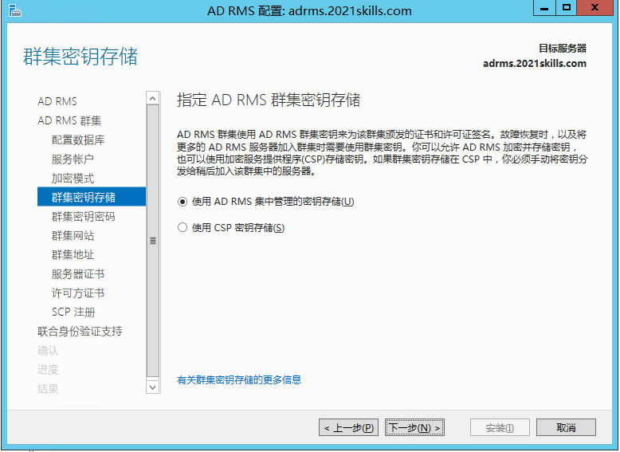
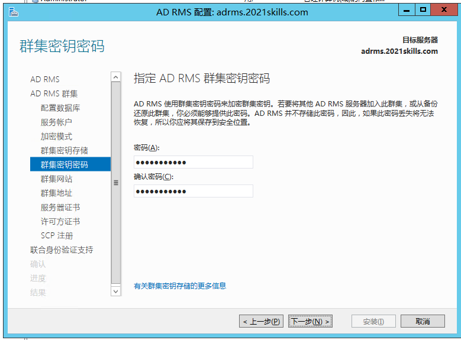
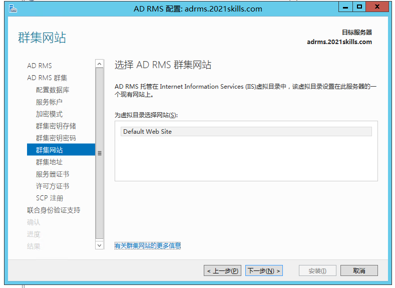
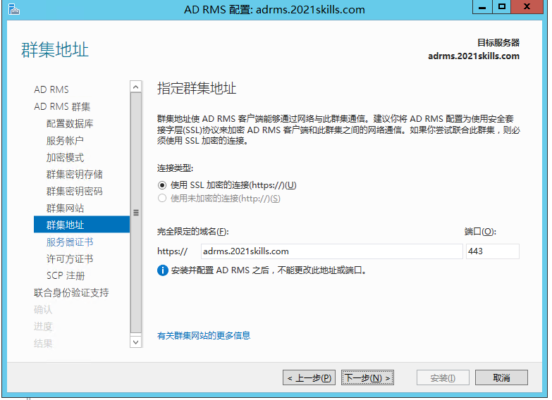
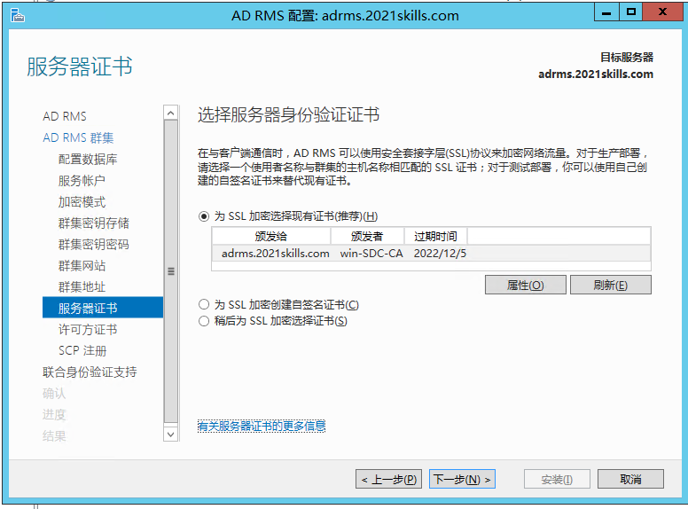

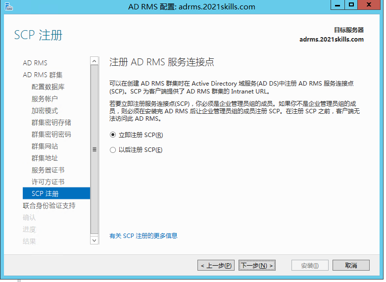
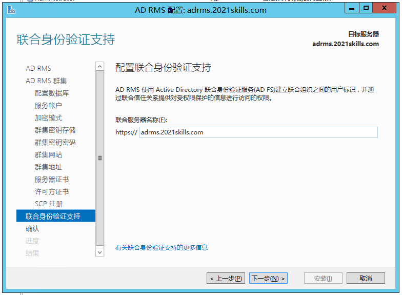
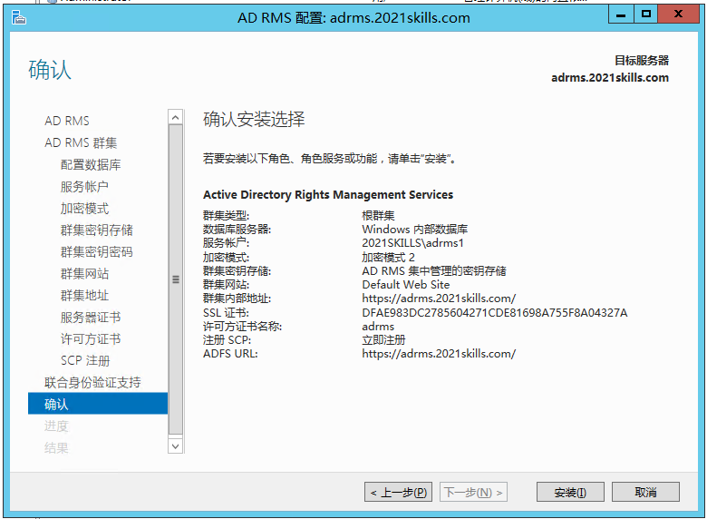

**配置完成后重启计算机！**

## 使用

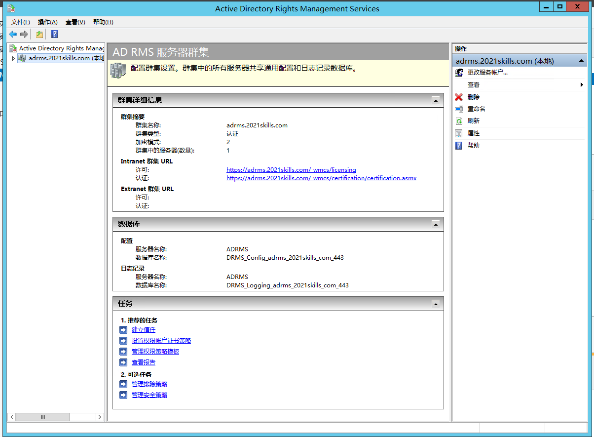

