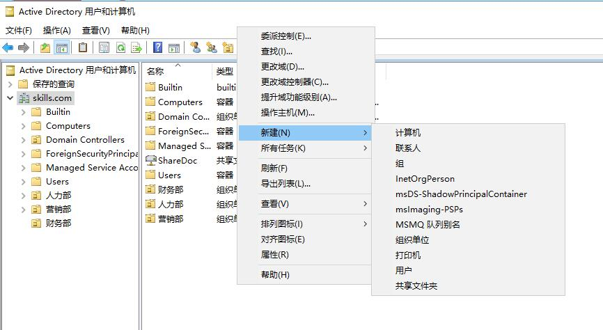
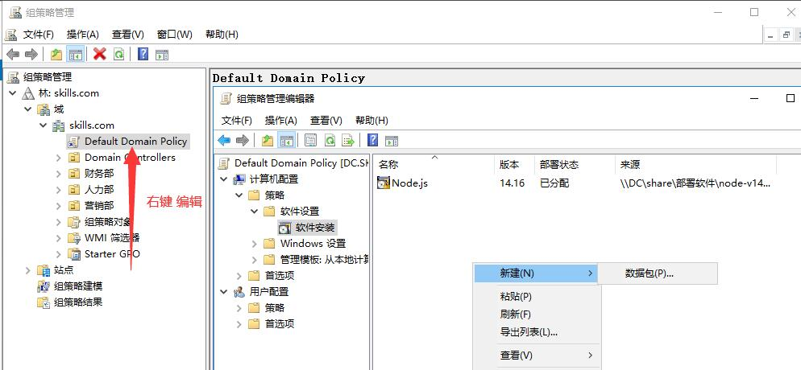
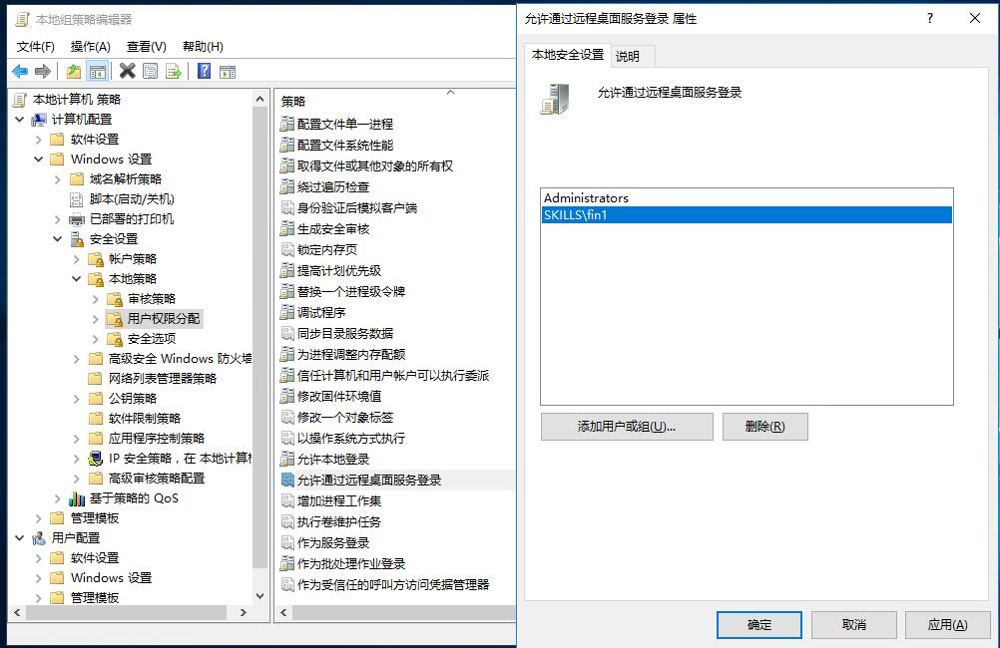

# Active Directory 域服务

::: tip
Active Directory 存储有关网络上对象的信息，并让管理员和用户可以更容易地使用这些信息。
Active Directory 使用结构化数据存储作为目录信息的逻辑层次组织的基础。

[Active Directory 域服务](https://docs.microsoft.com/zh-cn/windows-server/identity/ad-ds/active-directory-domain-services)
:::

## 开始之前

### 本例环境

### 修改计算机名

### 设置固定 IP 地址

## Active Directory 域配置

### 添加 Active Directory 域服务角色

### 提升为主域控制器

### 将域控制器添加到现有域

## AD DS 发布共享

先建一个文件夹，在属性中打开共享，记下共享路径。

然后在 **服务器管理器** -> **工具** -> **Active Directory 用户与计算机** -> 右键 **新建** -> **共享文件夹**

## AD DS 批量软件部署

先建一个文件夹，在属性中打开共享，给 `Everyone` 读取权限。

然后在 **服务器管理器**
-> **工具**
-> **组策略管理**
-> 在 **Default Domain Policy** 右键，编辑
-> 在 **组策略管理编辑器** 中的
-> 计算机配置
-> 策略
-> 软件设置
-> 软件安装
-> 右键，新建数据包

> 可以通过 `gpupdate /force` 指令强制更新组策略，或通过重启计算机更新组策略。

## 常见问题

### Error 001：尝试将此计算机配置为域控制器时出错

#### 错误详情

尝试将此计算机配置为域控制器时出错

操作失败的原因是:

试图将此计算机加入“skills.com”域失败。

无法完成域加入，原因是试图加入的域的 SID 与本计算机的 SID 相同。
未正确克隆的操作系统安装会出现这种情况。
你应该在本计算机上运行 `sysprep`，以便生成一个新的计算机 SID。
有关详细信息，请参阅 <http://go.microsoft.com/fwlink/?LinkId=168895>。

#### 出错原因

Windows 使用 SID 来表示所有的安全对象（security principals）。
安全对象包括主机、域、计算机账户、用户与安全组。
名字 Name 是用来代表 SID 的一个方法，可以允许用户改名而无需更新 ACL（access control list）。
SID 是一串数字代码包含了架构版本数字，一个 48 位的 ID 权威值，一个 32 位的子全位置或者 RID 值。
权威值识别颁发出 SID 的代理，这个代理一般是 windows 本地系统或者域。
子权威值识别颁发权威的委派，RID 则是 Windows 用来创建唯一 SID 用到的一个普通 SID。

相同 SID 在单机使用过程中可能没有什么问题。
但是在 Windows 内部，每个账号具有一个惟一的 Security ID，可以在
`HKEY_LOCAL_MACHINE\SOFTWARE\Microsoft\Windows NT\CurrentVersion\ProfileList`
看到。

SID是用来识别账户的惟一标志，而不是通常以为的机器名\用户名。

而现有的克隆虚拟机是把整个安装好的系统分区直接克隆下来，这样多台机器就有了相同的SID，这样在你加入域的时候，会报错，工作不正常。

#### 解决方法

1. 点击 **开始菜单** -> **Windows 系统** -> **运行** -> 输入 `sysprep` 回车。
2. 双击 `Sysprep.exe` **勾选 [√] 通用**，点击确定后将自动重启计算机。

> 参考：
> - [Windows server 2012 R2 解决“无法完成域加入，原因是试图加入的域的SID与本计算机的SID相同 - 小油2018 - 博客园](https://www.cnblogs.com/xiaoyou2018/p/10677437.html)
> - [Windows server 2012 R2 解决“无法完成域加入，原因是试图加入的域的SID与本计算机的SID相同。”_段传涛  的专栏-CSDN博客_无法完成域加入](https://blog.csdn.net/duanchuanttao/article/details/53467060)
> - [Windows中的SID详解 - jack_Meng - 博客园](https://www.cnblogs.com/mq0036/p/3518542.html)

### Error 002：需要具有通过远程桌面服务进行登录的权限

#### 错误详情

若要远程登录，你需要具有通过远程桌面服务进行登录的权限。默认情况下，管理员组的成员有这项权限。如果你所属的组没有这项权限，或者管理员组中已经删除了这项权限，那么需要为你手动授予这项权限。

#### 解决方法

<!-- <kbd>Ctel</kbd> + <kbd>R</kbd> 运行 `gpedit.msc`，打开 **本地组策略管理器** 如下图， -->

<!--  -->

在 **服务器管理器**
-> **工具**
-> **组策略管理**
-> 在 **Default Domain Policy** 右键，编辑
-> 在 **组策略管理编辑器** 中的
-> 计算机配置
-> 策略
-> Windows 设置
-> 安全设置
-> 本地策略
-> 用户权限分配
-> **允许通过远程桌面服务登入** 中添加用户或用户组

<!--
为什么要使用域？假设你是公司的系统管理员，你们公司有一千台电脑。
如果你要为每台电脑设置登录帐户，设置权限(比如是否允许登录帐户安装软件)，那你要分别坐在这一千台电脑前工作。
如果你要做一些改变，你也要分别在这一千台电脑上修改。
相信没有哪个管理员想要用这种不吃不喝不睡觉的方式来工作，所以就应运而生了域的概念。
下面列出了域的几个主要概念：

# Active Directory 域配置

这里我使用windows server 2012 r2 搭建域服务器。
第一步：添加角色功能=>安装’Active Directory域服务’，接着一路下一步，安装完即可。
 注：（1）最好使用Administrator来安装，要不可能会因为没有目录权限而安装失败。
    （2） 加入域不能使用Home版的Windows操作系统（顾名思义它是给你在家用的，而你家里是不用搭建域的）。
    （3） 域控制器不能使用web edition server，因为它没有安装活动目录。
第二步：配置服务器的ip地址
第三步：开始配置域服务
第四步：创建域用户及在域下可以创建用户，组织单位，联系人等。
第五步：加入到域中
右键我的电脑=>属性=>高级系统设置=>计算机名页签=>计算机名或域更改，进入这个页面后，你的电脑应该属于一个工作组，这里隶属于我们选择域，并输入test.cn,完事点确定，不出意外肯定会报这个错误。

## Active Directory 域（Domain）

**AD的全称是Active Directory**：活动目录
**域（Domain）**:
1)域是Windows网络中独立运行的单位，域之间相互访问则需要建立信任关系(即Trust Relation)。信任关系是连接在域与域之间的桥梁。当一个域与其他域建立了信任关系后
2)两个域之间不但可以按需要相互进行管理，还可以跨网分配文件和打印机等设备资源，使不同的域之间实现网络资源的共享与管理，以及相互通信和数据传输

## Active Directory 域控制器（DC）

域控制器就是一台服务器，负责每一台联入网络的电脑和用户的验证工作。

## Active Directory 组（group）

组主要用于权限设置，组可以包含用户、计算机、本地服务器上的共享资源、单个域、域目录树或目录林。
组在AD中可以理解为权限目录，它指定了用户在AD中所具有的一些属性，也可以理解为权限的集合。
 组织单元是域中包含的一类目录对象如用户、计算机和组、文件与打印机等资源。是一个容器。组织单元还具有分层结构可用来建立域的分层结构模型，进而可使用户把网络所需的域的数量减至最小（这点应该很好理解了吧，组织单元的分层肯定要比森林方便管理吧^_^）。组织单元具有继承性，子单元能够继承父单元的acl。同时域管理员可授予用户对域中所有组织单位或单个组织单位的管理权限。就像一个公司的各个部门的主管，权力平均化能更有效的管理

## Active Directory 组织单元（OU）

组织单元是域中包含的一类目录对象如用户、计算机和组、文件与打印机等资源，是一个容器，可以在OU上部署组策略

## Active Directory 用户名服务器名（CN）

Active Directory用户账户bai用于验证用户身份，指派用户的访问权限。用户必须使用用户账户登录到特定的计算机和域。登录到网络的每个用户应有自己的惟一账户和密码。用户账户也可用作某些应用程序的服务账户。
在域控制器上建立的是域用户账户，账户数据存储在AD中，用来登录域、访问域内的资源。非域控制器的计算机上还有本地账户。本地账户数据存储在本机中，不会发布到AD中，只能用来登录账户所在计算机，访问该计算机上的资源。本地账户主要用于工作组环境，对于加入域的计算机来说，一般不再建立和管理本地账户，除非要以本地账户登录。
-->