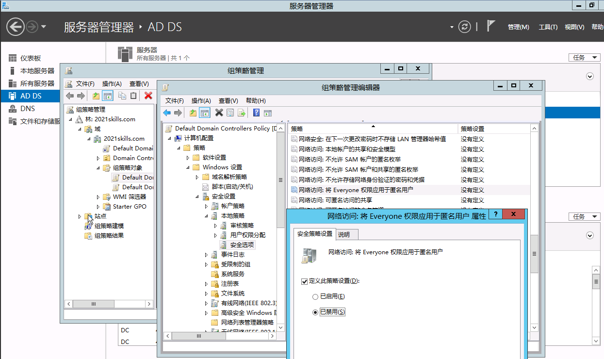
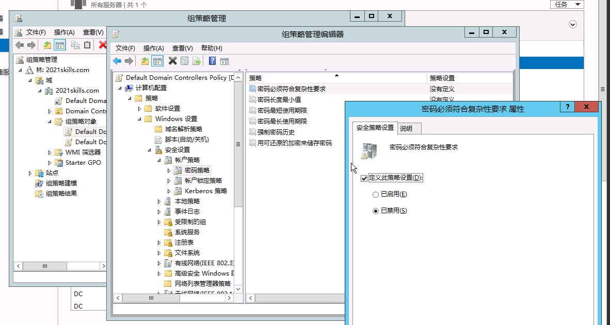
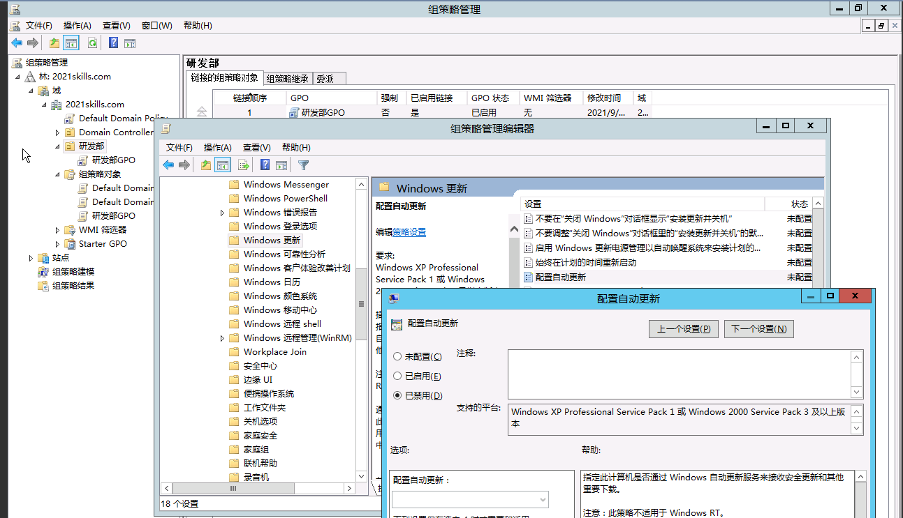
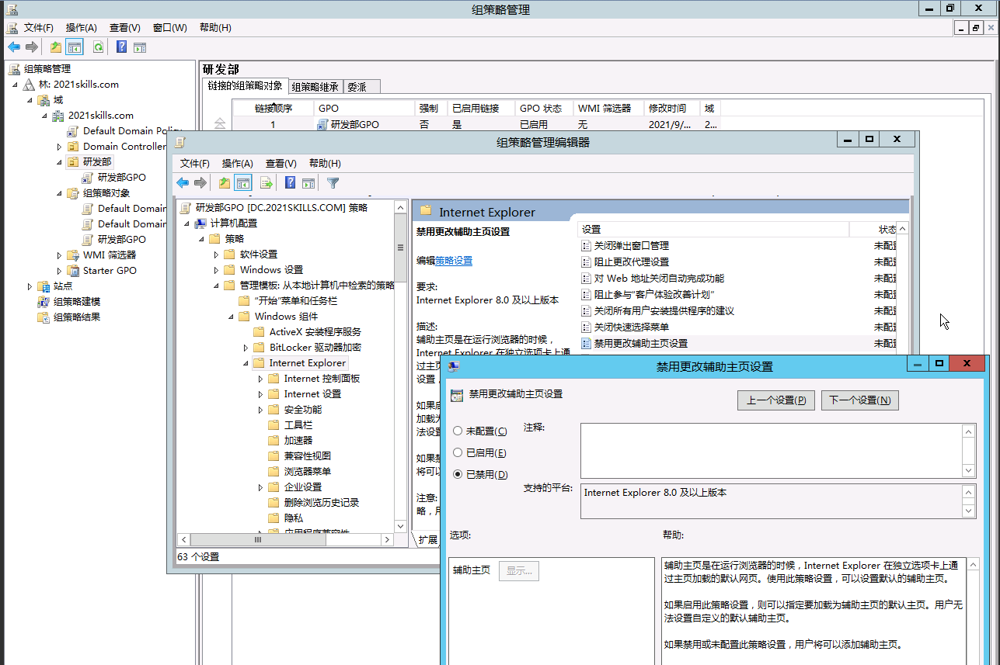
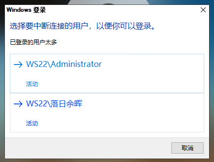
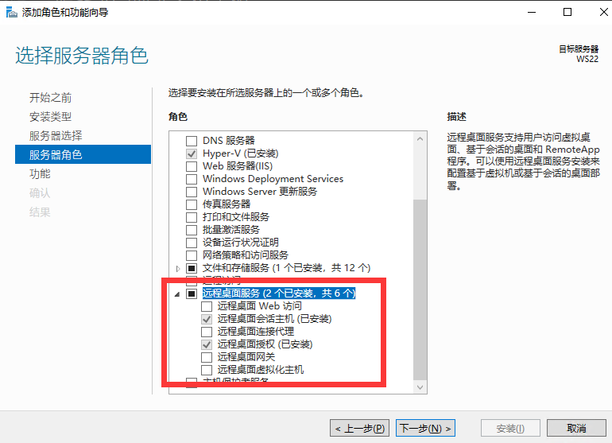
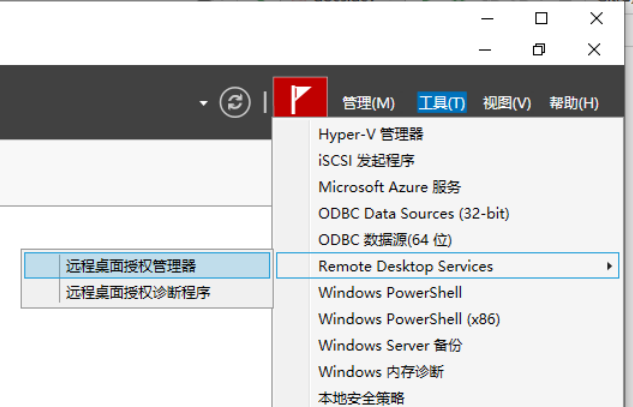
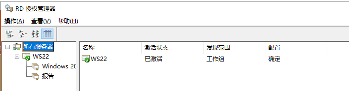
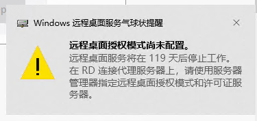
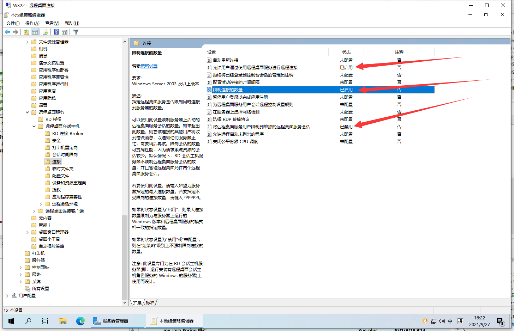

# Windows Server 配置常见需求

## 交互式登入：不显示最后的用户名

## 网络访问：将 Everyone 权限应用于匿名用户

## 密码必须符合复杂性要求

## Print Spooler

## 配置自动更新

## IE 禁止更改主页

## 远程桌面：已登入的用户太多

大于两名用户同时远程登入时会出现以下问题：

这是因为 Windows Server 默认只能俩用户同时登入。

可以通过添加 **远程桌面服务** 角色来支持更多用户同时登入：

需要激活许可证（随便输都能激活~）。

<!-- TODO 待补全：配置远程桌面授权模式 -->

通过 <kbd>Ctrl</kbd> + <kbd>R</kbd> 输入 `gpedit.msc` 打开 **本地组策略编辑器**：

