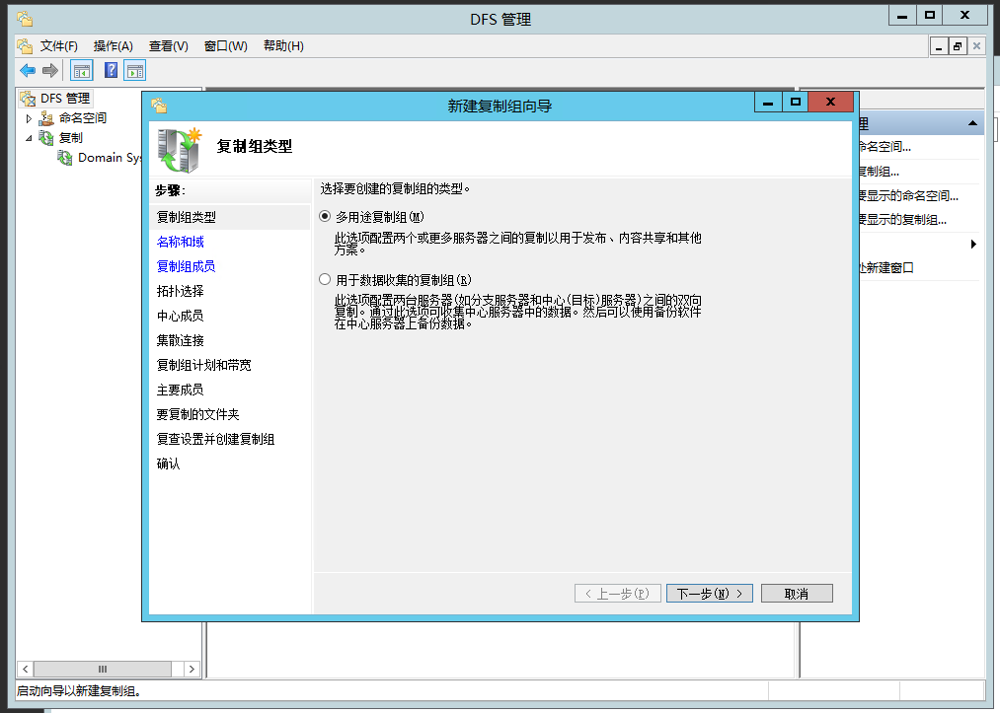
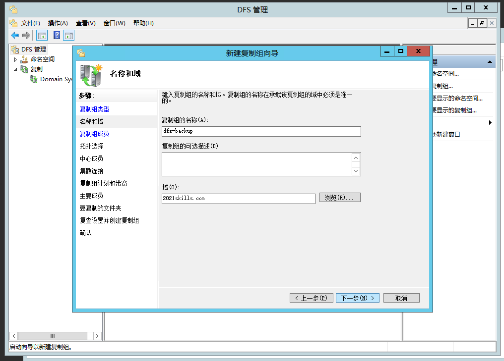
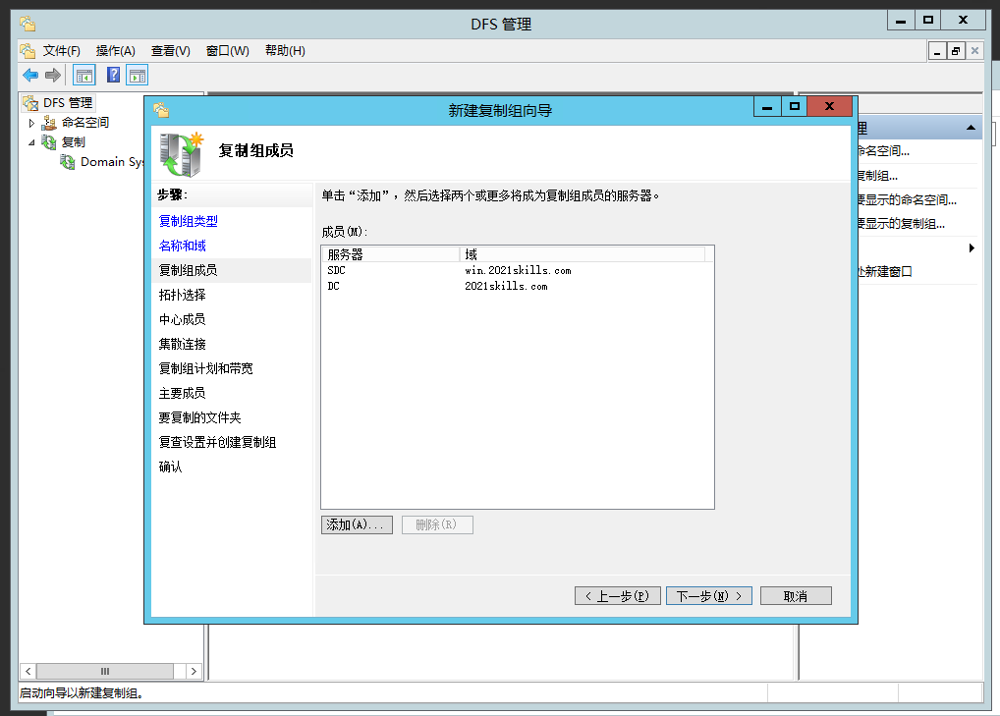
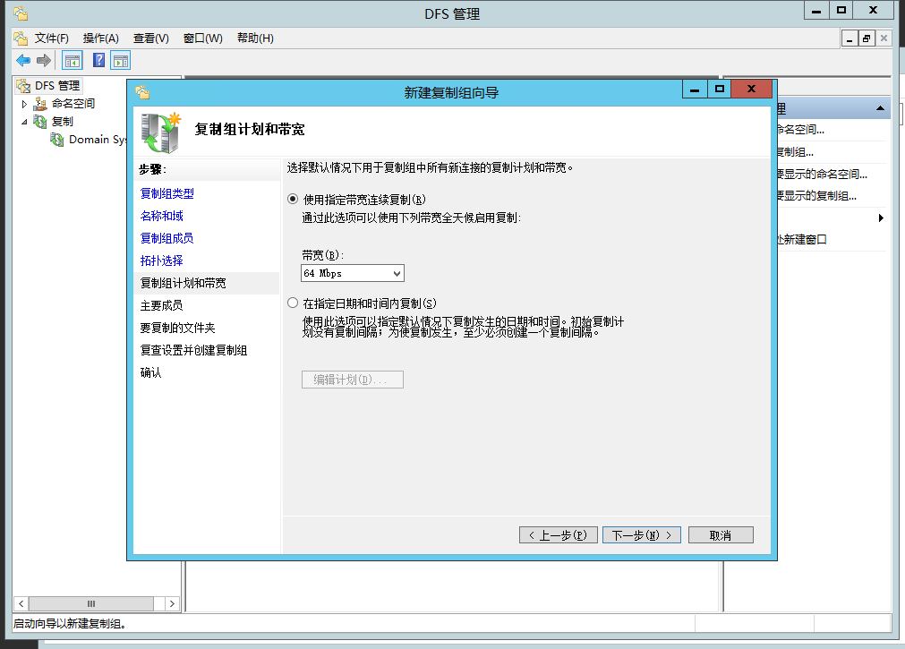
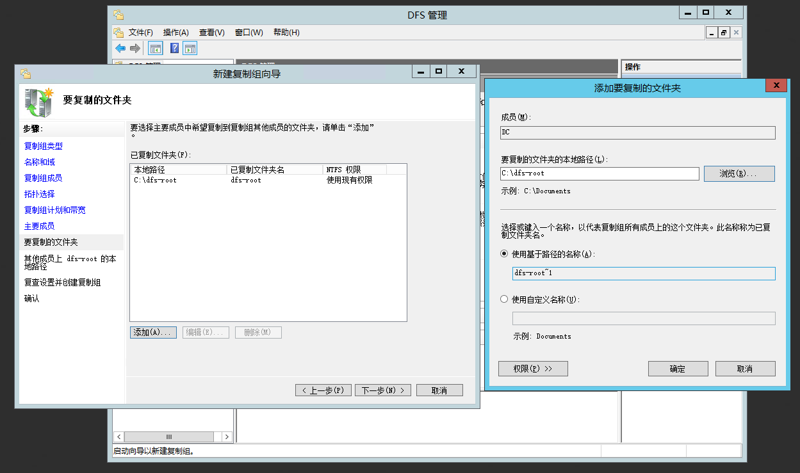
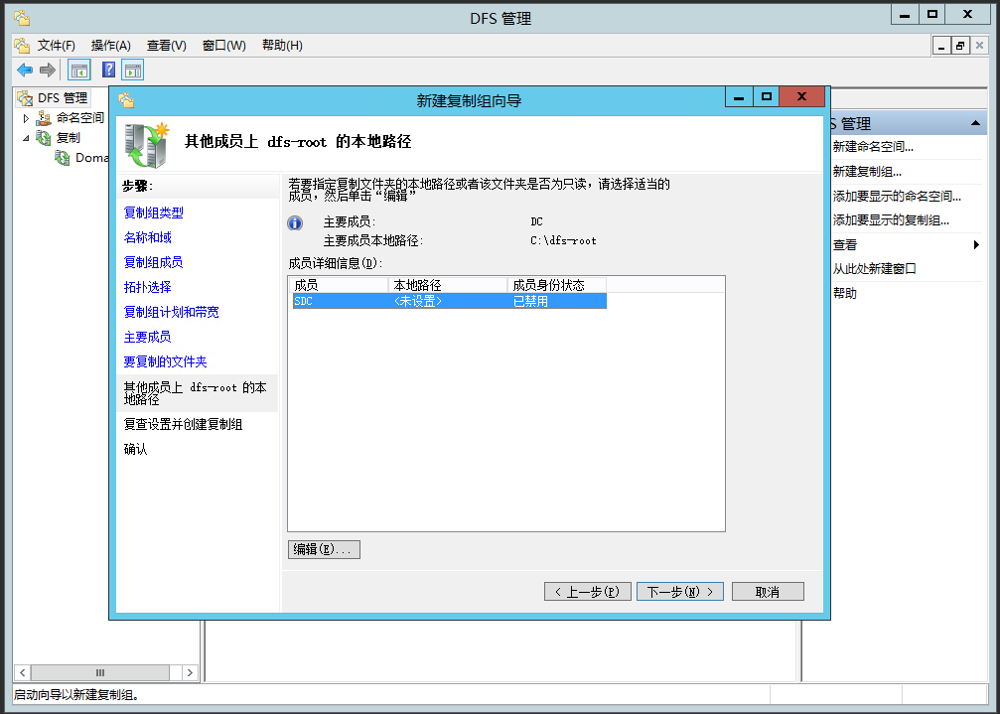
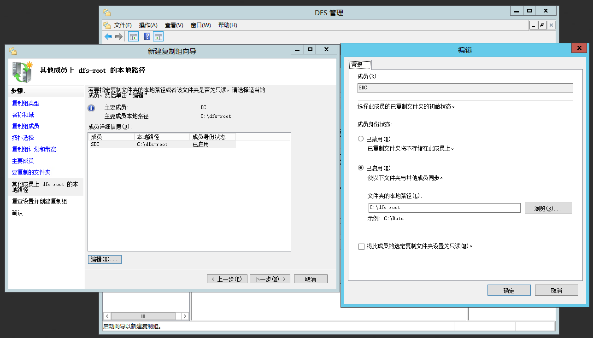

# DFS（分布式文件系统）服务配置

::: tip
Microsoft Docs:
[DFS 命名空间概述](https://docs.microsoft.com/zh-cn/windows-server/storage/dfs-namespaces/dfs-overview)
[DFS 复制概述](https://docs.microsoft.com/zh-cn/windows-server/storage/dfs-replication/dfsr-overview)
:::

分布式文件系统（DFS，Distributed File System）使用户更加容易访问和管理物理上跨网络分布的文件。
DFS 为文件系统提供了单个访问点和一个逻辑树结构，通过 DFS，用户在访问文件时不需要知道它们的实际物理位置，即分布在多个服务器上的文件在用户面前就如同在网络的同一个位置。  
通过 DFS，可以将同一网络中的不同计算机上的共享文件夹组织起来，形成一个单独的、逻辑的、层次式的共享文件系统。  
DFS 是一个树状结构，包含一个根目录和一个或多个 DFS 链接。要建立 DFS 共享，必须首先建立 DFS 根，然后在每一个 DFS 根下，创建一个或多个 DFS 链接，每一个链接可以指向网络中的一个共享文件夹。
DFS 链接的最大数目是 1000。
如果 DFS 链接的目标文件夹不是 Windows 2000 文件夹，则该目标文件夹不能有子文件夹。

## 视频教程

- [第十五讲上：Windows 2012 Server DFS分布管理](https://www.bilibili.com/video/BV1UK4y1s7yW)
- [第十五讲下：Windows 2012 Server DFS多路备份](https://www.bilibili.com/video/BV1wC4y1h7j3)

## 安装

添加服务器角色 > 文件和储存服务 > 文件和 iSCSI 服务 > “DFS 复制”/“DFS 命名空间”。

## 配置两台计算机之间文件同步

## 配置复制计划

