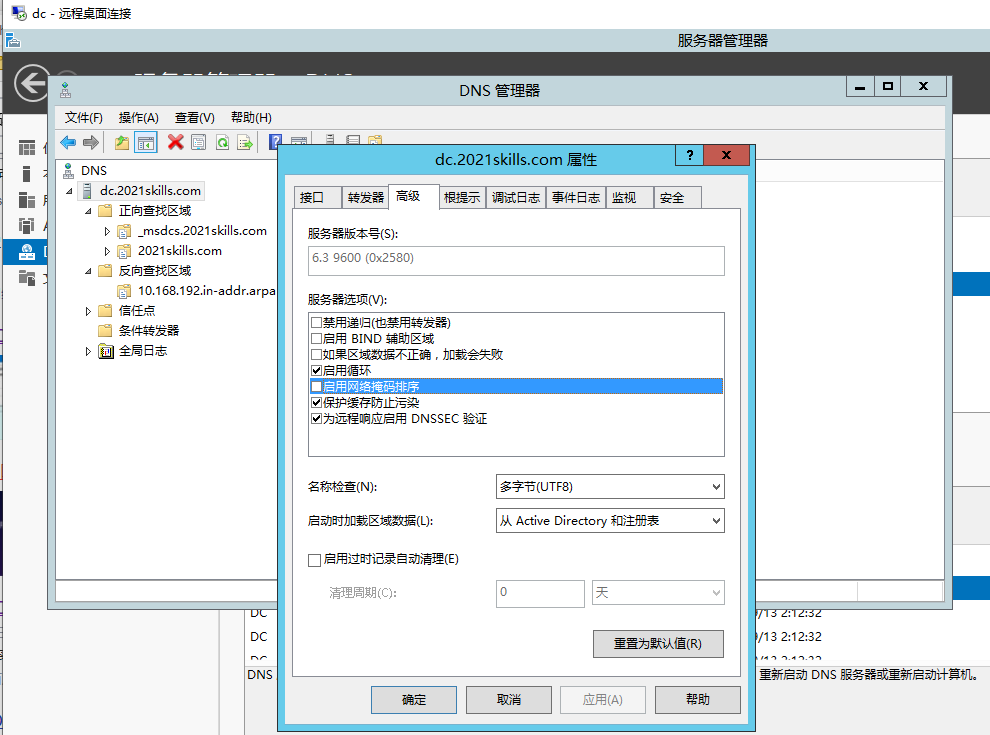

# DNS

::: tip
域名系统缩写为：DNS（英文：Domain Name System）是互联网的一项服务。
它作为将域名和 IP 地址相互映射的一个分布式数据库，能够使人更方便地访问互联网。
DNS 使用 UDP 端口 53。
当前，对于每一级域名长度的限制是 63 个字符，域名总长度则不能超过 253 个字符。
:::

## 安装

<!-- TODO -->

## 配置

### 网络掩码排序

