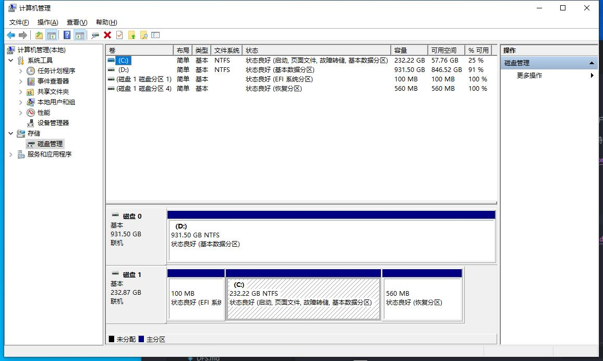

# 文件和储存服务

::: tip
Windows Server 中的存储为专注虚拟化工作负载的软件定义数据中心 (SDDC) 客户提供了新的和改进的功能。
Windows Server 还为使用文件服务器处于现有工作负荷的企业客户提供广泛的支持。

[Windows Server 存储文档 | Microsoft Docs](https://docs.microsoft.com/zh-cn/windows-server/storage/storage)
:::

## 基本磁盘管理

Windows 10 右键 **此电脑** -> **管理** -> **储存** -> **磁盘管理**

Windows Server 点击 **服务器管理器** 右上角的 *工具* -> **计算机管理** -> **储存** -> **磁盘管理**

[磁盘管理概述 | Microsoft Docs](https://docs.microsoft.com/zh-cn/windows-server/storage/disk-management/overview-of-disk-management)

## 配置储存池

## 配置 RAID 10

## 配置 iSCSI
