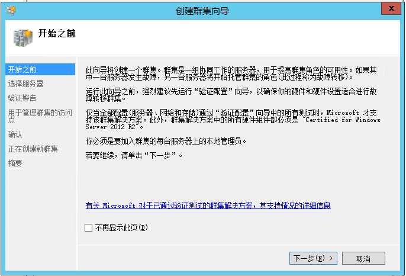
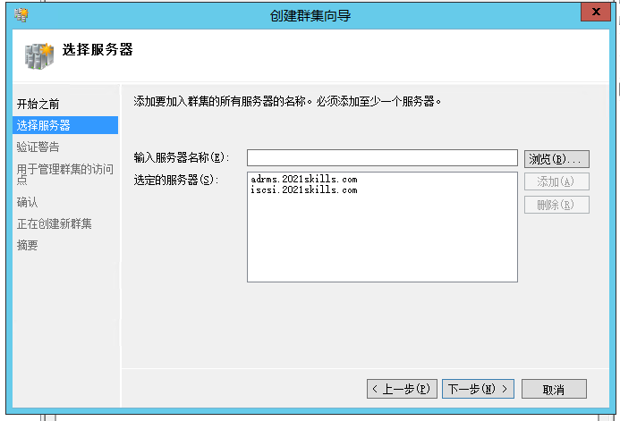
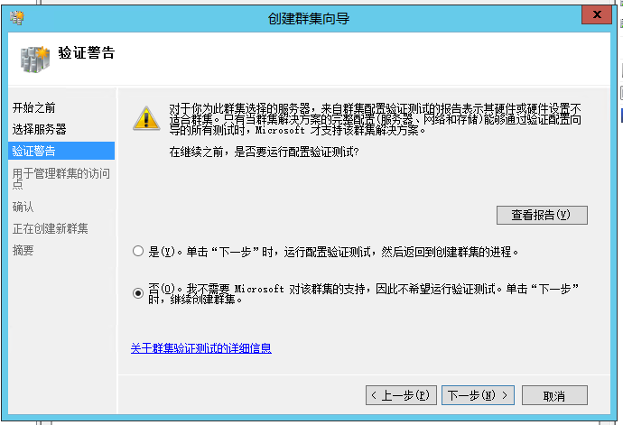
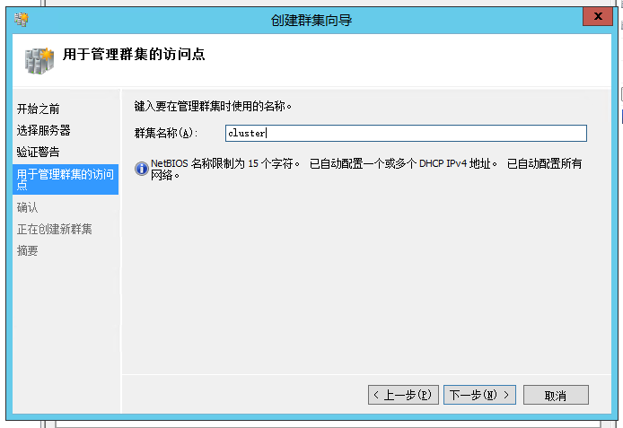

# Failover Cluster（故障转移群集）配置

::: tip
故障转移群集是一组独立的计算机，这些计算机相互协作以提高群集角色（之前称为应用程序和服务）的可用性和可伸缩性。
多台群集服务器（称为节点）通过物理电缆和软件连接。
如果一个或多个群集节点出现故障，其他节点就会开始提供服务（该过程称为故障转移）。
此外，群集角色会得到主动监视以验证它们是否正常工作。
如果不工作，则会重新启动这些角色或将其移动到其他节点。

故障转移群集还提供群集共享卷 (CSV) 功能，该功能提供一致的分布式命名空间，群集角色可以使用这样的命名空间，从所有的节点访问共享存储。
借助故障转移群集功能，用户将会在服务中体验到最低程度的中断。

故障转移群集有许多实际应用，包括：
- 用于如 Microsoft SQL Server 和 Hyper-V 虚拟机等应用程序的高度可用或持续可用文件共享存储
- 在物理服务器或虚拟机（安装在运行 Hyper-V 的服务器上）上运行的高度可用群集角色

[故障转移群集 | Microsoft Docs](https://docs.microsoft.com/zh-cn/windows-server/failover-clustering/failover-clustering-overview)
:::

## 安装

## 验证配置

## 创建集群

**新建集群前使用 `Clear-ClusterNode` 断开所有 iSCSI 设备**

## 销毁

## 常见问题

### Error 001：由于此错误对象不存在。而无法确定节点是否为只读域控制器

#### 错误详情

- [Windows Server 2012 不支持将域控制器作为集群节点](https://docs.microsoft.com/zh-CN/troubleshoot/windows-server/identity/cannot-add-domain-controller-node-failover-cluster)
- [如何将 Windows 服务器群集节点用作域控制器](https://docs.microsoft.com/zh-CN/troubleshoot/windows-server/high-availability/use-cluster-nodes-as-domain-controllers)

#### 解决方法

**加入域控制器时选择只读域控制器**
