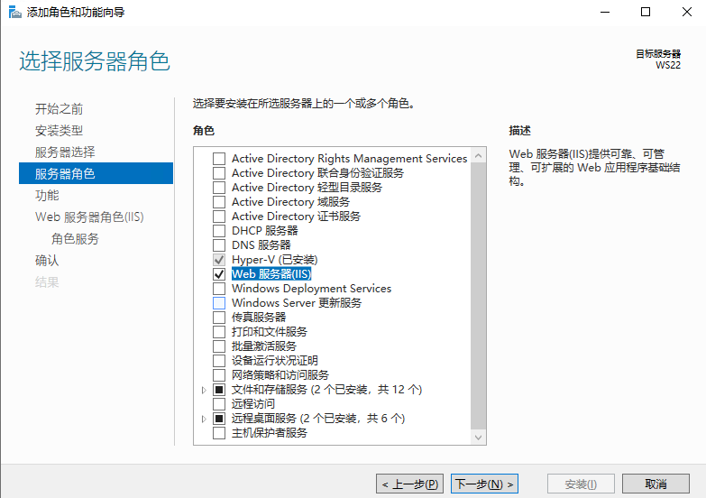
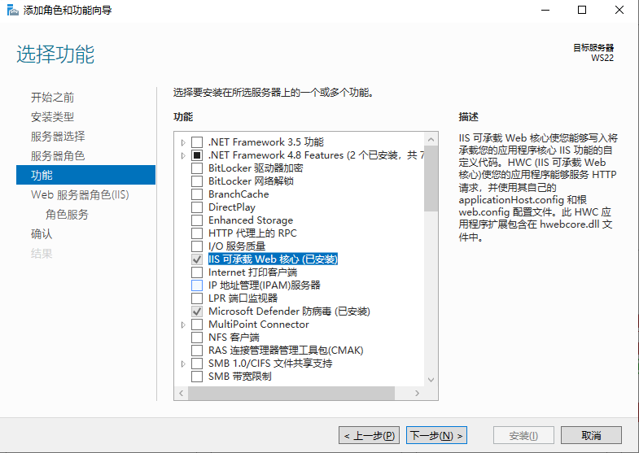

# Web 服务器（IIS - Internet Information Services）

::: tip
IIS 是 Internet Information Services 的缩写，是一个 World Wide Web server。
Gopher server 和 FTP server 全部包容在里面。
IIS 意味着能发布网页，并且有 ASP（Active Server Pages）、JAVA、VBscript 产生页面，有着一些扩展功能。

[（英文）IIS | Microsoft Docs](https://docs.microsoft.com/zh-cn/iis/get-started/)
:::

## 安装

## 配置简单站点

## 配置 AD 证书颁发机构 Web 注册

## 配置 HTTPS（SSL）

## 配置文件共享（Shared Configuration）
