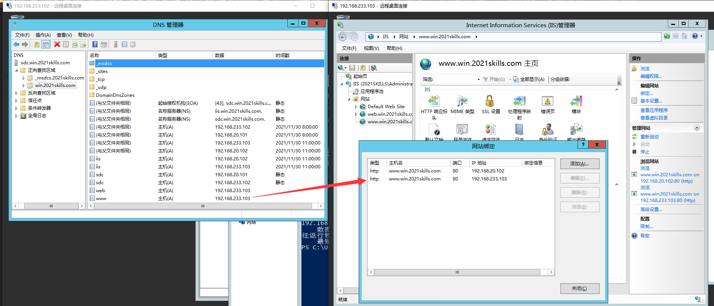

# Web 服务器（IIS）

::: tip
IIS 是 Internet Information Services 的缩写，是一个 World Wide Web server。
Gopher server 和 FTP server 全部包容在里面。
IIS 意味着能发布网页，并且有 ASP（Active Server Pages）、JAVA、VBscript 产生页面，有着一些扩展功能。

[（英文）IIS | Microsoft Docs](https://docs.microsoft.com/zh-cn/iis/get-started/)
:::

## 安装

## 配置

## 配置简单站点

## 配置域名

首先需要安装 DNS 角色，然后创建对应的 **正向查找区域**，并在 IIS 内绑定域名：

> 由于 DNS 缓存，配置的正向解析区域可能不会立即生效。
> 可尝试使用 `ipconfig /flushdns` 命令来刷新 DNS 缓存。

## 配置身份验证

先要在 AD 域中或本地用户中创建一个用于验证的账户才能编辑匿名用户身份验证凭据：

### 配置 AD 证书颁发机构 Web 注册

### 配置 HTTPS（SSL）

### 配置文件共享（Shared Configuration）

