# Web 服务器（IIS）

::: tip
IIS 是 Internet Information Services 的缩写，是一个 World Wide Web server。
Gopher server 和 FTP server 全部包容在里面。
IIS 意味着能发布网页，并且有 ASP（Active Server Pages）、JAVA、VBscript 产生页面，有着一些扩展功能。

[（英文）IIS | Microsoft Docs](https://docs.microsoft.com/zh-cn/iis/get-started/)
:::

## 安装


## 配置简单站点


## 配置域名

首先需要安装 DNS 角色，然后创建对应的 **正向查找区域**，并在 IIS 内绑定域名：


> 由于 DNS 缓存，配置的正向解析区域可能不会立即生效。
> 可尝试使用 `ipconfig /flushdns` 命令来刷新 DNS 缓存。

## 配置身份验证

先要在 AD 域中或本地用户中创建一个用于验证的账户才能编辑匿名用户身份验证凭据：


### 配置 AD 证书颁发机构 Web 注册

### 配置 HTTPS（SSL）

### 配置文件共享（Shared Configuration）

## 配置 FTP 站点

### 安装角色服务器

在 [安装](#安装) IIS 角色时勾选 **FTP 服务器** 角色服务器：

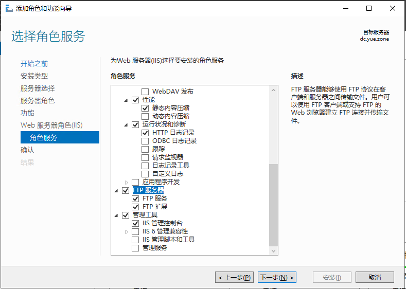

### 在 DNS 管理器中添加主机（必须）

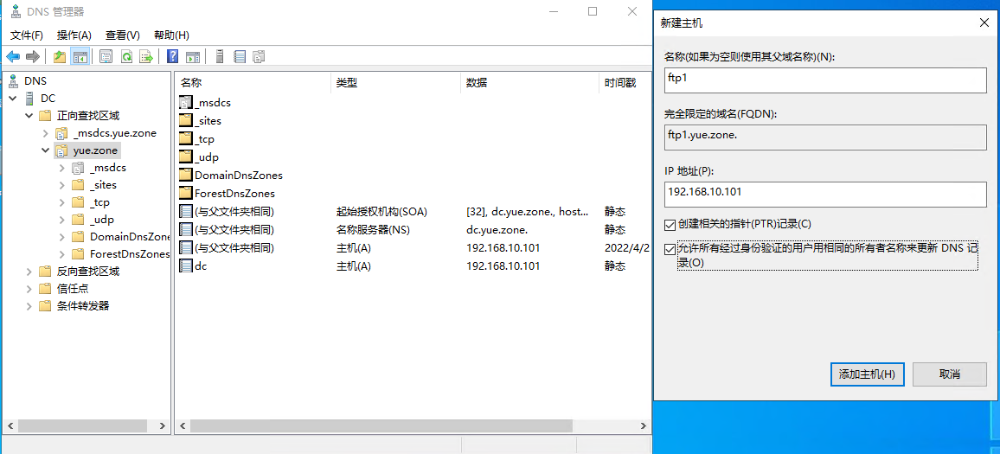

### 在域中创建 FTP 用户与用户组（建议）


设置 FTP 管理员隶属于 FTP 组：

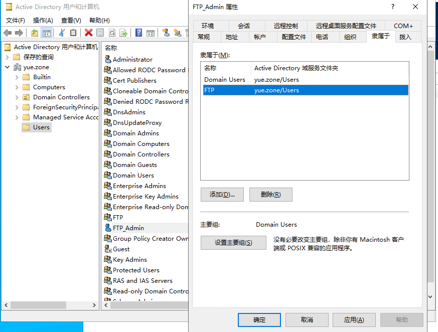

### 设置 FTP 根目录拥有完全控制权限（建议）

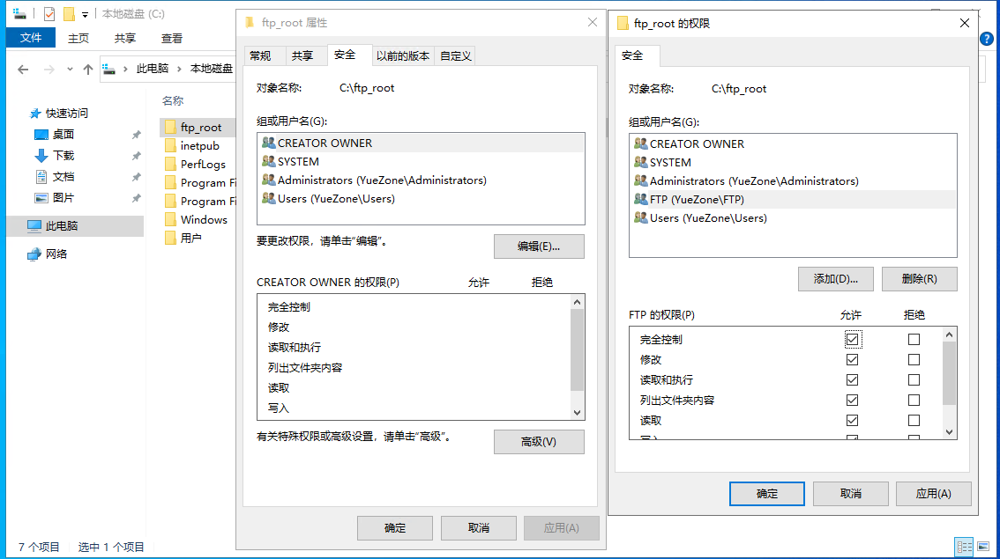

### 在 IIS 管理器中新建 FTP 站点

在 **IIS 管理器** 中，右键 *网站* ，点击 *新建 FTP 站点* ：

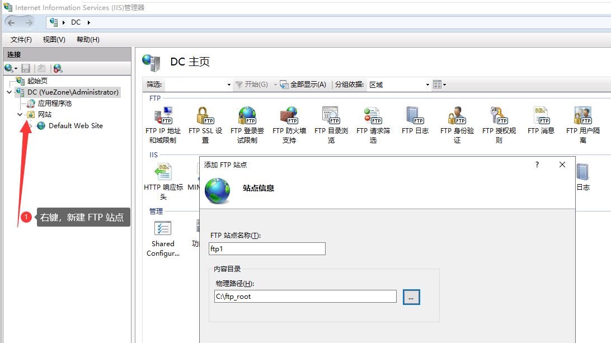
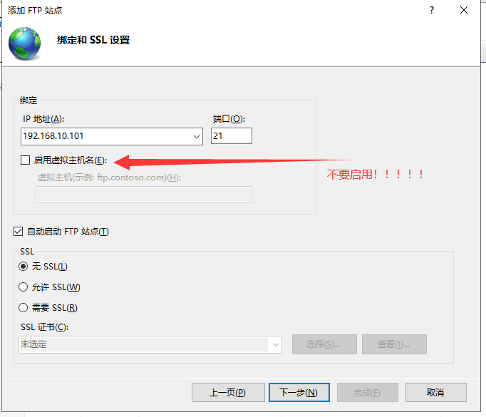
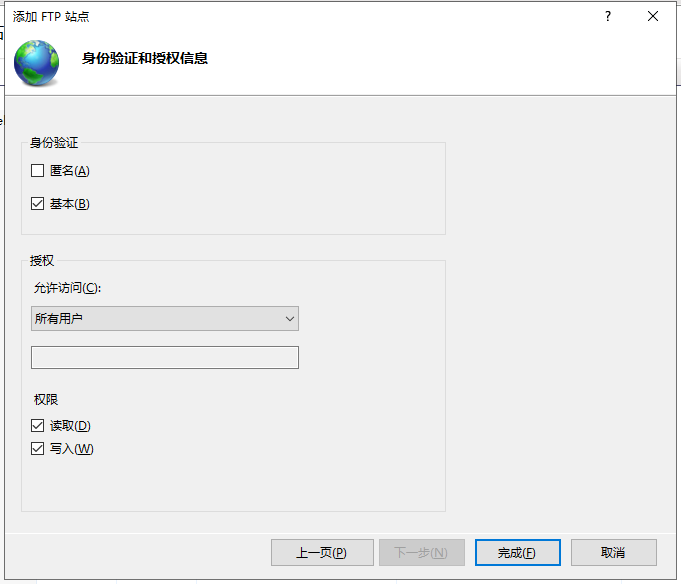

### 设置 FTP 防火墙

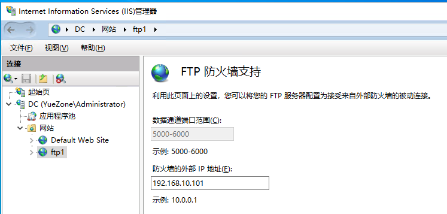

### 设置 Windows 防火墙

如果需要请在 **高级安全 Windows Defender 防火墙** 中添加 **出/入站规则** ！

### 设置 FTP 消息


### 设置 FTP 目录浏览

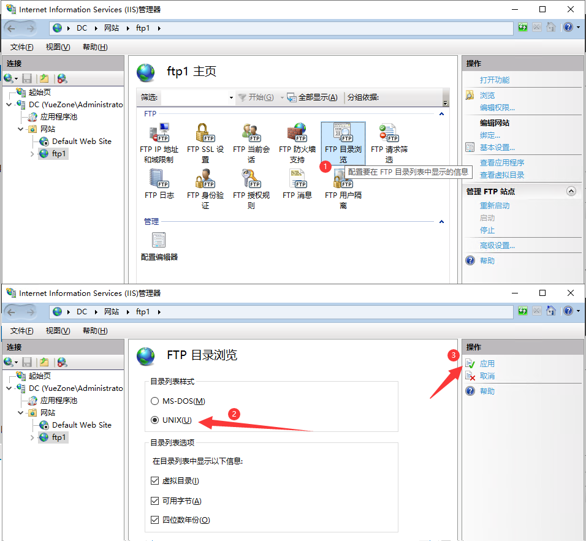

### 设置 FTP 日志


### 使用 IE 浏览器访问

使用 **IE 浏览器** 访问 <ftp://127.0.0.1/> 或内网 IP 或域名


- 添加到受信任的站点：
  
- 使用 **域账号** 登入：
  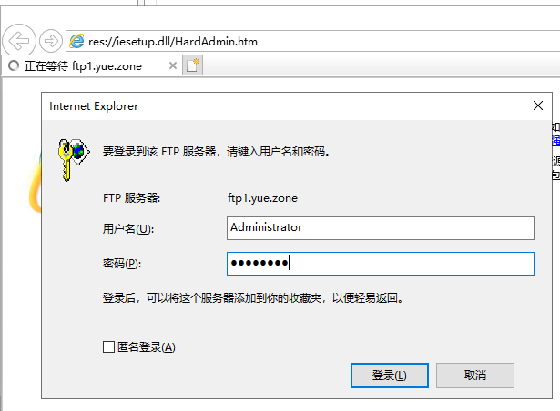
- 登入成功：
  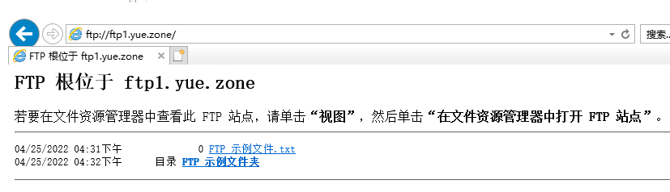

### 使用终端访问

```ps
PS C:\Users\Administrator> ftp ftp1.yue.zone
连接到 ftp1.yue.zone。
220 Microsoft FTP Service
200 OPTS UTF8 command successful - UTF8 encoding now ON.
用户(ftp1.yue.zone:(none)): Administrator
331 Password required
密码:
230 User logged in.
ftp> ls
200 PORT command successful.
125 Data connection already open; Transfer starting.
FTP 示例文件.txt
FTP 示例文件夹
226 Transfer complete.
ftp: 收到 46 字节，用时 0.00秒 46000.00千字节/秒。
```

### 使用 Windows 资源管理器访问

在资源管理器中输入 `ftp://服务器IP或域名/` 可以直接访问 FTP 服务器：

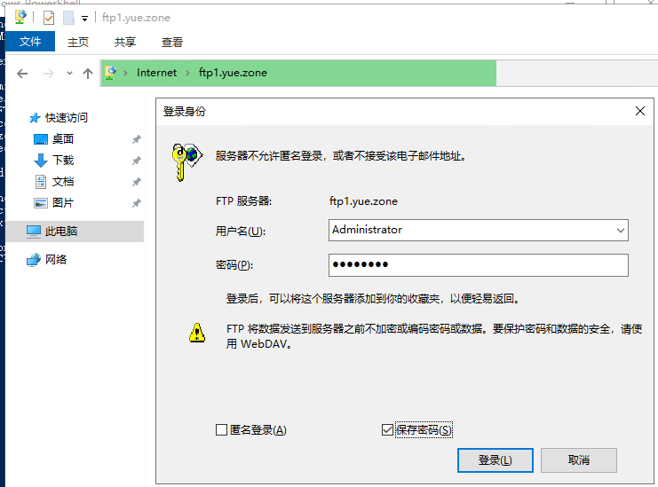