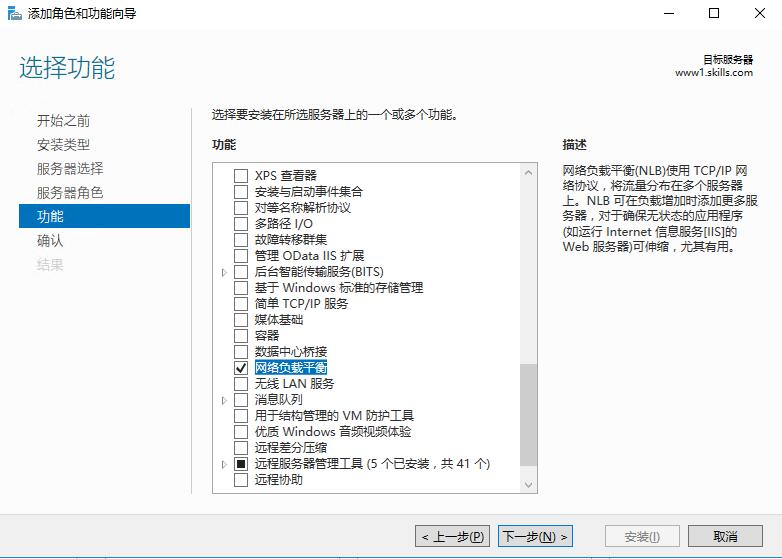

# NLB（负载均衡）服务配置

::: tip
网络负载平衡（Network Load Balancing）功能使用 TCP/IP 网络协议将流量分布到多个服务器上。
通过将运行应用程序的两台或多台计算机组合到单个虚拟群集，NLB 可为 Web 服务器和其他任务关键型服务器提供可靠性和性能。

Microsoft Docs:
- [Network Load Balancing](https://docs.microsoft.com/zh-cn/windows-server/networking/technologies/network-load-balancing)
- [配置网络基础结构以支持 NLB 操作模式 - Windows Client](https://docs.microsoft.com/zh-cn/troubleshoot/windows-client/networking/configure-network-to-support-nlb-operation-mode)
:::

## 安装

在 **添加角色和功能向导** 中添加 _功能_：**网络负载平衡**：

安装成功后可以使用 **服务器管理器** -> **工具** -> **网络负载平衡管理器**

