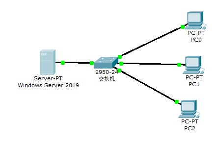
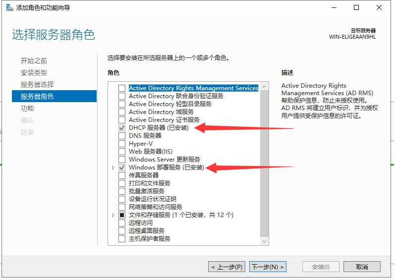
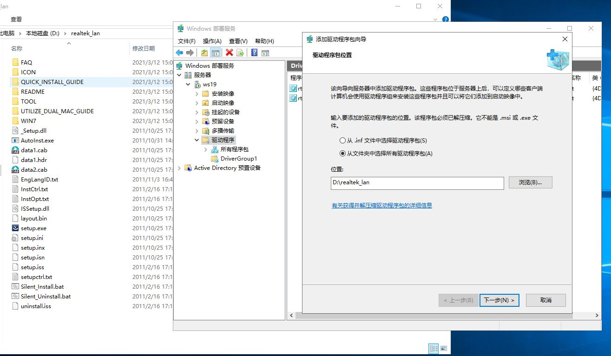
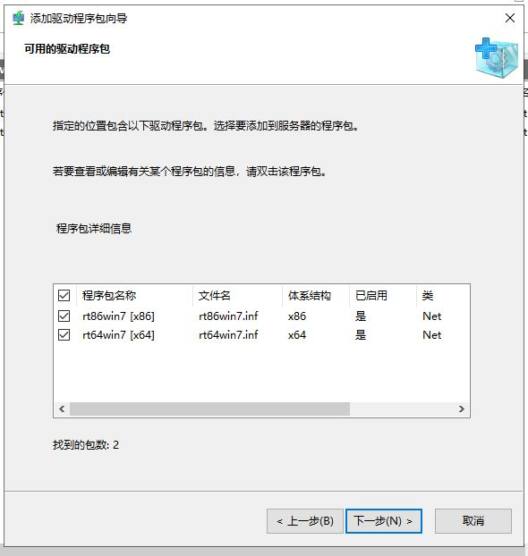
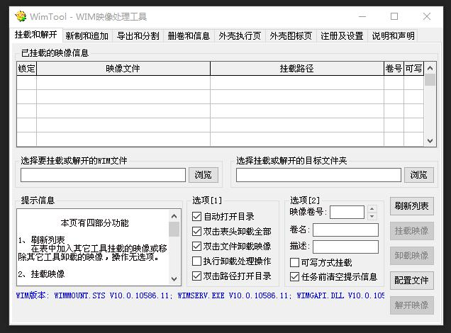
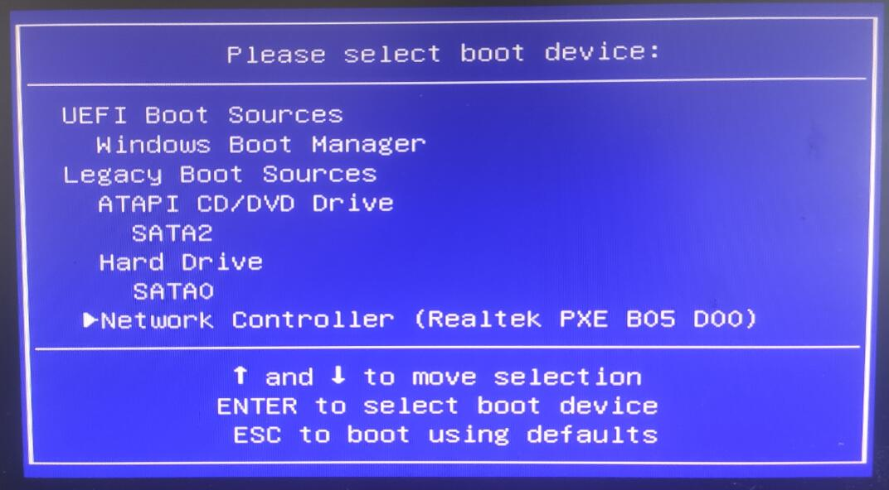
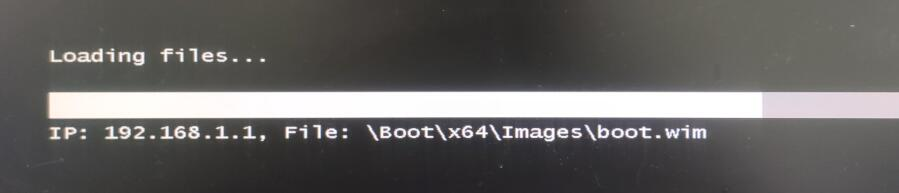

# Windows 部署服务（WDS）

## 开始之前

准备所需镜像：
- Windows Server 2012 及以上版本镜像
- Windows 7/10 原版镜像

> 可在 [我告诉你](https://msdn.itellyou.cn/) 获取所有所需系统镜像

安装一台系统为 Windows Server 2012 以上的主机、一台交换机、目标主机若干。
如下图连接：

## 修改计算机名与新建用户

为安装时方便输入，为 Windows Server 设置一个简短的主机名（重启生效）；

并添加一个 `wds` 用户（必须设置密码），勾选 **用户不能更改密码** 与 **密码永不过期**

## Windows Server 添加角色与功能

从 **服务器管理器** → **添加角色与功能** → 添加服务角色：**DHCP 服务器**、**Windows 部署服务**

## 配置 DHCP 服务器

### 配置作用域

点击 **服务器管理器** 右上角 **工具** -> **DHCP** -> **IPv4** -> **新建作用域**。

DHCP 服务器的配置设置：
- 起始 IP 地址：`192.168.1.1`
- 结束 IP 地址：`192.168.1.200`

传播到 DHCP 客户端的配置设置
- 长度：`24`（默认）
- 子网掩码：`255.255.255.0`（默认）

## 配置 Windows 部署服务（WDS）

点击 **服务器管理器** 右上角 **工具** -> **Windows 部署服务**。

按照向导完成初始配置：

> 待补全向导步骤

### 添加启动镜像

在 Windows Server 中 **挂载** Windows 7/10 的原版镜像。

在 **Windows 部署服务** -> **启动镜像** 右键 -> **添加镜像**

选择挂载的 Windows 7/10 镜像中的 `sources/boot.wim`

### 添加安装镜像

在安装镜像中新建一个镜像组，名称任意。

在镜像组中添加镜像，Windows 7 原版镜像中为 `sources/install.wim`

- `HOMEBASIC` 为 **家庭版**
- `HOMEPREMIUM` 为 **家庭高级版**
- `PROFESSIONAL` 为 **专业版**
- `ULTIMATE` 为 **旗舰版**

一般推荐安装旗舰版，所以只需要添加 `Windows 7 ULTIMATE` 即可。

### 添加驱动包

先添加一个驱动程序组，名称任意。

下图为网卡驱动示例：

## 制作自己的镜像

先使用原版镜像在一台实体机上安装好系统与所需软件。

推荐使用 [优启通](https://www.itsk.com/) U盘 PE 系统，
内涵多种装机工具，
选择自己喜欢的工具将实体机的 C 盘备份为 **`.wim`** 镜像。

Easy Image 2：

Easy Image X：

WimTool：

将备份的 `.wim` 文件，复制到 Windows Server 中，在 **Windows 部署服务** 中 [添加安装镜像](#添加安装镜像)

## 使用 Windows 部署服务

### 从网卡启动

#### HP Pro 3380 MT

开机狂按 <kbd>F9</kbd> 进入快速启动菜单，选择 `Network Controller (Realtek PXE B05 D00)`

按下 <kbd>F12</kbd> 确定从网络启动

使用 [之前设置的](#修改计算机名与新建用户) 主机名\用户名登入（`ws19\wds`）。

之后便是选择镜像、分区、安装的常规操作。

## 附：WdsClient: 启动网络时出错

这是因为 **启动镜像** 中没有合适的 **网卡驱动**。

### 解决方法

在 **启动镜像** 中添加 [驱动](#添加驱动包)。

