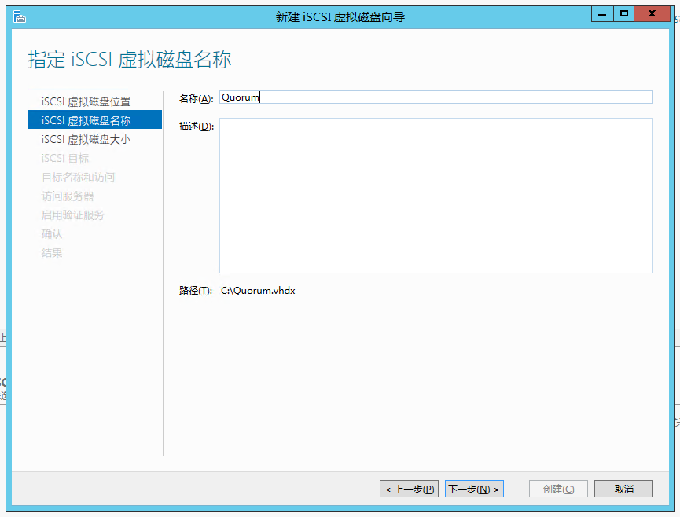
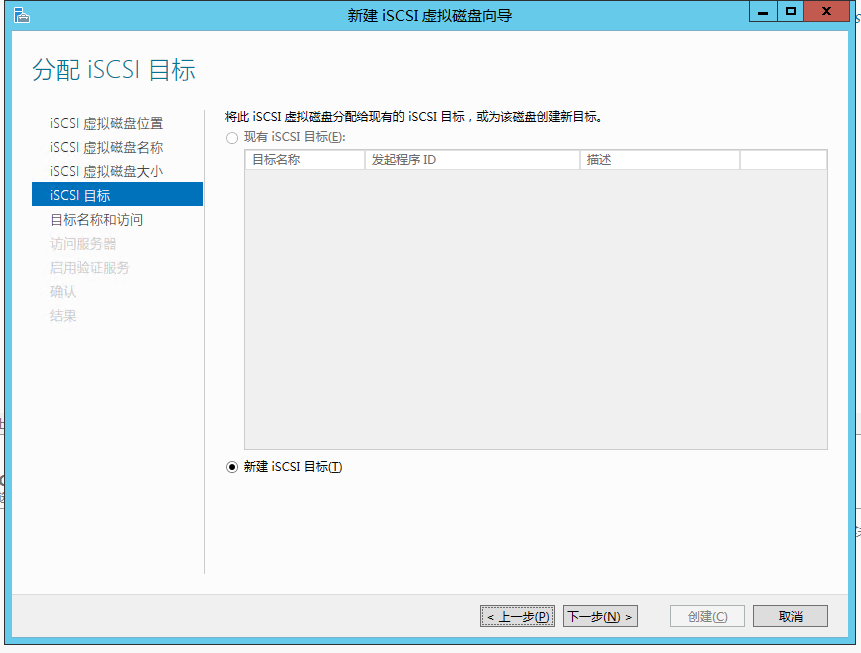
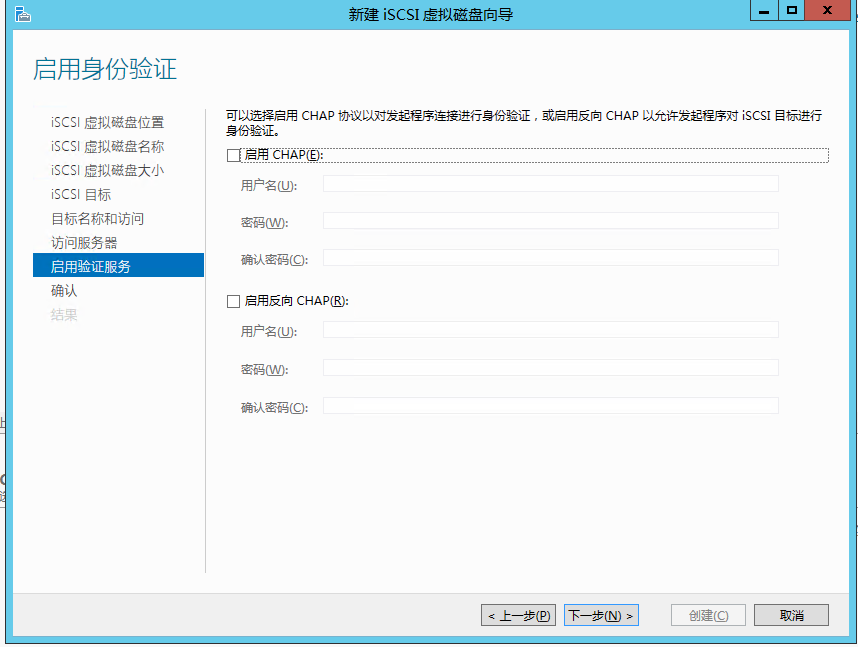
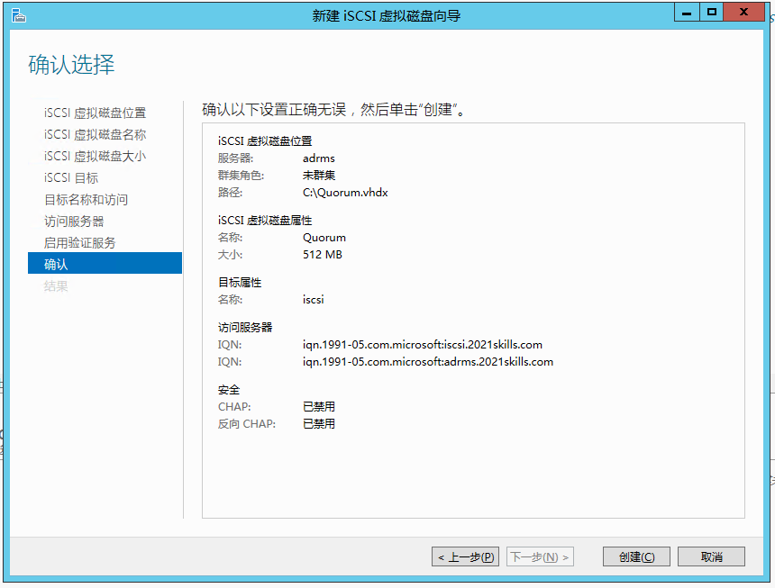
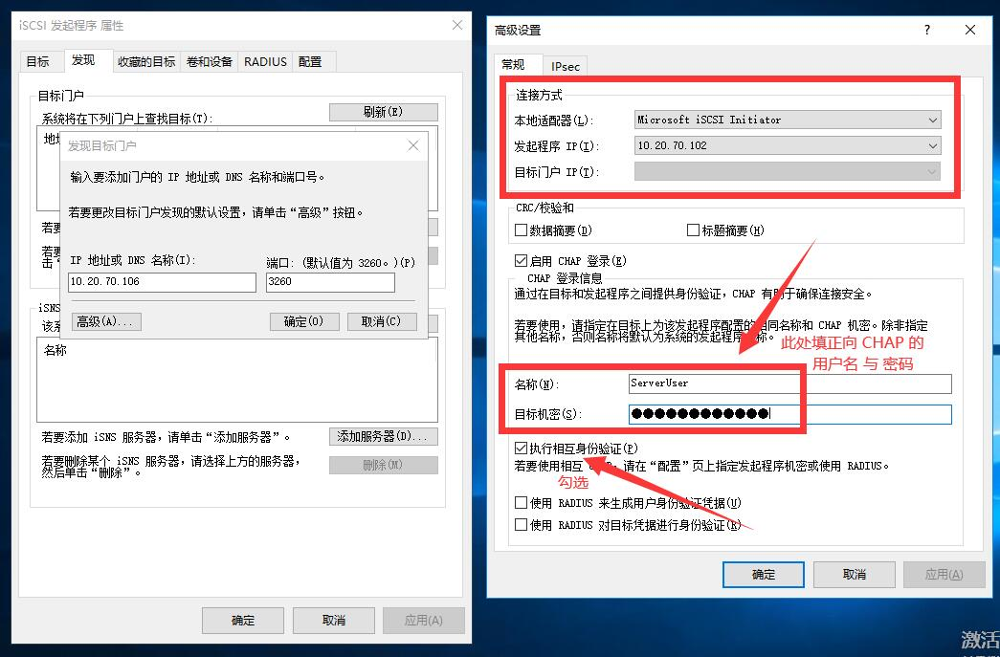
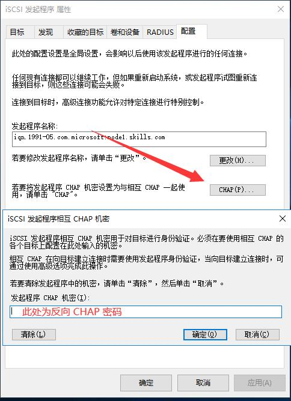

# iSCSI

## 什么是 iSCSI？

- [iSCSI 目标服务器概述 | Microsoft Docs](https://docs.microsoft.com/zh-cn/windows-server/storage/iscsi/iscsi-target-server)
- [iSCSI的基本架构及操作简介 - 知乎](https://zhuanlan.zhihu.com/p/60986068)
- [iSCSI_百度百科](https://baike.baidu.com/item/iSCSI/2169135?fr=aladdin)

## 安装

## 新建 iSCSI 虚拟磁盘

## 新建 iSCSI 目标

## iSCSI 发起程序

## 配置 CHAP 双向认证

在 [新建 iSCSI 目标](#新建-iscsi-目标) 时可以配置 CHAP 身份验证；
也可以在 iSCSI 目标属性中更改认证密码。

## 连接时

如果开启了 **反向 CHAP** 认证，连接时需要到 **配置** 选项卡中设置反向 CHAP 密码：

