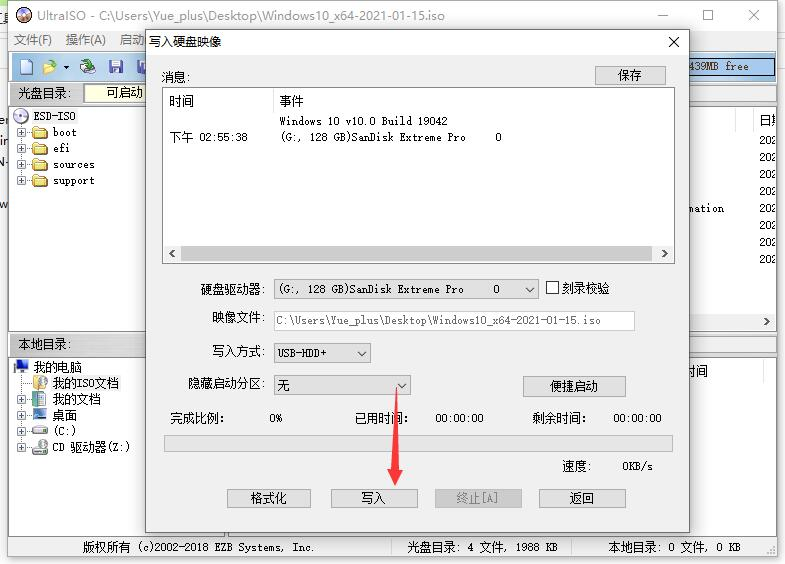
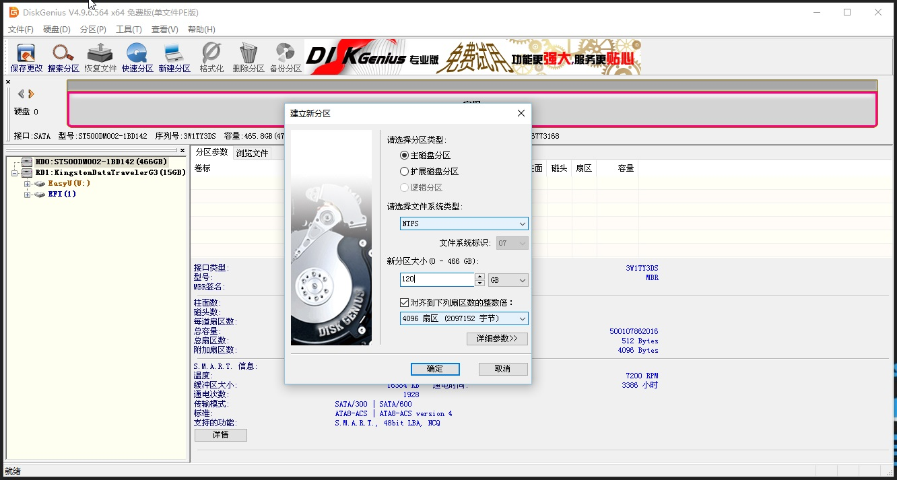
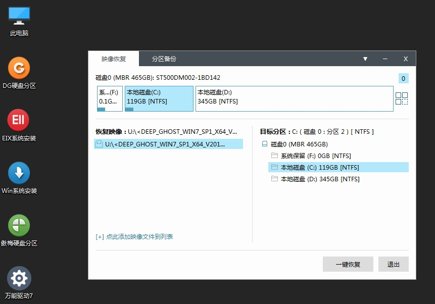

# 系统安装

## 开始之前需要

1. 一台功能完好的电脑
2. 一台需要安装操作系统的电脑
2. 一个 **8GB** 以上的U盘
3. 大概 10GB 的网络流量

## 获取安装镜像

### 原版镜像

可以从以下渠道获得 Windows 安装镜像：

- [下载 Windows 10 - Microsoft](https://www.microsoft.com/zh-cn/software-download/windows10)
  
- [我告诉你](https://msdn.itellyou.cn/)
  
- Windows 10 (consumer edition), version 20H2 (updated Feb 2021) (x64) - DVD (Chinese-Simplified)
  ED2k：
  ```text
  ed2k://|file|cn_windows_10_consumer_editions_version_20h2_updated_feb_2021_x64_dvd_8ddab99d.iso|6223781888|954B729026D6E420EE46FB2DC912F256|/
  ```
  BT：
  ```text
  magnet:?xt=urn:btih:65AC835ABC26EA04F0CBF4B8D18F99C5633F6DF9&dn=cn_windows_10_consumer_editions_version_20h2_updated_feb_2021_x64_dvd_8ddab99d.iso&xl=6223781888
  ```

### 获取 `.GHO` 镜像

::: danger
现在 <span title="Yue_plus">个人</span> 极度 **不推荐** 这种系统安装方式！

现在 **深度技术**、**雨林木风**、**萝卜家园**、**番茄花园** 等工作室都早已悉数解散。
现在最新的 Ghost 系统镜像都不同程度的含有 主页绑定、自带 2345 全家桶等辣鸡软件、甚至自带病毒程序等。
:::

#### 看起来还行的 Ghost 镜像网站

- [系统之家](http://www.xitongzhijia.net/)
- [系统城](http://www.xitongcheng.com/)
- [系统天地](https://www.xitongtiandi.net/)

## 制作装机U盘

### U盘 PE 系统

**推荐** 的：
- [IT 天空](https://www.itsk.com/topic-software.html)的 **优启通**
- [微 PE 工具箱](http://www.wepe.com.cn/)

------

感兴趣可以看看的：
- [Ventoy](https://www.ventoy.net/)
- [Edgeless](https://home.edgeless.top/)
- Linux Live 了解一下？`( •̀ ω •́ )✧`
  [Deepin](https://www.deepin.org/zh/)
  [Ubuntu Desktop](https://ubuntu.com/download/desktop)
  [Manjaro](https://manjaro.org/)

-----

<span title="绝对不要用 ε=( o｀ω′)ノ" style="color: red;">不推荐</span>的：
[老毛桃](https://www.laomaotao.net/)
[大白菜](http://www.winbaicai.com/)

### 软碟通（UltraISO）

UltraISO 软碟通是一款功能强大、方便实用、老牌优秀的光盘映像文件制作/编辑/转换工具

#### 安装

前往 [官方网站下载](https://cn.ultraiso.net/xiazai.html)

一个广为流传的激活码：
- 用户名：`王涛`
- 注册码：`7C81-1689-4046-626F`

#### 使用

以 **管理员身份** 打开，[下载的镜像](#获取安装镜像)，
点击 **启动** -> **写入硬盘映像**


***注意！以下操作会删除U盘内所有数据！注意备份！***



设置保持全默认，点击 **写入**。

## BIOS

::: tip
BIOS 是英文 "Basic Input Output System" 的缩略词，直译过来后中文名称就是"基本输入输出系统"。
在 IBM PC 兼容系统上，是一种业界标准的固件接口。
BIOS是个人电脑启动时加载的第一个软件。

[BIOS - 百度百科](https://baike.baidu.com/item/BIOS/91424)
:::


各种电脑进入 BIOS 界面的操作各不相同，可按照机器品牌、主板型号搜索相关操作。

通常的操作为开机狂按：
<kbd>F1</kbd> /
<kbd>F2</kbd> /
<kbd>F8</kbd> /
<kbd>F9</kbd> /
<kbd>F11</kbd> /
<kbd>F12</kbd> /
<kbd>DEL</kbd> /
<kbd>TAB</kbd> /
<kbd>ESC</kbd> 等

### 快速启动菜单

多数 BIOS 会配备 **快速启动菜单**，可以便捷的选择需要从哪个设备启动：


惠普（HP）：<kbd>F9</kbd>
联想（Lenovo）：<kbd>F12</kbd>

## 磁盘分区

可以使用以下工具给磁盘分区：

### [DiskGenius](https://www.diskgenius.cn/)

优启通中包含了免费版的 DiskGenius。



### Windows 磁盘管理

可在 Windows 系统中，右键 **此电脑/计算机/我的电脑** -> **管理** -> **磁盘管理**
使用 Windows 系统内的磁盘管理工具：


## 安装系统

### 使用原版镜像

### 使用 `.GHO` 镜像

使用 [U盘 PE 系统](#u盘-pe-系统) 内的 **EIX 系统安装** 选择 **恢复镜像** 与 **目标分区** 点击一键恢复。



恢复完成后会重启数次。
