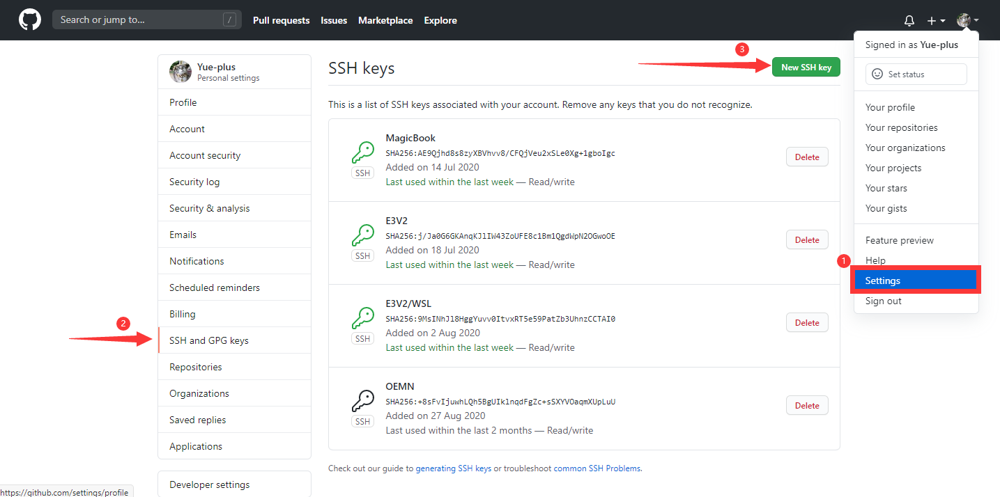

# 开始项目

## 推荐安装以下软件

编辑器：
- [IntelliJ IDEA ——集成开发环境](/start/use_IDEA/)
- [VScode ——开源代码编辑器](https://code.visualstudio.com/)
- [Typora ——简洁的 Markdown 编辑器](https://www.typora.io/#windows)
- [Notepad++ ——代替 Windows 自带记事本](https://notepad-plus-plus.org/downloads/)

浏览器插件：
- [沙拉查词](https://saladict.crimx.com/)。

系统环境：
- [Git](https://git-scm.com/)
- [Node.js](#本地安装-nodejs)
- [yarn](#本地安装-yarn)
- [GitHub CLI](https://cli.github.com/)

装机推荐：
- [bandizip ——压缩软件](http://www.bandisoft.com/bandizip/)
- [Motrix ——一款开源的全能下载工具](https://motrix.app/zh-CN/)
- [WinSCP ——开源图形化 SFTP 客户端](https://winscp.net/eng/download.php)
- [PotPlayer ——本地视频播放器](https://potplayer.daum.net/)
- [Windows Terminal](https://www.microsoft.com/zh-cn/p/windows-terminal/9n0dx20hk701)

## 注册 GitHub 账号

前往<span style="color: black; background-color: black;">~~全球最大的同性交友网站~~</span>面向开源及私有软件项目的托管平台 [GitHub](https://github.com/) 注册并登入账号。

前往本项目地址 <https://github.com/Yue-plus/NetNote>，点击 Watch、Star、Fork。

## 本地安装 Git

<iframe src="//player.bilibili.com/player.html?aid=98007542&bvid=BV1FE411P7B3&cid=167296411&page=1" scrolling="no" border="0" frameborder="no" framespacing="0" allowfullscreen="true"  style="width: 100%; height: 380px;"> </iframe>

前往 [Git 官网](https://git-scm.com/) 下载安装包，下一步到底。

> [Git - 菜鸟教程](https://www.runoob.com/git/git-tutorial.html)

### 配置 Git

桌面右键点击 [Git Bash Here]，输入以下指令：

```sh
# "username" 为 GitHub 账号，用户名
git config --global user.name "username"

# xxxxxxxxxx@mail.com 为 GitHub 账号，注册时的用的邮箱
git config --global user.email xxxxxxxxxx@mail.com
```

### 生成自己的 SSH Key

Git Bash 终端中，输入 `ssh-keygen`

```bash {1,3-5}
$ ssh-keygen
Generating public/private rsa key pair.
Enter file in which to save the key (/c/Users/Yue_p/.ssh/id_rsa): # 直接回车
Enter passphrase (empty for no passphrase):    # 直接回车
Enter same passphrase again:                   # 直接回车
Your identification has been saved in yes
Your public key has been saved in yes.pub
The key fingerprint is:
SHA256:xuvPaGeJuufX6k4oiufALDHD7PCfZxkfXQxjCBElkCA Yue_p@DESKTOP-SQLFD1T
The key's randomart image is:
+---[RSA 3072]----+
|E ...o==..       |
| .  .  .. +      |
|         . +     |
|o      .    o    |
|=o      S. .     |
|oB    ...o.      |
|..=   .+oo.o     |
| . +.o+o=+= .    |
|  .o=oo*+B*.     |
+----[SHA256]-----+
```

现在，`<个人文件夹>/.ssh/` 中应该有 `id_rsa`（私钥）与 `id_rsa.pub`（公钥）两个文件。

## GitHub 添加 SSH Key

用 **记事本打开** `<个人文件夹>/.ssh/id_rsa.pub` 文件。

打开 [GitHub.com](https://github.com/) 参照以下截图添加 SSH Key：




最后点击 **[Add SSH Key]**

## 本地安装 NodeJS

前往 [NodeJS 官网](https://nodejs.org/en/download/) 下载安装包，下一步到底。

## 本地安装 Yarn

前往 [Yarn](https://classic.yarnpkg.com/en/docs/install#windows-stable) 下载安装包，下一步到底。

## 拉取项目

找一个合适的路径，执行以下指令：

```sh
# 克隆仓库（注意替换为 GitHub 用户名：<username>）
git clone git@github.com:<username>/NetNote.git

cd NetNote

# 安装依赖
yarn
```

## 运行项目

在项目路径下执行：

```
yarn docs:dev
```

通过浏览器访问：<http://127.0.0.1:8080/>

> 更多配置可参考 **[VuePress 介绍](https://vuepress.vuejs.org/zh/guide/)**

## 部署

复制 `deploy.sh.examples` 文件，并重命名为 `deploy.sh` 并适当修改 `<USERNAME>/<REPO>`。

## 附：项目目录结构

当前所有文档都保存在 `NetNote\docs\` 文件夹内。

新建目录需修改 `NetNote\docs\.vuepress\config.yml` 文件。

公共图片统一放在 `NetNote\docs\.vuepress\public\img` 文件夹内。

每个文档都可以放在独立的文件夹下，维护自己的 `img` 文件夹。

```text
doc
├─.vuepress
│  └─public
│      └─img
├─coding
│  ├─Java
│  │  └─img
│  │      └─01-Path
│  └─Web
├─net
│  ├─acap
│  ├─base
│  ├─router
│  ├─security
│  ├─switch
│  └─wan
├─serve
│  ├─Linux
│  │  ├─01-Base
│  │  ├─02-Chrony
│  │  ├─03-NFS
│  │  ├─04-MariaDB
│  │  ├─05-Apache
│  │  ├─06-Tomcat
│  │  ├─07-Samba
│  │  ├─08-NIS
│  │  ├─09-Postfix
│  │  └─10-Pacemaker
│  ├─VM
│  │  ├─Cloud
│  │  └─img
│  │      └─setup
│  └─WS
└─start
    ├─img
    └─use_IDEA
        └─img
```

## 附：终端设置代理

### Git Bash

#### 设置代理

```sh
# http
git config --global http.proxy http://127.0.0.1:1080
git config --global https.proxy https://127.0.0.1:1080

# socks5
git config --global http.proxy 'socks5://127.0.0.1:1080'
git config --global https.proxy 'socks5://127.0.0.1:1080'
```

#### 取消代理

```sh
git config --global --unset http.proxy
git config --global --unset https.proxy
```

### PowerShell

#### 设置代理

```sh
netsh winhttp set proxy 127.0.0.1:1080
```

#### 取消代理

```sh
netsh winhttp reset proxy
```

#### 查看代理

```sh
netsh winhttp show proxy
```
