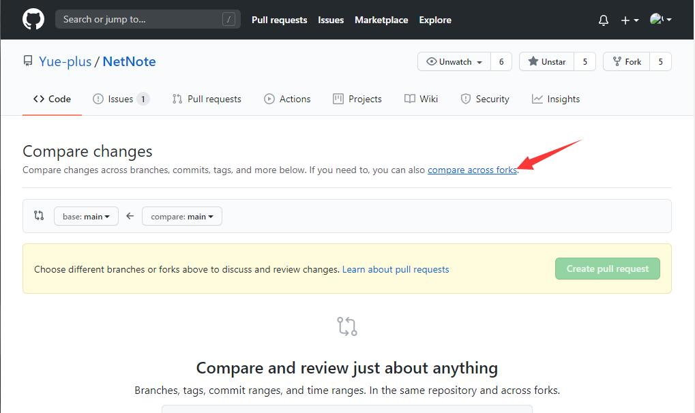
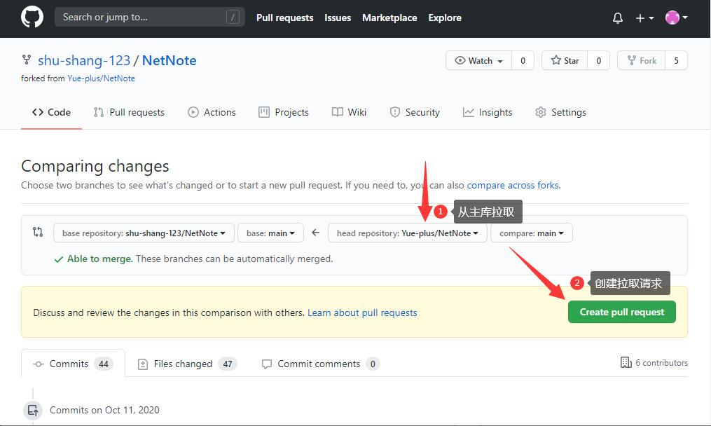
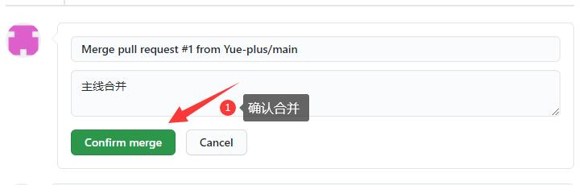
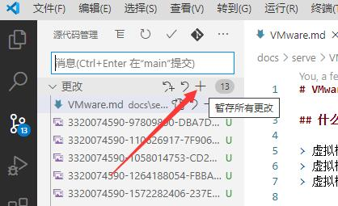
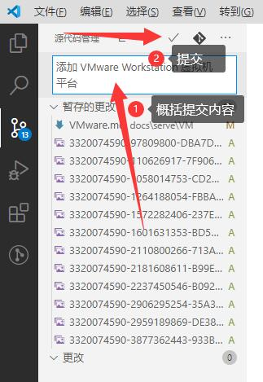
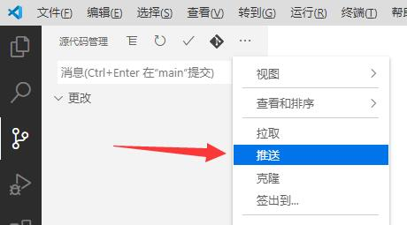
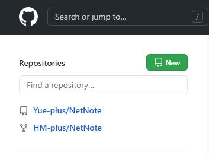
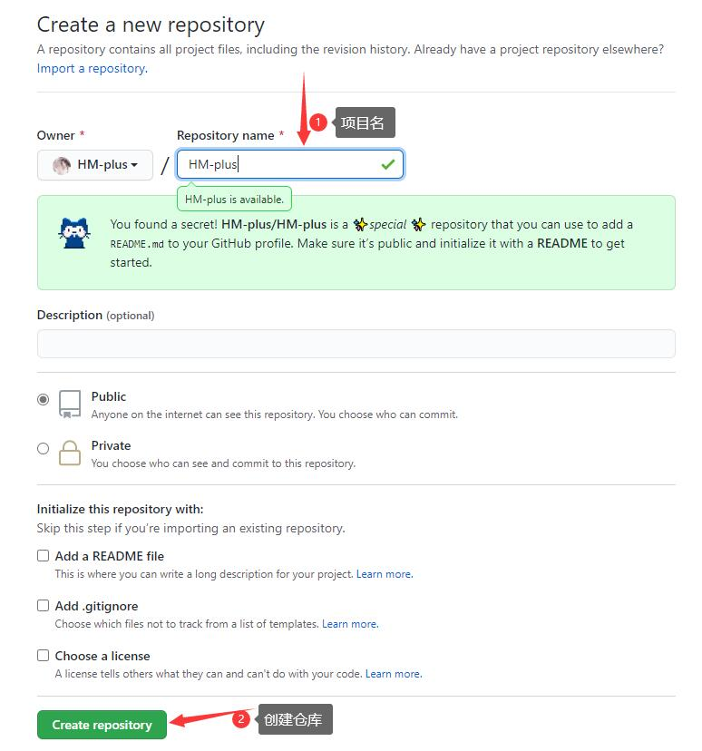
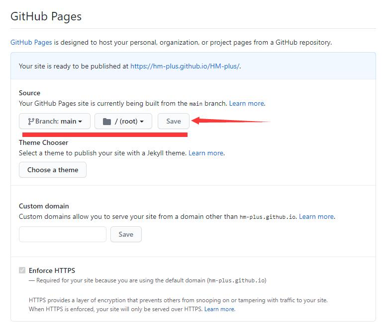
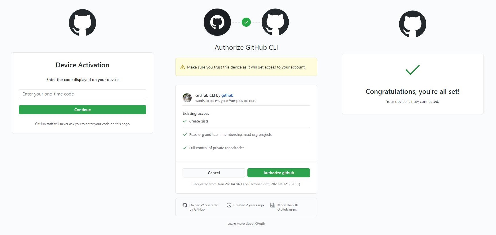

# GitHub 使用方法

::: tip
GitHub 是一个<span style="color: black; background-color: black;">全球最大的同性交友网站</span>面向开源及私有软件项目的托管平台。
:::

**先参考阅读 [本地安装 Git](/start/start.html#%E6%9C%AC%E5%9C%B0%E5%AE%89%E8%A3%85-git)！**

> - [Git 教程 - 廖雪峰的官方网站](https://www.liaoxuefeng.com/wiki/896043488029600)
> - [Git 教程 - 菜鸟教程](https://www.runoob.com/git/git-tutorial.html)
> - [如何使用 GitHub？- 知乎](https://www.zhihu.com/question/20070065)


## 从主库创建拉取请求







### VScode 拉取到本地

  

### IDEA 拉取到本地

  

## 推送本地更改到主库

### [推送之前先拉取](#从主库创建拉取请求)

 

### 推送到远程仓库

 
 
 

### 向主库提交拉取请求

 
 
 

## GitHub Page（静态网页托管）

1. 打开 [GitHub](https://github.com/)，点击左上角的新建仓库。

   

2. 设置项目名。

   

3. 参考 [此教程](https://www.liaoxuefeng.com/wiki/896043488029600/898732864121440) 推送项目代码到远程仓库。

3. 点击右上角的 `settings` 选项。

   

4. 点击 `seve` 选项即可

   

## 附：使用 GitHub CLI

::: tip
前往[下载 GitHub CLI](https://cli.github.com/) 并安装。
:::

::: tip
**命令行界面**（英语：**command-line interface**，缩写：CLI）是在图形用户界面得到普及之前使用最为广泛的用户界面，它通常不支持鼠标，用户通过键盘输入指令，计算机接收到指令后，予以执行。
也有人称之为 **字符用户界面**（CUI）。

**推荐在 PowerShell 中使用 GitHub CLI。**
:::

### 登入

使用以下指令登入到 GitHub：

```sh
gh auth login
```

1. 选择 `GitHub.com` 
2. 选择 `Login with a web browser`（通过浏览器登入）
3. 按下 <kbd>Enter</kbd> 键，将打开浏览器，将 `one-time code` 粘贴进去：
   
   浏览器操作完后，回到 PowerShell 按下 <kbd>Enter</kbd> 键
4. 选择 Git 协议为 `SSH`
5. 登入成功！

```text {2,6,10,11,15}
? What account do you want to log into?  [Use arrows to move, type to filter]
> GitHub.com
  GitHub Enterprise Server

? How would you like to authenticate?  [Use arrows to move, type to filter]
> Login with a web browser
  Paste an authentication token

! First copy your one-time code: FFFF-FFFF
- Press Enter to open github.com in your browser...
✓ Authentication complete. Press Enter to continue...

? Choose default git protocol  [Use arrows to move, type to filter]
  HTTPS
> SSH

✓ Logged in as Yue-plus
```

### 常用指令

查看 [GitHub CLI 使用手册（英文）](https://cli.github.com/manual/)