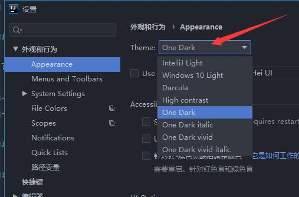

# IDEA 使用方法

:::tip
IDEA 全称 [IntelliJ IDEA](https://www.jetbrains.com/idea/)，是 java 编程语言开发的集成环境。
:::

## 下载安装

[前往官网下载](https://www.jetbrains.com/zh-cn/idea/download/#section=windows) IntelliJ IDEA **Ultimate**（旗舰版），可以免费试用 30 天。

## 申请许可证

可通过官方渠道申请免费的正版许可证：

- [教育许可证](https://www.jetbrains.com/zh-cn/community/education/#students)
- [开源许可证](https://www.jetbrains.com/zh-cn/community/opensource/#support)

## 常用设置

### 安装中文语言包

前往官网 [Chinese ​(Simplified)​ Language Pack EAP](https://plugins.jetbrains.com/plugin/13710-chinese-simplified-language-pack-eap) 下载中文语言包插件。

拖入 IDEA 窗口安装。

<!-- TODO: 待添加截图 -->

### 更改颜色主题

点击左上角 **文件** → **设置**：

点击 **确定**。

## 友情链接

[judasn/IntelliJ-IDEA-Tutorial](https://github.com/judasn/IntelliJ-IDEA-Tutorial#%E7%9B%AE%E5%BD%95contents)

- **教程介绍（新用户必看）**
	- [IntelliJ IDEA 介绍](https://github.com/judasn/IntelliJ-IDEA-Tutorial/blob/master/introduce.md)
	- [本教程介绍](https://github.com/judasn/IntelliJ-IDEA-Tutorial/blob/master/about-this-tutorial.md)
- **安装、基础环境介绍（新用户必看）**
	- [Windows 下安装](https://github.com/judasn/IntelliJ-IDEA-Tutorial/blob/master/windows-install.md)
	- [Ubuntu 下安装](https://github.com/judasn/IntelliJ-IDEA-Tutorial/blob/master/ubuntu-install.md)
	- [Mac 下安装](https://github.com/judasn/IntelliJ-IDEA-Tutorial/blob/master/mac-install.md)
	- [安装环境总结](https://github.com/judasn/IntelliJ-IDEA-Tutorial/blob/master/install-summarize.md)
	- [首次运行向导](https://github.com/judasn/IntelliJ-IDEA-Tutorial/blob/master/first-run-wizard.md)
	- [安装后生成的目录说明、VM 设置](https://github.com/judasn/IntelliJ-IDEA-Tutorial/blob/master/installation-directory-introduce.md)
- **首次使用的基础设置介绍（新用户必看）**
	- [UI 界面](https://github.com/judasn/IntelliJ-IDEA-Tutorial/blob/master/interface-introduce.md)
	- [UI 主题、字体、编辑区主题、文件编码修改、乱码问题](https://github.com/judasn/IntelliJ-IDEA-Tutorial/blob/master/theme-settings.md)
- **IntelliJ IDEA 特别地方（新用户必看）**
	- [IntelliJ IDEA 搜索快的原因：索引](https://github.com/judasn/IntelliJ-IDEA-Tutorial/blob/master/IntelliJ-IDEA-cache.md)
	- [IntelliJ IDEA 下 Java 文件编译方式](https://github.com/judasn/IntelliJ-IDEA-Tutorial/blob/master/make-introduce.md)
	- [IntelliJ IDEA 下项目相关特有概念说明](https://github.com/judasn/IntelliJ-IDEA-Tutorial/blob/master/project-composition-introduce.md)
- **必备的快捷键（新用户必看）**
	- [IntelliJ IDEA 常用快捷键讲解（Win + Linux）](https://github.com/judasn/IntelliJ-IDEA-Tutorial/blob/master/keymap-introduce.md)
	- [IntelliJ IDEA 常用快捷键讲解（Mac）](https://github.com/judasn/IntelliJ-IDEA-Tutorial/blob/master/keymap-mac-introduce.md)
	- [从 Windows 过度到 Mac 必备快捷键对照表](https://github.com/judasn/IntelliJ-IDEA-Tutorial/blob/master/keymap-win-mac.md)
	- [最特殊的快捷键 Alt + Enter 介绍](https://github.com/judasn/IntelliJ-IDEA-Tutorial/blob/master/hotkey-alt-enter-introduce.md)
- **提高编码效率功能介绍**
	- [Maven 设置](https://github.com/judasn/IntelliJ-IDEA-Tutorial/blob/master/maven-project-introduce.md)
	- [IntelliJ IDEA 配合 Maven 的一些要点](https://github.com/judasn/IntelliJ-IDEA-Tutorial/blob/master/maven-skill-introduce.md)
	- [版本控制讲解（SVN + Git）](https://github.com/judasn/IntelliJ-IDEA-Tutorial/blob/master/vcs-introduce.md)
	- [实时代码模板](https://github.com/judasn/IntelliJ-IDEA-Tutorial/blob/master/live-templates-introduce.md)
	- [文件代码模板](https://github.com/judasn/IntelliJ-IDEA-Tutorial/blob/master/file-templates-introduce.md)
	- [前端代码模板：Emmet](https://github.com/judasn/IntelliJ-IDEA-Tutorial/blob/master/emmet-introduce.md)
	- [特殊代码模板：Postfix Completion](https://github.com/judasn/IntelliJ-IDEA-Tutorial/blob/master/postfix-completion-introduce.md)
	- [Debug 技巧](https://github.com/judasn/IntelliJ-IDEA-Tutorial/blob/master/debug-introduce.md)
	- [重构技巧](https://github.com/judasn/IntelliJ-IDEA-Tutorial/blob/master/refactor-introduce.md)
	- [数据库管理工具](https://github.com/judasn/IntelliJ-IDEA-Tutorial/blob/master/database-introduce.md)
	- [远程调试介绍（Tomcat + Jetty）](https://github.com/judasn/IntelliJ-IDEA-Tutorial/blob/master/remote-debugging.md)
- **高级设置介绍**
	- [IntelliJ IDEA 推荐设置（新人重点）](https://github.com/judasn/IntelliJ-IDEA-Tutorial/blob/master/settings-recommend-introduce.md)
	- [IntelliJ IDEA 常用细节-1](https://github.com/judasn/IntelliJ-IDEA-Tutorial/blob/master/settings-introduce-1.md)
	- [IntelliJ IDEA 常用细节-2](https://github.com/judasn/IntelliJ-IDEA-Tutorial/blob/master/settings-introduce-2.md)
	- [IntelliJ IDEA 常用细节-3](https://github.com/judasn/IntelliJ-IDEA-Tutorial/blob/master/settings-introduce-3.md)
	- [IntelliJ IDEA 常用细节-4](https://github.com/judasn/IntelliJ-IDEA-Tutorial/blob/master/settings-introduce-4.md)
- **插件推荐、插件开发**
	- [插件相关功能设置、插件推荐](https://github.com/judasn/IntelliJ-IDEA-Tutorial/blob/master/plugins-settings.md)
	- [Java 热部署插件 JRebel 安装及使用](https://github.com/judasn/IntelliJ-IDEA-Tutorial/blob/master/jrebel-setup.md)
	- [插件开发视频教程](https://github.com/judasn/IntelliJ-IDEA-Tutorial/blob/master/plugins-develop.md)
- **基于 IntelliJ IDEA 下的 demo 尝试**
	- [Maven 的单模块 / 多模块 Spring MVC + Spring + Mybatis 项目（新人重点）](https://github.com/judasn/IntelliJ-IDEA-Tutorial/blob/master/maven-java-web-project-introduce.md)
	- [Maven 的单模块 Spring MVC + Spring + Spring Data JPA 项目](https://github.com/judasn/IntelliJ-IDEA-Tutorial/blob/master/maven-java-web-project-introduce2.md)
	- [Maven 的单模块 Spring Boot 项目](https://github.com/judasn/SpringBoot-Simple-Demo-From-YouMeek)
	- [Hello World 的 Java 项目创建和项目配置文件](https://github.com/judasn/IntelliJ-IDEA-Tutorial/blob/master/project-settings.md)
	- [基于 Eclipse 的 Java Web 项目在 IntelliJ IDEA 下的环境搭建](https://github.com/judasn/IntelliJ-IDEA-Tutorial/blob/master/eclipse-java-web-project-introduce.md)
- **其他（新用户必看）**
	- [常见各类文件类型图标](https://github.com/judasn/IntelliJ-IDEA-Tutorial/blob/master/file-symbols-introduce.md)
	- [本教程总结](https://github.com/judasn/IntelliJ-IDEA-Tutorial/blob/master/this-tutorial-the-end.md)