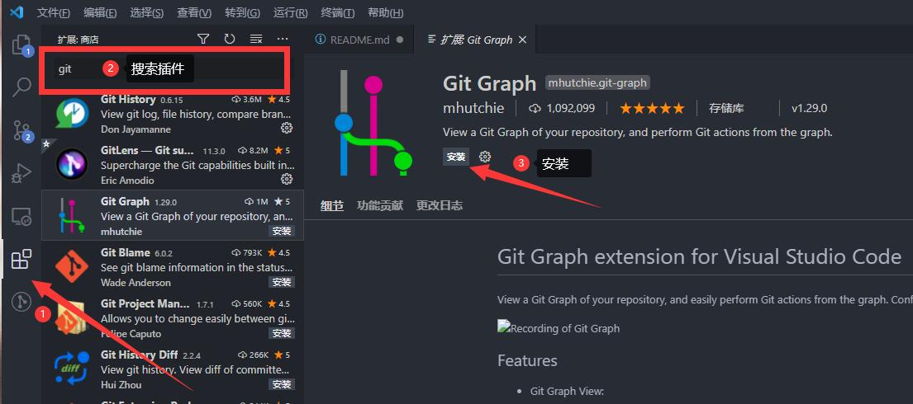
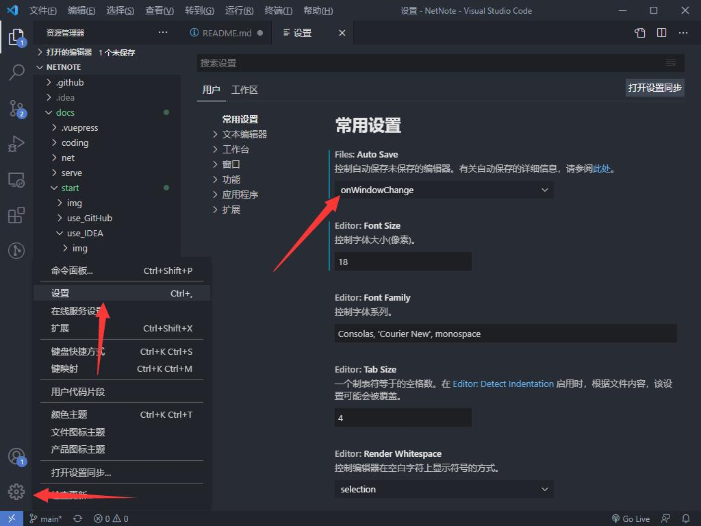

# VScode 使用方法

::: tip
VScode 全称 [Visual Studio Code](https://code.visualstudio.com/)，是一个运行于 OS X、Windows 与 Linux 之上的，针对于编写现代 Web 与云应用的跨平台编辑器。
:::

## 下载安装

[前往官网下载](https://code.visualstudio.com/)

## 基础配置

### 安装插件

可在侧边栏搜索并安装插件

### 安装中文语言包

安装 [Chinese (Simplified) Language Pack for Visual Studio Code](https://marketplace.visualstudio.com/items?itemName=MS-CEINTL.vscode-language-pack-zh-hans)

### 开启自动保存

右下角点开设置（<kbd>Ctrl</kbd> + <kbd>,</kbd>），将自动保存设置为“窗口失去焦点自动保存”。

### 更改主题

右下角点开颜色主题（<kbd>Ctrl</kbd> + <kbd>K</kbd> + <kbd>T</kbd>）

## 推荐插件

+ Git
  - [Git History](https://marketplace.visualstudio.com/items?itemName=donjayamanne.githistory)
  - [GitLens — Git supercharged](https://gitlens.amod.io/)
+ 主题
  - [One Dark Pro](https://marketplace.visualstudio.com/items?itemName=zhuangtongfa.Material-theme)